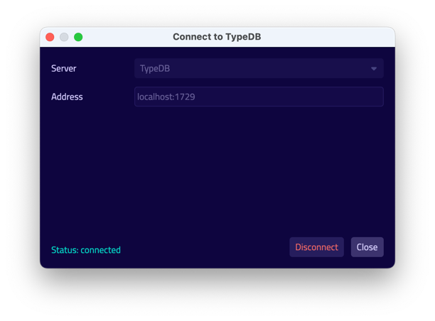
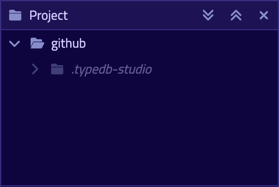
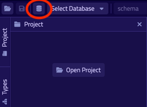
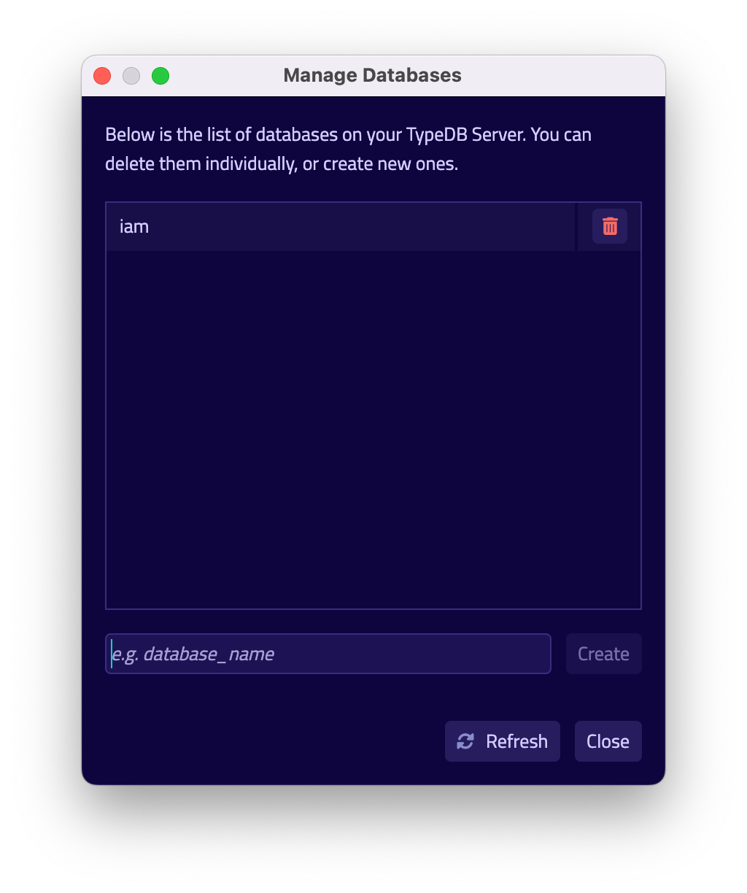
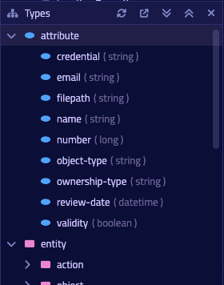
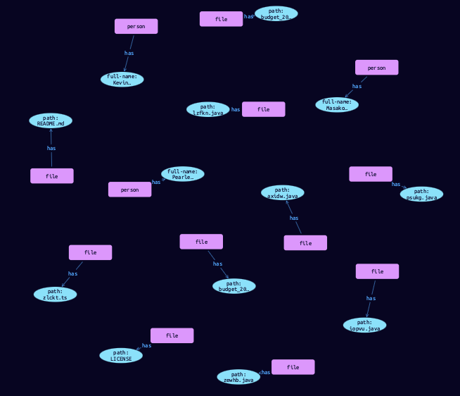

# Quickstart guide

## Overview

This Quickstart guide goes through the step-by-step process of creating and interacting with a TypeDB database designed 
for an
[Identity and Access Management](https://en.wikipedia.org/wiki/Identity_management) solution that will be described 
[later](04-iam-schema.md).

<div class="note">
[Important]
We highly recommend completing this guide. Its goal is to prepare an environment for TypeDB exploration and development.
The resulting database (schema and data) will be needed for example queries throughout the documentation.
</div>

## Prerequisites

This Quickstart guide takes advantage of TypeDB Studio, a desktop GUI tool for interacting with TypeDB. To proceed, 
please install both TypeDB and TypeDB Studio:

- [Install TypeDB](02-installation.md)
- [Install TypeDB Studio](../../02-clients/01-studio.md#get-typedb-studio)

IMPORTANT:
<div class="note">
[Important]
It’s recommended to use TypeDB and TypeDB Studio of the same version number in order to ensure compatibility. If 
TypeDB Studio doesn't have a version similar to the TypeDB release — use the closest lower version instead.
</div>

## Initialize database

### Start TypeDB

Run the following command in a terminal:

<!-- test-ignore -->
```bash
typedb server
```

After showing the TypeDB ASCII logo and the bootup completion time, TypeDB is ready for connections.


### Connect to TypeDB

Launch TypeDB Studio, then:

1. Click the [**Connect to TypeDB**] button (right side of the toolbar).
2. Enter localhost:1729 in the [**Address**] field.
3. Click the [**Connect**] button (the dialog will close after a successful connection).



### Create a project

TypeDB Studio projects allow you to organize and save related queries for future reuse.


To create a new project:

1. Click the [**Open Project**] button in the [**Project**] panel (upper left).
2. Choose a directory for the project files.
3. Click the [**Open**] button.

The [**Project**] panel will now display the root directory and a nested hidden directory for unsaved files.



### Create a database

1. Click the database icon to open the [**Manage Databases**] dialog (left side of the toolbar).

   

2. Enter `iam` in the text field, and click the [**Create**] button next to it.
3. Click the [**Close**] button in the bottom right.

   

4. Select `iam` from the database dropdown (next to the database icon).

### Prepare a TQL file

A [TypeDB schema](../02-dev/02-schema.md) contains entity, relation, and attribute type definitions that make up the 
data model, as well as rules which may be applied to it – all of which are expressed in [TypeQL](../../11-query), 
TypeDB’s query language.

To prepare the schema definition file:

1. Click the `+` icon in the top left corner of the [**Text-editor**] panel (directly right from the [**Project**] 
   panel).
2. Copy the TypeQL statements below into the [**Text-editor**] panel.
3. Click the save icon on the left side of the toolbar.
4. Enter `iam-schema.tql` in the [**Save As**] field.
5. Click the [**Save**] button.

<!-- test-ignore -->
```typeql
#
# Copyright (C) 2022 Vaticle
#
# This program is free software: you can redistribute it and/or modify
# it under the terms of the GNU Affero General Public License as
# published by the Free Software Foundation, either version 3 of the
# License, or (at your option) any later version.
#
# This program is distributed in the hope that it will be useful,
# but WITHOUT ANY WARRANTY; without even the implied warranty of
# MERCHANTABILITY or FITNESS FOR A PARTICULAR PURPOSE.  See the
# GNU Affero General Public License for more details.
#
# You should have received a copy of the GNU Affero General Public License
# along with this program.  If not, see <https://www.gnu.org/licenses/>.
#

define

company sub entity,
    owns name,
    plays company-membership:parent-company;

company-membership sub relation,
    relates parent-company,
    relates company-member;

parent-company sub attribute,
    value string;

#rule attribute-parent-company:
#    when {
#        (parent-company: $c, company-member: $t) isa company-membership;
#        $c has name $c-name;
#        ?name-value = $c-name
#    } then {
#        $t has parent-company ?name-value;
#    };

rule attribute-parent-company:
    when {
        (parent-company: $c, company-member: $t) isa company-membership;
        $c has name $c-name;
        $pc isa parent-company;
        $c-name = $pc;
    } then {
        $t has $pc;
    };

root-collection sub attribute,
    value boolean;

rule automatic-member-collection:
    when {
        $c isa resource-collection;
        (collection-member: $c) isa collection-membership;
    } then {
        $c has root-collection false;
    };

rule automatic-root-collection:
    when {
        $c isa resource-collection;
        not {
            $c has root-collection false;
        };
    } then {
        $c has root-collection true;
    };

subject sub entity,
    abstract,
    owns parent-company,
    owns credential,
    plays company-membership:company-member,
    plays group-membership:group-member,
    plays group-ownership:group-owner,
    plays object-ownership:object-owner,
    plays permission:permitted-subject,
    plays change-request:requesting-subject,
    plays change-request:requested-subject,
    plays segregation-violation:violating-subject;

user sub subject,
    abstract;

user-group sub subject,
    abstract,
    plays group-membership:parent-group,
    plays group-ownership:owned-group;

object sub entity,
    abstract,
    owns parent-company,
    owns object-type,
    plays company-membership:company-member,
    plays collection-membership:collection-member,
    plays object-ownership:owned-object,
    plays access:accessed-object,
    plays segregation-violation:violating-object;

resource sub object,
    abstract;

resource-collection sub object,
    abstract,
    owns root-collection,
    plays collection-membership:parent-collection;

action sub entity,
    abstract,
    owns parent-company,
    owns action-name,
    owns object-type,
    plays company-membership:company-member,
    plays set-membership:set-member,
    plays access:valid-action,
    plays segregation-policy:segregated-action;

operation sub action;

operation-set sub action,
    plays set-membership:parent-set;

membership sub relation,
    abstract,
    relates parent,
    relates member;

group-membership sub membership,
    relates parent-group as parent,
    relates group-member as member;

collection-membership sub membership,
    relates parent-collection as parent,
    relates collection-member as member;

set-membership sub membership,
    relates parent-set as parent,
    relates set-member as member;

ownership sub relation,
    abstract,
    relates owned,
    relates owner;

group-ownership sub ownership,
    relates owned-group as owned,
    relates group-owner as owner,
    owns ownership-type;

object-ownership sub ownership,
    relates owned-object as owned,
    relates object-owner as owner,
    owns ownership-type;

access sub relation,
    relates accessed-object,
    relates valid-action,
    plays permission:permitted-access,
    plays change-request:requested-change;

permission sub relation,
    relates permitted-subject,
    relates permitted-access,
    owns review-date,
    owns validity;

change-request sub relation,
    relates requesting-subject,
    relates requested-subject,
    relates requested-change;

segregation-policy sub relation,
    relates segregated-action,
    owns policy-name,
    plays segregation-violation:violated-policy;

segregation-violation sub relation,
    relates violating-subject,
    relates violating-object,
    relates violated-policy;

credential sub attribute,
    value string;

object-type sub attribute,
    value string;

action-name sub attribute,
    value string;

ownership-type sub attribute,
    value string;

review-date sub attribute,
    value datetime;

validity sub attribute,
    value boolean;

policy-name sub attribute,
    value string;

person sub user,
    owns full-name,
    owns email;

business-unit sub user-group,
    owns name;

user-role sub user-group,
    owns name;

user-account sub user-group,
    owns email;

file sub resource,
    owns path,
    owns size-kb;

interface sub resource,
    owns name;

record sub resource,
    owns number;

directory sub resource-collection,
    owns path,
    owns size-kb;

application sub resource-collection,
    owns name;

database sub resource-collection,
    owns name;

table sub resource-collection,
    owns name;

id sub attribute,
    abstract,
    value string;

email sub id,
    value string;

name sub id,
    value string;

path sub id,
    value string;

number sub id,
    value string;

full-name sub attribute,
    value string;

size-kb sub attribute,
    value long;

rule transitive-membership:
    when {
        ($parent-role: $e1, $member-role: $e2) isa! $membership-type;
        ($parent-role: $e2, $member-role: $e3) isa! $membership-type;
        $membership-type sub membership;
        $membership-type relates $parent-role, relates $member-role;
    } then {
        ($parent-role: $e1, $member-role: $e3) isa $membership-type;
    };

rule transitive-object-access:
    when {
        (parent-collection: $c1, collection-member: $c2) isa collection-membership;
        $c1 isa! $c1-type;
        $c2 isa! $c2-type;
        $c1-type is $c2-type;
        (accessed-object: $c1, valid-action: $a) isa access;
    } then {
        (accessed-object: $c2, valid-action: $a) isa access;
    };

rule transitive-action-access:
    when {
        (parent-set: $s, set-member: $a) isa set-membership;
        (accessed-object: $o, valid-action: $s) isa access;
    } then {
        (accessed-object: $o, valid-action: $a) isa access;
    };

rule transitive-subject-permission:
    when {
        (parent-group: $g, group-member: $s) isa group-membership;
        (permitted-subject: $g, permitted-access: $a) isa permission;
    } then {
        (permitted-subject: $s, permitted-access: $a) isa permission;
    };

rule transitive-object-permission:
    when {
        (parent-collection: $c, collection-member: $o) isa collection-membership;
        $ac-c(accessed-object: $c, valid-action: $a) isa access;
        $ac-o(accessed-object: $o, valid-action: $a) isa access;
        (permitted-subject: $s, permitted-access: $ac-c) isa permission;
    } then {
        (permitted-subject: $s, permitted-access: $ac-o) isa permission;
    };

rule transitive-action-permission:
    when {
        (parent-set: $s, set-member: $a) isa set-membership;
        $ac-s(accessed-object: $o, valid-action: $s) isa access;
        $ac-a(accessed-object: $o, valid-action: $a) isa access;
        (permitted-subject: $su, permitted-access: $ac-s) isa permission;
    } then {
        (permitted-subject: $su, permitted-access: $ac-a) isa permission;
    };

rule automatic-segregation-violation:
    when {
        $s(segregated-action: $a1, segregated-action: $a2) isa segregation-policy;
        $ac1(accessed-object: $o, valid-action: $a1) isa access;
        $ac2(accessed-object: $o, valid-action: $a2) isa access;
        $p1(permitted-subject: $su, permitted-access: $ac1) isa permission;
        $p2(permitted-subject: $su, permitted-access: $ac2) isa permission;
    } then {
        (violating-subject: $su, violating-object: $o, violated-policy: $s) isa segregation-violation;
    };

rule automatic-permission-invalidity:
    when {
        $s(segregated-action: $a1, segregated-action: $a2) isa segregation-policy;
        $ac1(accessed-object: $o, valid-action: $a1) isa access;
        $ac2(accessed-object: $o, valid-action: $a2) isa access;
        $p1(permitted-subject: $su, permitted-access: $ac1) isa permission;
        $p2(permitted-subject: $su, permitted-access: $ac2) isa permission;
    } then {
        $p1 has validity false;
    };

rule automatic-permission-validity:
    when {
        $p isa permission;
        not {
            $p has validity false;
        };
    } then {
        $p has validity true;
    };
    
rule add-view-access:
    when {
        $modify isa action, has action-name "modify_file";
        $view isa action, has action-name "view_file";
        $ac_modify (accessed-object: $obj, valid-action: $modify) isa access;
        $ac_view (accessed-object: $obj, valid-action: $view) isa access;
        (permitted-subject: $subj, permitted-access: $ac_modify) isa permission;
    } then {
        (permitted-subject: $subj, permitted-access: $ac_view) isa permission;
    };
```

### Upload the schema

To execute the TypeQL statements in the opened file and send them as queries:

1. Ensure the [**Session type**] (schema / data) switch (next to the database dropdown) is set to `schema`.
2. Ensure the [**Transaction type**] (write / read) switch is set to `write`.

   

3. Click the green “play” button (middle of the toolbar) to start the transaction.
4. Click the “checkmark” button (left of the “play” button) to commit the changes.

The transaction has been committed, and `iam` database now has a schema.

The Types panel will now display the entity, relation, and attribute types within a type hierarchy of the schema.



Data can now be inserted.

## First important queries

### Read the schema

TypeQL can be used to query the schema.

To execute a simple schema query:

1. Ensure the [**Session type**] (schema / data) switch is set to `schema` (next to the database dropdown).
2. Ensure the [**Transaction type**] (write / read) switch is set to `read`.
3. Click the `+` icon right from the [**Project**] panel next to the `iam-schema.tql` tab in the Text-editor panel.
4. Copy the TypeQL statement below.
5. Click the green “play” button.

<!-- test-ignore -->
```typeql
match $t sub thing;
```
The above query returns all types in the schema and displays the results as a graph.

<div class="note">
[Warning]
The `thing` built-in type will be deprecated in TypeDB version `3.0`. Consider using `entity`, `attribute`, or `relation` 
built-in type instead. To produce the same result as the above example, use the following query:

<!-- test-ignore -->
```typeql
match $t sub $a;
```

</div>


### Insert data

We will insert data the same way we created the schema, by creating a TQL file in our project and executing it.

To create the file:

1. Click the `+` icon right from the [**Project**] panel next to the `iam-schema.tql` tab in the Text-editor panel.
2. Copy the TypeQL statements below.
3. Click the save icon (left side of toolbar).
4. Enter `iam-data.tql` in the [**Save As**] field.
5. Click the [**Save**] button.

<!-- test-ignore -->
```typeql
# Subjects
insert $p isa person, has full-name "Masako Holley", has email "masako.holley@vaticle.com";  # No access
insert $p isa person, has full-name "Pearle Goodman", has email "pearle.goodman@vaticle.com";  # Sales manager
insert $p isa person, has full-name "Kevin Morrison", has email "kevin.morrison@vaticle.com";  # Full access

# Objects
insert $f isa file, has path "iopvu.java", has size-kb 55;
insert $f isa file, has path "zlckt.ts", has size-kb 143;
insert $f isa file, has path "psukg.java", has size-kb 171;
insert $f isa file, has path "axidw.java", has size-kb 212;
insert $f isa file, has path "lzfkn.java", has size-kb 70;
insert $f isa file, has path "budget_2022-05-01.xlsx", has size-kb 758;
insert $f isa file, has path "zewhb.java";
insert $f isa file, has path "budget_2021-08-01.xlsx", has size-kb 1705;
insert $f isa file, has path "LICENSE";
insert $f isa file, has path "README.md";

# Operations
insert $o isa operation, has action-name "modify_file";
insert $o isa operation, has action-name "view_file";

# Potential access types
match $ob isa file, has path "iopvu.java"; $op isa operation, has action-name "modify_file"; insert $a (accessed-object: $ob, valid-action: $op) isa access;
match $ob isa file, has path "zlckt.ts"; $op isa operation, has action-name "modify_file"; insert $a (accessed-object: $ob, valid-action: $op) isa access;
match $ob isa file, has path "psukg.java"; $op isa operation, has action-name "modify_file"; insert $a (accessed-object: $ob, valid-action: $op) isa access;
match $ob isa file, has path "axidw.java"; $op isa operation, has action-name "modify_file"; insert $a (accessed-object: $ob, valid-action: $op) isa access;
match $ob isa file, has path "lzfkn.java"; $op isa operation, has action-name "modify_file"; insert $a (accessed-object: $ob, valid-action: $op) isa access;
match $ob isa file, has path "budget_2022-05-01.xlsx"; $op isa operation, has action-name "modify_file"; insert $a (accessed-object: $ob, valid-action: $op) isa access;
match $ob isa file, has path "zewhb.java"; $op isa operation, has action-name "modify_file"; insert $a (accessed-object: $ob, valid-action: $op) isa access;
match $ob isa file, has path "budget_2021-08-01.xlsx"; $op isa operation, has action-name "modify_file"; insert $a (accessed-object: $ob, valid-action: $op) isa access;
match $ob isa file, has path "LICENSE"; $op isa operation, has action-name "modify_file"; insert $a (accessed-object: $ob, valid-action: $op) isa access;
match $ob isa file, has path "README.md"; $op isa operation, has action-name "modify_file"; insert $a (accessed-object: $ob, valid-action: $op) isa access;

match $ob isa file, has path "iopvu.java"; $op isa operation, has action-name "view_file"; insert $a (accessed-object: $ob, valid-action: $op) isa access;
match $ob isa file, has path "zlckt.ts"; $op isa operation, has action-name "view_file"; insert $a (accessed-object: $ob, valid-action: $op) isa access;
match $ob isa file, has path "psukg.java"; $op isa operation, has action-name "view_file"; insert $a (accessed-object: $ob, valid-action: $op) isa access;
match $ob isa file, has path "axidw.java"; $op isa operation, has action-name "view_file"; insert $a (accessed-object: $ob, valid-action: $op) isa access;
match $ob isa file, has path "lzfkn.java"; $op isa operation, has action-name "view_file"; insert $a (accessed-object: $ob, valid-action: $op) isa access;
match $ob isa file, has path "budget_2022-05-01.xlsx"; $op isa operation, has action-name "view_file"; insert $a (accessed-object: $ob, valid-action: $op) isa access;
match $ob isa file, has path "zewhb.java"; $op isa operation, has action-name "view_file"; insert $a (accessed-object: $ob, valid-action: $op) isa access;
match $ob isa file, has path "budget_2021-08-01.xlsx"; $op isa operation, has action-name "view_file"; insert $a (accessed-object: $ob, valid-action: $op) isa access;
match $ob isa file, has path "LICENSE"; $op isa operation, has action-name "view_file"; insert $a (accessed-object: $ob, valid-action: $op) isa access;
match $ob isa file, has path "README.md"; $op isa operation, has action-name "view_file"; insert $a (accessed-object: $ob, valid-action: $op) isa access;

# Permissions
match $s isa subject, has full-name "Kevin Morrison"; $o isa object, has path "iopvu.java";
      $a isa action, has action-name "modify_file"; $ac (accessed-object: $o, valid-action: $a) isa access;
insert $p (permitted-subject: $s, permitted-access: $ac) isa permission;

match $s isa subject, has full-name "Kevin Morrison"; $o isa object, has path "zlckt.ts"; 
      $a isa action, has action-name "modify_file"; $ac (accessed-object: $o, valid-action: $a) isa access; 
insert $p (permitted-subject: $s, permitted-access: $ac) isa permission;

match $s isa subject, has full-name "Kevin Morrison"; $o isa object, has path "psukg.java"; 
      $a isa action, has action-name "modify_file"; $ac (accessed-object: $o, valid-action: $a) isa access; 
insert $p (permitted-subject: $s, permitted-access: $ac) isa permission;

match $s isa subject, has full-name "Kevin Morrison"; $o isa object, has path "axidw.java"; 
      $a isa action, has action-name "modify_file"; $ac (accessed-object: $o, valid-action: $a) isa access; 
insert $p (permitted-subject: $s, permitted-access: $ac) isa permission;

match $s isa subject, has full-name "Kevin Morrison"; $o isa object, has path "lzfkn.java"; 
      $a isa action, has action-name "modify_file"; $ac (accessed-object: $o, valid-action: $a) isa access; 
insert $p (permitted-subject: $s, permitted-access: $ac) isa permission;

match $s isa subject, has full-name "Kevin Morrison"; $o isa object, has path "budget_2022-05-01.xlsx"; 
      $a isa action, has action-name "modify_file"; $ac (accessed-object: $o, valid-action: $a) isa access; 
insert $p (permitted-subject: $s, permitted-access: $ac) isa permission;

match $s isa subject, has full-name "Kevin Morrison"; $o isa object, has path "zewhb.java"; 
      $a isa action, has action-name "modify_file"; $ac (accessed-object: $o, valid-action: $a) isa access; 
insert $p (permitted-subject: $s, permitted-access: $ac) isa permission;

match $s isa subject, has full-name "Kevin Morrison"; $o isa object, has path "budget_2021-08-01.xlsx"; 
      $a isa action, has action-name "modify_file"; $ac (accessed-object: $o, valid-action: $a) isa access; 
insert $p (permitted-subject: $s, permitted-access: $ac) isa permission;

match $s isa subject, has full-name "Kevin Morrison"; $o isa object, has path "LICENSE"; 
      $a isa action, has action-name "modify_file"; $ac (accessed-object: $o, valid-action: $a) isa access; 
insert $p (permitted-subject: $s, permitted-access: $ac) isa permission;

match $s isa subject, has full-name "Kevin Morrison"; $o isa object, has path "README.md"; 
      $a isa action, has action-name "modify_file"; $ac (accessed-object: $o, valid-action: $a) isa access; 
insert $p (permitted-subject: $s, permitted-access: $ac) isa permission;

match $s isa subject, has full-name "Pearle Goodman"; $o isa object, has path "budget_2022-05-01.xlsx"; 
      $a isa action, has action-name "modify_file"; $ac (accessed-object: $o, valid-action: $a) isa access; 
insert $p (permitted-subject: $s, permitted-access: $ac) isa permission;

match $s isa subject, has full-name "Pearle Goodman"; $o isa object, has path "zewhb.java"; 
      $a isa action, has action-name "view_file"; $ac (accessed-object: $o, valid-action: $a) isa access; 
insert $p (permitted-subject: $s, permitted-access: $ac) isa permission;

match $s isa subject, has full-name "Pearle Goodman"; $o isa object, has path "budget_2021-08-01.xlsx"; 
      $a isa action, has action-name "modify_file"; $ac (accessed-object: $o, valid-action: $a) isa access; 
insert $p (permitted-subject: $s, permitted-access: $ac) isa permission;

match $s isa subject, has full-name "Pearle Goodman"; $o isa object, has path "LICENSE"; 
      $a isa action, has action-name "modify_file"; $ac (accessed-object: $o, valid-action: $a) isa access; 
insert $p (permitted-subject: $s, permitted-access: $ac) isa permission;

match $s isa subject, has full-name "Pearle Goodman"; $o isa object, has path "README.md"; 
      $a isa action, has action-name "modify_file"; $ac (accessed-object: $o, valid-action: $a) isa access; 
insert $p (permitted-subject: $s, permitted-access: $ac) isa permission;
```

To execute the TypeQL statements copied from code block above:

1. Ensure the [Session type] (schema / data) switch (next to the database dropdown) is set to `data`.
2. Ensure the [Transaction type] (write / read) switch is set to `write`.
3. Click the green “play” button.
4. Click the “checkmark” button.

The transaction has been committed, and data can now be queried.

### Read data

To retrieve data from a database:

1. Click the `+` icon right from the [**Project**] panel next to the `iam-data.tql` tab in the Text-editor panel.
2. Ensure the [Session type] (schema / data) switch (next to the database dropdown) is set to `data`.
3. Ensure the [Transaction type] (write / read) switch is set to `read`.
4. Replace the TypeQL statement in the Text-editor panel with the one below.
5. Click the green “play” button.

<!-- test-ignore -->
```typeql
match $f isa file, has path $fp;
```

The above query returns all `file` entities with their `path` attributes. TypeDB Studio displays the results as in 
the image below.



## Schema and data

The Quickstart guide above provides a fast and easy way to set up the minimum IAM database environment.

The files that have been used in the guide:

- [iam-schema.tql](../../files/iam/iam-schema.tql) — TypeQL script for the IAM schema definition.
- [iam-data.tql](../../files/iam/iam-data.tql) — TypeQL script to load a sample dataset into the IAM schema.
