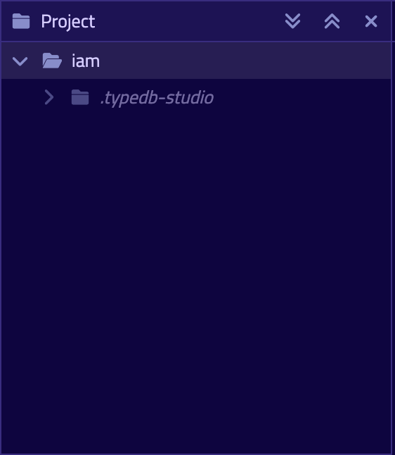

# Quickstart Guide

## An Overview

In this Quickstart guide, we go through step-by-step process of creating and interacting with a TypeDB database 
representing an [Identity and Access Management](https://en.wikipedia.org/wiki/Identity_management) solution. This exact
database with both [schema](../../09-schema/00-overview.md) and [data](../../11-query/00-overview.md) is used in the 
most examples of the TypeDB documentation.

<div class="note">
[Important]
By completing this quickstart guide you will prepare an environment to successfully execute most requests explored 
in this documentation.
</div>

## Prerequisites

To proceed we need TypeDB and TypeDB Studio installed and ready. We can use the following guides to achieve that:

1. [Install TypeDB](02-installation.md)
2. [Install TypeDB Studio](../../02-clients/01-studio.md#download--install)

<div class="note">
[Important]
We need to use compatible versions of TypeDB and TypeDB Studio. Usually that means that version numbers should be 
similar.
</div>

## Prepare a Database

### First step: Launch TypeDB server

Launch the server by issuing command in terminal:

```bash
typedb server
```

After startup TypeDB server will show its logo and some technical output, including server version and server address. 


Note or copy the server address, we will connect to this address on the next step. By default, it's `0.0.0.0:1729`.

### Second step: Connect to a TypeDB server

Launch TypeDB Studio and at the top right-hand corner click `Connect to TypeDB` button.


At the Address field insert or type in the address of the TypeDB server. Press connect.


Now TypeDB Studio is connected to your TypeDB instance.

### Third step: Open Project Folder

Studio will store queries you save in a project folder on you local machine, so you don't need to rewrite all your
queries each time you open Studio. To open a project folder click on the Open Folder icon in the top left corner or the
Open Project button in the Project section on the left (under the database icon).


This is the project view. Here we see files and folders inside the selected Project folder. Unsaved queries saved in a
hidden folder inside Project folder.



### Fourth step: Create a database

Let's create a new database. To do so, go to the databases manager by clicking on the database icon in the top left-hand 
corner. It is located directly left from the "Select Database" dropdown menu.


In the database manager window locate single line input field at the bottom, type in `iam` and hit "Create".


Now we've successfully created a database named `iam`!

### Fifth step: Prepare a Schema

A [TypeDB schema](../02-dev/05-schema.md) is the blueprint of a TypeDB database.
We use [TypeQL](../../11-query) to define all concepts of a data model.

To load a schema we can use one of the files in a project folder, or we can create one. To create a new request/file 
just click the plus (`+`) icon immediately right from the Project folder section tite. In the newly opened text editor 
on the right paste the following code of the IAM schema.

```typeql
define

subject sub entity,
    abstract,
    owns credential,
    plays group-membership:group-member,
    plays group-ownership:group-owner,
    plays object-ownership:object-owner,
    plays permission:permitted-subject,
    plays change-request:requesting-subject,
    plays change-request:requested-subject,
    plays segregation-violation:violating-subject;

user sub subject,
    abstract;

user-group sub subject,
    abstract,
    plays group-membership:user-group,
    plays group-ownership:owned-group;

object sub entity,
    abstract,
    owns object-type,
    plays collection-membership:collection-member,
    plays object-ownership:owned-object,
    plays access:accessed-object,
    plays segregation-violation:violating-object;

resource sub object,
    abstract;

resource-collection sub object,
    abstract,
    plays collection-membership:resource-collection;

action sub entity,
    abstract,
    owns name,
    owns object-type,
    plays set-membership:set-member,
    plays access:valid-action,
    plays segregation-policy:segregated-action;

operation sub action;

operation-set sub action,
    plays set-membership:operation-set;

group-membership sub relation,
    relates user-group,
    relates group-member;

collection-membership sub relation,
    relates resource-collection,
    relates collection-member;

set-membership sub relation,
    relates operation-set,
    relates set-member;

group-ownership sub relation,
    relates owned-group,
    relates group-owner,
    owns ownership-type;

object-ownership sub relation,
    relates owned-object,
    relates object-owner,
    owns ownership-type;

access sub relation,
    relates accessed-object,
    relates valid-action,
    plays permission:permitted-access,
    plays change-request:requested-change;

permission sub relation,
    relates permitted-subject,
    relates permitted-access,
    owns review-date,
    owns validity;

change-request sub relation,
    relates requesting-subject,
    relates requested-subject,
    relates requested-change;

segregation-policy sub relation,
    relates segregated-action,
    plays segregation-violation:violated-policy;

segregation-violation sub relation,
    relates violating-subject,
    relates violating-object,
    relates violated-policy;

credential sub attribute,
    value string;

object-type sub attribute,
    value string;

name sub attribute,
    value string;

ownership-type sub attribute,
    value string;

review-date sub attribute,
    value datetime;

validity sub attribute,
    value boolean;

person sub user,
    owns name,
    owns email;

business-unit sub user-group,
    owns name;

user-role sub user-group,
    owns name;

user-account sub user-group,
    owns email;

file sub resource,
    owns filepath;

interface sub resource,
    owns name;

record sub resource,
    owns number;

directory sub resource-collection,
    owns filepath;

application sub resource-collection,
    owns name;

database sub resource-collection,
    owns name;

table sub resource-collection,
    owns name;

email sub attribute,
    value string;

filepath sub attribute,
    value string;

number sub attribute,
    value long;
    
rule add-view-access:
    when {
        $modify isa action, has name "modify_file";
        $view isa action, has name "view_file";
        $ac_modify (accessed-object: $obj, valid-action: $modify) isa access;
        $ac_view (accessed-object: $obj, valid-action: $view) isa access;
        (permitted-subject: $subj, permitted-access: $ac_modify) isa permission;
    } then {
        (permitted-subject: $subj, permitted-access: $ac_view) isa permission;
    };
    
```

### Sixth step: Load a Schema

To load a schema we need to execute our first transaction to the `iam` database. To do that correctly we need to make 
sure the session and transaction types are set to `schema` and `write` respectively. These can be found to the right of 
the database selector.


Click the green play button to start the transaction. This will validate the request. If validation fails we will not 
be able to commit.

Finally, commit transaction by clicking the green tick immediately left from the play button. If we fail to commit the
changes will not be saved (persisted) in the database.

Now that `iam` database have a schema the Type browser will be populated with all the types from the databases schema.


## Read a schema

To read a schema from TypeDB database we need to prepare query. We can use the following request to read full schema:

```typeql
match $s sub thing;
```

To execute that query we need to make sure the session and transaction types are set to `schema` and `read` 
respectively. Click the green play button to start the transaction. As a result by default we will see a graph 
visualization of the response data. In this case — graph of IAM schema.


## Insert data

Let's insert some test data into our `iam` database to be able to read it later.

Prepare the following query to load a miniature test dataset:

```typeql
# Subjects
insert $p isa person, has name "Masako Holley", has email "masako.holley@vaticle.com";  # No access
insert $p isa person, has name "Pearle Goodman", has email "pearle.goodman@vaticle.com";  # Sales manager
insert $p isa person, has name "Kevin Morrison", has email "kevin.morrison@vaticle.com";  # Full access

# Objects
insert $f isa file, has filepath "iopvu.java";
insert $f isa file, has filepath "zlckt.ts";
insert $f isa file, has filepath "psukg.java";
insert $f isa file, has filepath "axidw.java";
insert $f isa file, has filepath "lzfkn.java";
insert $f isa file, has filepath "budget_2022-05-01.xlsx";
insert $f isa file, has filepath "zewhb.java";
insert $f isa file, has filepath "budget_2021-08-01.xlsx";
insert $f isa file, has filepath "LICENSE";
insert $f isa file, has filepath "README.md";

# Operations
insert $o isa operation, has name "modify_file";
insert $o isa operation, has name "view_file";

# Potential access types
match $ob isa file, has filepath "iopvu.java"; $op isa operation, has name "modify_file"; insert $a (accessed-object: $ob, valid-action: $op) isa access;
match $ob isa file, has filepath "zlckt.ts"; $op isa operation, has name "modify_file"; insert $a (accessed-object: $ob, valid-action: $op) isa access;
match $ob isa file, has filepath "psukg.java"; $op isa operation, has name "modify_file"; insert $a (accessed-object: $ob, valid-action: $op) isa access;
match $ob isa file, has filepath "axidw.java"; $op isa operation, has name "modify_file"; insert $a (accessed-object: $ob, valid-action: $op) isa access;
match $ob isa file, has filepath "lzfkn.java"; $op isa operation, has name "modify_file"; insert $a (accessed-object: $ob, valid-action: $op) isa access;
match $ob isa file, has filepath "budget_2022-05-01.xlsx"; $op isa operation, has name "modify_file"; insert $a (accessed-object: $ob, valid-action: $op) isa access;
match $ob isa file, has filepath "zewhb.java"; $op isa operation, has name "modify_file"; insert $a (accessed-object: $ob, valid-action: $op) isa access;
match $ob isa file, has filepath "budget_2021-08-01.xlsx"; $op isa operation, has name "modify_file"; insert $a (accessed-object: $ob, valid-action: $op) isa access;
match $ob isa file, has filepath "LICENSE"; $op isa operation, has name "modify_file"; insert $a (accessed-object: $ob, valid-action: $op) isa access;
match $ob isa file, has filepath "README.md"; $op isa operation, has name "modify_file"; insert $a (accessed-object: $ob, valid-action: $op) isa access;

match $ob isa file, has filepath "iopvu.java"; $op isa operation, has name "view_file"; insert $a (accessed-object: $ob, valid-action: $op) isa access;
match $ob isa file, has filepath "zlckt.ts"; $op isa operation, has name "view_file"; insert $a (accessed-object: $ob, valid-action: $op) isa access;
match $ob isa file, has filepath "psukg.java"; $op isa operation, has name "view_file"; insert $a (accessed-object: $ob, valid-action: $op) isa access;
match $ob isa file, has filepath "axidw.java"; $op isa operation, has name "view_file"; insert $a (accessed-object: $ob, valid-action: $op) isa access;
match $ob isa file, has filepath "lzfkn.java"; $op isa operation, has name "view_file"; insert $a (accessed-object: $ob, valid-action: $op) isa access;
match $ob isa file, has filepath "budget_2022-05-01.xlsx"; $op isa operation, has name "view_file"; insert $a (accessed-object: $ob, valid-action: $op) isa access;
match $ob isa file, has filepath "zewhb.java"; $op isa operation, has name "view_file"; insert $a (accessed-object: $ob, valid-action: $op) isa access;
match $ob isa file, has filepath "budget_2021-08-01.xlsx"; $op isa operation, has name "view_file"; insert $a (accessed-object: $ob, valid-action: $op) isa access;
match $ob isa file, has filepath "LICENSE"; $op isa operation, has name "view_file"; insert $a (accessed-object: $ob, valid-action: $op) isa access;
match $ob isa file, has filepath "README.md"; $op isa operation, has name "view_file"; insert $a (accessed-object: $ob, valid-action: $op) isa access;

# Permissions
match $s isa subject, has name "Kevin Morrison"; $o isa object, has filepath "iopvu.java"; 
      $a isa action, has name "modify_file"; $ac (accessed-object: $o, valid-action: $a) isa access; 
insert $p (permitted-subject: $s, permitted-access: $ac) isa permission;

match $s isa subject, has name "Kevin Morrison"; $o isa object, has filepath "zlckt.ts"; 
      $a isa action, has name "modify_file"; $ac (accessed-object: $o, valid-action: $a) isa access; 
insert $p (permitted-subject: $s, permitted-access: $ac) isa permission;

match $s isa subject, has name "Kevin Morrison"; $o isa object, has filepath "psukg.java"; 
      $a isa action, has name "modify_file"; $ac (accessed-object: $o, valid-action: $a) isa access; 
insert $p (permitted-subject: $s, permitted-access: $ac) isa permission;

match $s isa subject, has name "Kevin Morrison"; $o isa object, has filepath "axidw.java"; 
      $a isa action, has name "modify_file"; $ac (accessed-object: $o, valid-action: $a) isa access; 
insert $p (permitted-subject: $s, permitted-access: $ac) isa permission;

match $s isa subject, has name "Kevin Morrison"; $o isa object, has filepath "lzfkn.java"; 
      $a isa action, has name "modify_file"; $ac (accessed-object: $o, valid-action: $a) isa access; 
insert $p (permitted-subject: $s, permitted-access: $ac) isa permission;

match $s isa subject, has name "Kevin Morrison"; $o isa object, has filepath "budget_2022-05-01.xlsx"; 
      $a isa action, has name "modify_file"; $ac (accessed-object: $o, valid-action: $a) isa access; 
insert $p (permitted-subject: $s, permitted-access: $ac) isa permission;

match $s isa subject, has name "Kevin Morrison"; $o isa object, has filepath "zewhb.java"; 
      $a isa action, has name "modify_file"; $ac (accessed-object: $o, valid-action: $a) isa access; 
insert $p (permitted-subject: $s, permitted-access: $ac) isa permission;

match $s isa subject, has name "Kevin Morrison"; $o isa object, has filepath "budget_2021-08-01.xlsx"; 
      $a isa action, has name "modify_file"; $ac (accessed-object: $o, valid-action: $a) isa access; 
insert $p (permitted-subject: $s, permitted-access: $ac) isa permission;

match $s isa subject, has name "Kevin Morrison"; $o isa object, has filepath "LICENSE"; 
      $a isa action, has name "modify_file"; $ac (accessed-object: $o, valid-action: $a) isa access; 
insert $p (permitted-subject: $s, permitted-access: $ac) isa permission;

match $s isa subject, has name "Kevin Morrison"; $o isa object, has filepath "README.md"; 
      $a isa action, has name "modify_file"; $ac (accessed-object: $o, valid-action: $a) isa access; 
insert $p (permitted-subject: $s, permitted-access: $ac) isa permission;

match $s isa subject, has name "Pearle Goodman"; $o isa object, has filepath "budget_2022-05-01.xlsx"; 
      $a isa action, has name "modify_file"; $ac (accessed-object: $o, valid-action: $a) isa access; 
insert $p (permitted-subject: $s, permitted-access: $ac) isa permission;

match $s isa subject, has name "Pearle Goodman"; $o isa object, has filepath "zewhb.java"; 
      $a isa action, has name "view_file"; $ac (accessed-object: $o, valid-action: $a) isa access; 
insert $p (permitted-subject: $s, permitted-access: $ac) isa permission;

match $s isa subject, has name "Pearle Goodman"; $o isa object, has filepath "budget_2021-08-01.xlsx"; 
      $a isa action, has name "modify_file"; $ac (accessed-object: $o, valid-action: $a) isa access; 
insert $p (permitted-subject: $s, permitted-access: $ac) isa permission;

match $s isa subject, has name "Pearle Goodman"; $o isa object, has filepath "LICENSE"; 
      $a isa action, has name "modify_file"; $ac (accessed-object: $o, valid-action: $a) isa access; 
insert $p (permitted-subject: $s, permitted-access: $ac) isa permission;

match $s isa subject, has name "Pearle Goodman"; $o isa object, has filepath "README.md"; 
      $a isa action, has name "modify_file"; $ac (accessed-object: $o, valid-action: $a) isa access; 
insert $p (permitted-subject: $s, permitted-access: $ac) isa permission;
```

Make sure the session and transaction types are set to `data` and `write` respectively. Click the green play button to 
start the transaction. This will validate the request. If validation fails we will not be able to commit.

Finally, commit transaction by clicking the green tick immediately left from the play button. If we fail to commit the
changes will not be saved (persisted) in the database.

## Read data

To read data from TypeDB database we need to prepare query. We can use the following request to read all data in a 
database:

```typeql
match $t isa thing;
```

To execute that query we need to make sure the session and transaction types are set to `data` and `read`
respectively. Click the green play button to start the transaction. As a result by default we will see a graph
visualization of the response data. In this case — all our inserted data from the miniature dataset.


