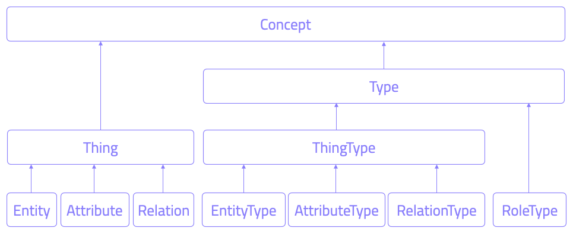

# Schema

TypeDB database stores data and schema. 

TypeDB schema is a blueprint of a database. It describes how the data can be structured: 

- All user-defined types. 
- Type hierarchy. 
- Data constraints. 
- Inference rules. 

With TypeDB, thanks to our high-level knowledge model, the schema closely resembles 
[conceptual schema](https://en.wikipedia.org/wiki/Conceptual_schema). TypeDB takes care of the hassle of going through
other modelling steps. This greatly simplifies the design process, providing us with, what can be considered, a highly 
normalised distributed schema without the need of going through logical and physical modelling.



**Type** refers to a Concept Type as defined in the schema.

**Thing** refers to an instance of data that is an instantiation of a Concept Type.

## Types

Types constitute the core of the schema. They provide the necessary vocabulary to talk about our domain. They come in 
three flavours: 
- [Entity](#entity)
- [Relation](#relation)
- [Attribute](#attribute)

### Entity 

**Entities** are the main actors in our knowledge domain. These are usually the type of things we want to know about. 
Entity types provide means of classifying the objects in our domain. 

An entity is a thing with a distinct existence in the domain. For example, `organisation`, `location` and `person`.
The existence of each of these entities is independent of any other concept in the domain.

### Relation

**Relations** connect concepts together. Each relation can connect a number of things. A thing's participation in a 
relation is characterised by a **role** that can be played in that relation. Each relation is required to have at least 
one role.

**plays [role]** - the ability to participate in relations that allow for that [role](#roles) to be played.

**relates [role]** (only relations can have this) - the ability for other instances to play the given role in instances 
of the defined relation type.

#### Roles

_Roles_ are capabilities belonging to relations, that specify the nature of the connection between instances.
They are not types themselves. That means, we cannot have a thing which is an instance of a role, but we can have things
playing a role in a specific relation. However, roles can also be subtyped (with `as` keyword) and queried similarly to
regular schema types.

In the schema, we need to specify what role relates to each relation type and who can play this role. Thanks to roles,
we are able to guarantee the logical integrity of our data, disallowing a `marriage` between a `person` and a
`building`, for example. Unless we specifically allow such a relationship in the schema.

### Attribute

**Attributes** are used to characterise concepts with small pieces of data (think of numbers, strings, dates etc.). Consequently, by defining attributes we can attach values of a specified value type to our instances.

**owns [attribute type]** - the ability to have an attribute of a specified type attached to an instance.

## Type Hierarchies

We are free to create subtypes of existing types. For a given child type that subtypes a parent type, the child 
type inherits the attributes owned and roles played by the parent type. The mechanism is analogous to subclassing in 
Object Oriented Programming. Each type can have only a single parent type — multiple inheritance is not supported.
Subtyping not only allows us to mirror nature of a dataset as perceived in the real world but also enables automated 
reasoning.

## Rules

Lastly, the TypeDB schema is completed with [**TypeQL Rules**](../../09-schema/03-rules.md). Rules are used for 
query-time capture of patterns in the data and performing deduction. Rules are the building blocks of automated 
reasoning in TypeDB.

<!--- #todo Add information on rules -->

## Load the schema

Once we have defined the schema, the next immediate step is to load it into TypeDB. We can do this using:

- TypeDB Studio.
- TypeDB Console.
- TypeDB drivers.

### With TypeDB Console

With the TypeDB Console that comes in the TypeDB distribution run: 

```
$ typedb console --command="transaction <database-name> schema write" --command="source <path-to-schema.tql>" --command="commit"
```

This will access database with the name of `<database-name>` in the schema write mode and apply a TypeQL script in the
`<path-to-schema.tql>` file.

### With the TypeDB Studio

See the [TypeDB Studio documentation](../../02-clients/01-studio.md#write-a-schema).

### With TypeDB drivers (programmatically)

Defining a schema can also be done programmatically (at runtime) using one of the 
[TypeDB Clients](../../02-clients/00-clients.md).

## Reserved Keywords

The following keywords are reserved and meant to only be used by TypeQL.
<!-- test-ignore -->
```typeql
## Native types
thing, entity, attribute, relation, role

## Data types
long, double, string, boolean, datetime

## Query commands
define, undefine, match, get, insert, delete;

## Delete and get query modifiers
offset, limit, group, sort, asc, desc

## Statement properties
abstract, as, iid, type, isa, isa!, sub, sub!, owns, has, plays, relates, value, regex, rule, when, then

## Operators
or, not, like, is

## Literal values
true, false
```

## How to create a Schema
<!--- Fix all the examples! -->

### Define

As the name suggests, we use the `define` keyword to develop the [schema](02-schema.md) by adding new concepts:

- Entities.
- Relations.
- Attributes.
- Rules.

When defining the schema in a single `schema.tql` file, the keyword `define` needs to be included only once at the very
top.

We can also use the `define` keyword in the interactive mode of the:

- [TypeDB Console](../../02-clients/02-console.md)
- TypeDB drivers:
    - [Java](../../02-clients/03-java.md).
    - [Python](../../02-clients/04-python.md).
    - [Node.js](../../02-clients/05-nodejs.md).

We recommend using [TypeDB Studio](../../02-clients/01-studio.md) for experimenting with TypeDB, schemas and queries.

<div class="note">
[Important]
If you are using interactive mode don't forget to `commit` after executing a `define` query. Otherwise, anything you 
have defined is NOT committed to the original database that is running on the TypeDB server.
When using one of the TypeDB Clients, to commit changes, we call the `commit()` method on the `transaction` object that 
carried out the query. Via the TypeDB Console, we use the `commit` command.
</div>

<!---
#todo Rewrite and restructure to make define, assign attr, etc as the upper level and entity, relation, attr - lower.
Will shorten this page. Especially if we would use a single example with all three types everytime.
-->

#### Entity

##### Define an entity

To define a new [entity](02-schema.md#entity), we use the `sub` keyword followed by `entity` thus creating a subtype of
the built-in `entity` type.

<div class="tabs dark">

[tab:TypeQL]

```typeql
define
person sub entity;
```

[tab:end]

[tab:Java]
```java
TypeQLDefine query = TypeQL.define(
  type("person").sub("entity")
);
```

[tab:end]
</div>

<!---
#todo Rewrite all TypeQL examples according to the new IAM example.
-->

##### Assign an attribute to an entity

We can assign any number of attributes to an entity. To do so, we use the `owns` keyword followed by the attribute's
label. Those attributes must be defined in the schema already (by one of the previous lines of TypeQL code or previous
define requests).

<div class="tabs dark">

[tab:TypeQL]
```typeql
define

person sub entity,
  owns full-name,
  owns nickname,
  owns gender;
```
[tab:end]

[tab:Java]
```java
TypeQLDefine query = TypeQL.define(
  type("person").sub("entity").owns("full-name").owns("nickname").owns("gender")
);
```

[tab:end]
</div>

##### Assign an attribute to an entity as a unique identifier

To assign a unique attribute to an entity, we use the `owns` keyword followed by the attribute's label and the `@key`
modifier. It guarantees that no instances of the attribute may hold the same value among all instances of the entity.

<div class="tabs dark">

[tab:TypeQL]
```typeql
define

person sub entity,
    owns email @key;
```
[tab:end]

[tab:Java]
```java
TypeQLDefine query = TypeQL.define(
  type("person").sub("entity").owns("email", true)
);
```

[tab:end]
</div>

<div class="note">
[Note]
Although, in the example above, we have assigned attributes to the `person` entity, they are yet to be defined. We soon 
learn how to [define an attribute](#define-an-attribute).
</div>

##### Entity to play a role

An entity can play a role in a relation. To define the role played by an entity, we use the `plays` keyword followed by
the role's label.

<div class="tabs dark">

[tab:TypeQL]
```typeql
define

person sub entity,
  plays employment:employee;

organisation sub entity,
  plays employment:employer;
```
[tab:end]

[tab:Java]
```java
TypeQLDefine query = TypeQL.define(
  type("person").sub("entity").plays("employment", "employee"),
  type("organisation").sub("entity").plays("employment", "employer")
);
```

[tab:end]
</div>

<div class="note">
[Note]
We are yet to define the relation that relates to the roles `employer` and `employee`. We soon learn how to 
[define a relation](#define-a-relation).
</div>

##### Subtype an entity

We can define an entity to inherit all attributes owned and roles played by another entity. Let's look at an example of
subtyping the `media` entity.

<div class="tabs dark">

[tab:TypeQL]
```typeql
define

post sub entity,
  plays reply:to,
  plays tagging:in,
  plays reaction:to;

comment sub post,
  owns content,
  plays attachment:to;

media sub post,
  owns caption,
  owns file,
  plays attachment:attached;

video sub media;

photo sub media;
```
[tab:end]

[tab:Java]
```java
TypeQLDefine query = TypeQL.define(
  type("post").sub("entity").plays("reply", "to").plays("tagging", "in").plays("reaction", "to"),
  type("comment").sub("post").owns("content").plays("attachment", "to"),
  type("media").sub("post").owns("caption").owns("file").plays("attachment", "attached"),
  type("video").sub("media"),
  type("photo").sub("media")
);
```

[tab:end]
</div>

As you can see in the example above, when defining entities, what follows the `sub` keyword can be a label previously
given to another entity. By subtyping a parent entity, the children inherit all attributes owned and roles played by
their parent.

In this example, `comment` and `media` are both considered to be subtypes of `post`. Similarly `video` and `photo` are
subtypes of `media` and so are defined that way. Therefore, although not defined explicitly, we are right to assume that
`comment`, `media`, `video` and `photo` all play the roles `to`, `in` and `to`. However, the role `attached` and the
attributes `caption` and `file` are played and owned only by the `media` entity and its subtypes. Similarly, the role
`to` and the attribute `content` are played and owned only by the `comment` entity.

<div class="note">
[Note]
We are yet to define the relations that relate to the roles as well as the attributes in the example above. We soon 
learn how to [define a relation](#define-a-relation) and [define an attribute](#define-an-attribute).
</div>

The ability to subtype entities not only helps mirror the reality of the dataset as perceived in the real world but also
enables automated reasoning using type hierarchies.

##### Define an abstract entity

There may be scenarios where a parent entity is only defined for other entities to inherit, and under no circumstance,
do we expect to have any instances of this parent. To model this logic in the schema, we use the `abstract` keyword.
Let's say in the example above, we would like to define both the `post` and `media` entity types to be abstract. By
doing so, we are indicating that no data instances of these entity types are allowed to be created, leaving us only with
instances of `comment`, `photo` and `video`.

<div class="tabs dark">

[tab:TypeQL]
```typeql
define

post sub entity, abstract;

media sub post, abstract;
```
[tab:end]

[tab:Java]
```java
TypeQLDefine query = TypeQL.define(
  type("post").sub("entity").isAbstract(),
  type("media").sub("post").isAbstract()
);
```

[tab:end]
</div>

#### Relation

A relation describes how two or more things are in some way connected to each other. For example, `friendship` and
`employment`. Each of these relations must relate to roles that are played by something else in the domain. In other
words, relations are dependent on the existence of at least two other things.

##### Define a relation

To define a new relation, we use the `sub` keyword followed by `relation`.

```typeql
define

employment sub relation;
```

To complete the definition of a relation, we must determine the roles that it relates to. To do so, we use the `relates`
keyword followed by the role's label.

<div class="tabs dark">

[tab:TypeQL]
```typeql
define

employment sub relation,
  relates employee,
  relates employer;
```
[tab:end]

[tab:Java]
```java
TypeQLDefine query = TypeQL.define(
  type("employment").sub("relation").relates("employee").relates("employer")
);
```

[tab:end]
</div>

The roles `employee` and `employer` are now ready to be played by other concept types in the schema.

##### Role players of a relation

Entities, attributes, and even other relations can play a role in a relation. To do this we make use of the `plays`
keyword followed by the role's label.

We have already seen how to [define an entity to play a role](#entity-to-play-a-role) and soon learn how to
[define an attribute to play a role](#define-an-attribute-to-play-a-role) as well. But what about a relation that
plays a role in another relation?

##### Define a relation to play a role

Let's go through a simple example of how a relation can play a role in another relation.

<div class="tabs dark">

[tab:TypeQL]
```typeql
define

friendship sub relation,
  relates friend,
  plays friend-request:friendship;

friend-request sub relation,
  relates friendship,
  relates requester,
  relates respondent;

person sub entity,
  plays friendship:friend,
  plays friend-request:requester,
  plays friend-request:respondent;
```
[tab:end]

[tab:Java]
```java
TypeQLDefine query = TypeQL.define(
  type("friendship").sub("relation").relates("friend").plays("friend-request", "friendship"),
  type("friend-request").sub("relation").relates("friendship").relates("requester").relates("respondent"),
  type("person").sub("entity").plays("friendship", "friend").plays("friend-request", "requester").plays("friend-request", "respondent")
);
```

[tab:end]
</div>

In the example above, the `friendship` relation plays the role of the `friendship` in the `friend-request` relation. The
other two role players in a `friend-request` are 1) the `person` who plays the `requester` role and 2) another `person`
whole plays the `respondent` role.

Once the `friend-request` is accepted, then those two `person`s play the role of `friend` in the `friendship` relation.

##### A relation with many role players

A relation can relate to any number of roles. The example below illustrates a three-way relation.

<div class="tabs dark">

[tab:TypeQL]
```typeql
define

reaction sub relation,
  relates emotion,
  relates to,
  relates by;

emotion sub attribute,
  value string,
  plays reaction:emotion;

post sub entity,
  plays reaction:to;

person sub entity,
  plays reaction:by;
```
[tab:end]

[tab:Java]
```java
TypeQLDefine query = TypeQL.define(
  type("reaction").sub("relation").relates("emotion").relates("to").relates("by"),
  type("emotion").sub("attribute").value(TypeQLArg.ValueType.STRING).plays("reaction", "emotion"),
  type("post").sub("entity").plays("reaction", "to"),
  type("person").sub("entity").plays("reaction", "by")
);
```

[tab:end]
</div>

In the example above, the `reaction` relation relates to three roles:
1. `emotion` role played by an `emotion` attribute.
2. `to` role played by a `post` entity.
3. `by` role played by a `person` entity.

##### Assign an attribute to a relation

We can assign any number of attributes to a relation. To do so, we use the `owns` keyword followed by the attribute's
label.

<div class="tabs dark">

[tab:TypeQL]
```typeql
define

friend-request sub relation,
  owns approved-date,
  relates friendship,
  relates requester,
  relates respondent;
```
[tab:end]

[tab:Java]
```java
TypeQLDefine query = TypeQL.define(
  type("friend-request").sub("relation").owns("approved-date").relates("requested-friendship").relates("requester").relates("respondent")
);
```

[tab:end]
</div>

##### Assign an attribute to a relation as a unique identifier

To assign a unique attribute to a relation, we use the `key` keyword followed by the attribute's label.

<div class="tabs dark">

[tab:TypeQL]
```typeql
define

employment sub relation,
  owns reference-id @key,
  relates employer,
  relates employee;
```
[tab:end]

[tab:Java]
```java
TypeQLDefine query = TypeQL.define(
  type("employment").sub("relation").owns("reference-id", true).relates("employer").relates("employee")
);
```

[tab:end]
</div>

This guarantees that no instances of `reference-id` may hold the same value among all instances of `employment`.

<div class="note">
[Note]
Although, in the example above, we have assigned the attributes to the `friend-request` and `employment` relations , 
they are yet to be defined. We soon learn how to [define an attribute](#define-an-attribute).
</div>

##### Subtype a relation

We can define a relation to inherit all attributes owned, and roles related to and played by another relation. Let's
take a look at an example of subtyping a `friend-request` relation.

<div class="tabs dark">

[tab:TypeQL]
```typeql
define

request sub relation,
  abstract,
  relates subject,
  relates requester,
  relates respondent;

friend-request sub request,
  owns approved-date,
  relates friendship as subject,
  relates friend-requester as requester,
  relates friend-respondent as respondent;

membership-request sub request,
  owns approved-date,
  relates approved as subject,
  relates membership-requester as requester,
  relates membership-respondent as respondent;
```
[tab:end]

[tab:Java]
```java
TypeQLDefine query = TypeQL.define(
  type("request").isAbstract().sub("relation").relates("subject").relates("requester").relates("respondent"),
  type("friend-request").sub("request").relates("friendship", "subject").relates("friend-requester", "requester").relates("friend-respondent","respondent"),
  type("membership-request").sub("request").relates("approved", "subject").relates("membership-requester", "requester").relates("membership-respondent", "respondent")
);
```

[tab:end]
</div>

As you can see in the example above, when defining relations, what follows the `sub` keyword can be a label previously
given to another relation. By subtyping a parent relation, the children inherit all attributes owned and roles played by
their parent.

In this example, `friend-request` and `membership-request` are both considered to be subtypes of `request` and so are
defined that way. Modelling these relations in this way, not only allows us to query for locations of birth and
residence separately, but also allows us to query for all the associations that a given person has with a given location.

Note the use of the `as` keyword. This is necessary to determine the correspondence between the role of the child and
that of the parent.

<div class="note">
[Important]
All roles defined to relate to the parent relation must also be defined to relate to the child relation using the `as` 
keyword.
</div>

The ability to subtype relations not only helps mirror the reality of the dataset as perceived in the real world but
also enables automated reasoning using type hierarchies.

##### Define an abstract relation

There may be scenarios where a parent relation is only defined for other relations to inherit, and under no
circumstance, do we expect to have any instances of this parent. To model this logic in the schema, we use the
`abstract` keyword. Let's say in the example above, we would like to define the `localisation` relation type to be
abstract. By doing so, we are indicating that no data instances of the `request` relation are allowed to be created,
leaving us with instances of `friend-request` and `membership-request` only.

<div class="tabs dark">

[tab:TypeQL]
```typeql
define

request sub relation,
  abstract,
  relates subject,
  relates requester,
  relates respondent;
```
[tab:end]

[tab:Java]
```java
TypeQLDefine query = TypeQL.define(
  type("request").sub("relation").isAbstract().relates("subject").relates("requester").relates("respondent")
);
```

[tab:end]
</div>


#### Attribute
An attribute is a piece of information that determines the property of an element in the domain. For example, `name`, `language` and `age`. These attributes can be assigned to anything that needs them as a property.

##### Define an attribute
To define a new attribute, we use the `sub` keyword followed by `attribute`, `value` and the type of the desired value.

<div class="tabs dark">

[tab:TypeQL]
```typeql
define

name sub attribute,
	value string;
```
[tab:end]

[tab:Java]
```java
TypeQLDefine query = TypeQL.define(
  type("name").sub("attribute").value(TypeQLArg.ValueType.STRING)
);
```

[tab:end]
</div>

The `name` attribute is now ready to be owned by any other type in the schema.

The data types available in a TypeDB knowledge graph are:
- `long`: a 64-bit signed integer.
- `double`: a double-precision floating point number, including a decimal point.
- `string`: enclosed in double `"` or single `'` quotes
- `boolean`: `true` or `false`
- `datetime`: a date or date-time in the following formats:
    - `yyyy-mm-dd`
    - `yyyy-mm-ddThh:mm`
    - `yyyy-mm-ddThh:mm:ss`
    - `yyyy-mm-ddThh:mm:ss.f`
    - `yyyy-mm-ddThh:mm:ss.ff`
    - `yyyy-mm-ddThh:mm:ss.fff`

**The same attribute can be owned by different concept types.**

<div class="tabs dark">

[tab:TypeQL]
```typeql
define

start-date sub attribute,
	value datetime;
  
mortgage sub entity,
  owns start-date;

residency sub relation,
  ## roles and other attributes
  owns start-date;

travel sub relation,
  ## roles and other attributes
  owns start-date;
```
[tab:end]

[tab:Java]
```java
TypeQLDefine query = TypeQL.define(
  type("start-date").sub("attribute").value(TypeQLArg.ValueType.DATETIME),
  type("mortgage").sub("entity").owns("start-date"),
  type("residency").sub("relation").owns("start-date"),
  type("travel").sub("relation").owns("start-date")
);
```

[tab:end]
</div>

<div class="note">
[Important]
Attributes in a TypeDB knowledge graph are modeled differently to _columns_ in a relational database. In this example, 
the attribute `start-date` with the value of, for instance `2021-01-01`, exists only once in the knowledge graph and 
shared among any number of instances that may own it. This is useful when we need to query the knowledge graph for 
anything that has the `start-date` attribute with value `2021-01-01`. In this case, we would get all the residencies and
travels that started on the first day of 2021. It's important to remember this when performing write operations on 
instances of an attribute type.
</div>

**A concept type can have any number of the same attribute that holds different values.** In other words, a concept type
has a many-to-many relation with its attributes.

<div class="tabs dark">

[tab:TypeQL]
```typeql
define

phone-number sub attribute,
	value string;

person sub entity,
  owns phone-number;
```
[tab:end]

[tab:Java]
```java
TypeQLDefine query = TypeQL.define(
  type("phone-number").sub("attribute").value(TypeQLArg.ValueType.STRING),
  type("person").sub("entity").owns("phone-number")
);
```

[tab:end]
</div>

An instance of a `person` can have one instance of `phone-number`, or two or three, ... you get the idea.

##### Restrict attribute's value by Regex

Optionally, we can specify a Regex that the values of an attribute type must conform to. To do this, we use the `regex`
keyword followed by a [Java Regex Pattern](https://docs.oracle.com/javase/8/docs/api/java/util/regex/Pattern.html).

<div class="tabs dark">

[tab:TypeQL]
```typeql
define

emotion sub attribute,
  value string,
  regex "^(like|love|funny|shocking|sad|angry)$";
```
[tab:end]

[tab:Java]
```java
TypeQLDefine query = TypeQL.define(
  type("emotion").sub("attribute").value(TypeQLArg.ValueType.STRING).regex("[like, love, funny, shocking, sad, angry]")
);
```

[tab:end]
</div>

##### Owners of an attribute

Entities, relations, and even attributes can own one or more attributes of their own. To do this we make use of the
`owns` keyword followed by the attributes's label.

We have already seen how to [assign an attribute to an entity](#assign-an-attribute-to-an-entity) and similarly to
[assign an attribute to a relation](#assign-an-attribute-to-a-relation). But what about an attribute owning an attribute
of its own?

##### Assign an attribute to another attribute

Let's go through a simple example of how an attribute can own an attribute of its own.

<div class="tabs dark">

[tab:TypeQL]
```typeql
define

content sub attribute, value string,
  owns language;

language sub attribute,
	value string;
```
[tab:end]

[tab:Java]
```java
TypeQLDefine query = TypeQL.define(
  type("content").sub("attribute").value(TypeQLArg.ValueType.STRING).owns("language"),
  type("language").sub("attribute").value(TypeQLArg.ValueType.STRING)
);
```

[tab:end]
</div>

In this example, attribute `content` can be owned by, for instance, a `post` entity. What this example aims to showcase
is that the `content` attribute, besides its own value, owns an attribute named `language` which holds the name of the
language the text is written in.

##### Define an attribute to play a role

An attribute can play a role in a relation. To define the role played by an attribute, we use the `plays` keyword
followed by the role's label.

<div class="tabs dark">

[tab:TypeQL]
```typeql
define

language sub attribute, value string,
  plays fluency:language;

person sub entity,
  plays fluency:speaker;

fluency sub relation,
  relates speaker,
  relates language;
```
[tab:end]

[tab:Java]
```java
TypeQLDefine query = TypeQL.define(
  type("language").sub("attribute").value(TypeQLArg.ValueType.STRING).plays("fluency", "language"),
  type("person").sub("entity").plays("fluency", "speaker"),
  type("fluency").sub("relation").relates("speaker").relates("language")
);
```

[tab:end]
</div>

##### Subtype an attribute

We can define an attribute to inherit the value type, attributes owned and roles played by another attribute.

<div class="tabs dark">

[tab:TypeQL]
```typeql
define

event-date sub attribute, abstract, value datetime;
birth-date sub event-date;
start-date sub event-date;
end-date sub event-date;
```
[tab:end]

[tab:Java]
```java
TypeQLDefine query = TypeQL.define(
  type("event-date").sub("attribute").value(TypeQLArg.ValueType.DATETIME),
  type("birth-date").sub("event-date"),
  type("start-date").sub("event-date"),
  type("end-date").sub("event-date")
);
```

[tab:end]
</div>

What this definition means is that `birth-date`, `start-date` and `end-date` are all inherently subtypes of
`event-date`. They inherit the value type of `event-date` as well as its contextuality.

The ability to subtype attributes not only helps mirror the reality of our dataset but also enables automated reasoning
using type hierarchies.

##### Define an abstract attribute
There may be scenarios where a parent attribute is only defined for other attributes to inherit, and under no
circumstance, do we expect to have any instances of this parent. To model this logic in the schema, we use the
`abstract` keyword. Let's say in the example above, we would like to define the `event-date` attribute type to be
abstract. By doing so, we are indicating that no data instances of the `event-date` attribute are allowed to be created,
leaving us with instances of `birth-date`, `start-date` and `end-date`.

<div class="tabs dark">

[tab:TypeQL]
```typeql
define

event-date sub attribute, abstract, value datetime;
```
[tab:end]

[tab:Java]
```java
TypeQLDefine query = TypeQL.define(
  type("event-date").sub("attribute").value(TypeQLArg.ValueType.DATETIME)
);
```

[tab:end]
</div>

### Undefine

As the name suggests, we use the `undefine` keyword to remove the definition of a type or its association with other
types from the schema.

<div class="note">
[Important]
Don't forget to `commit` after executing an `undefine` statement. Otherwise, anything you have undefined is NOT 
committed to the original database that is running on the TypeDB server.
When using one of the [TypeDB Clients](../03-client-api/00-overview.md), to commit changes, we call the `commit()` 
method on the `transaction` object that carried out the query. Via the [TypeDB Console](../02-console/01-console.md), 
we use the `commit` command.
</div>

#### Undefine an attribute's association

We can undefine the association that a type has with an attribute.

<div class="tabs dark">

[tab:TypeQL]
```typeql
undefine

person owns nickname;
```
[tab:end]

[tab:Java]
```java
TypeQLUndefine query = TypeQL.undefine(
  type("person").owns("nickname")
);
```

[tab:end]
</div>

The query above, removes the attribute `nickname` from the entity `person`.

<div class="note">
[Important]
It's important to note that `undefine [label] sub [type] owns [attributes' label];` undefines the `label` itself, 
rather than its association with the attribute.
</div>

#### Undefine a relation
Undefining a relation inherently undefines all of its roles. Therefore when a relation is undefined any types that were
playing roles in that relation will no longer play those roles. Given a `marriage` relation type we can undefine it as
shown below.

<div class="tabs dark">

[tab:TypeQL]
```typeql
undefine marriage sub relation;
```
[tab:end]

[tab:Java]
<!-- test-delay -->
```java
TypeQLUndefine second_query = TypeQL.undefine(
  type("marriage").sub("relation")
);
```
[tab:end]
</div>

#### Undefine a Supertype

When the concept type to be undefined is a supertype to something else, we must first undefine all its subtypes before
undefining the supertype itself.

## Clients Guide

<div class = "note">
[Note]
**For those developing with Client [Java](04c-java.md)**: Executing `define` and `undefine` queries, is as simple as 
calling the [`execute()`](04c-java.md) method on a transaction and passing the query object to it.
</div>

<div class = "note">
[Note]
**For those developing with Client [Node.js](04e-nodejs.md)**: Executing `define` and `undefine` queries, is as simple 
as passing the TypeQL(string) query to the `query()` function available on the 
[`transaction`](04e-nodejs.md#transaction) object.
</div>

<div class = "note">
[Note]
**For those developing with Client [Python](04d-python.md)**: Executing `define` and `undefine` queries, is as simple as
passing the TypeQL(string) query to the `query()`method available on the 
[`transaction`](04d-python.md#transaction) object.
</div>

## Summary

We learned that a TypeDB schema is essentially a collection of [Entities](#entity), [Relations](#relation), and 
[Attributes](#attribute) - what we call the built-in Types.

Relations have [roles](#roles) that interface with any concept (entities, relations, or attributes!) that can play those 
roles. This creates the structures and shape of the data. Meanwhile, any concept can own attributes, which represent the
raw data values.

It is the modularity of these concept types and how they interact with one another that allows us to model complex
datasets in an intuitive way that represents their true nature.

There is one last addition to the schema — [TypeQL Rules](../../09-schema/03-rules.md).
