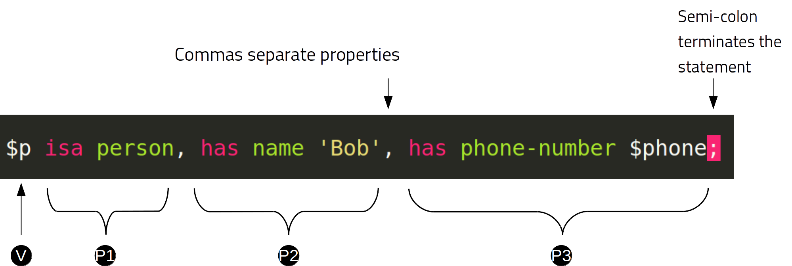
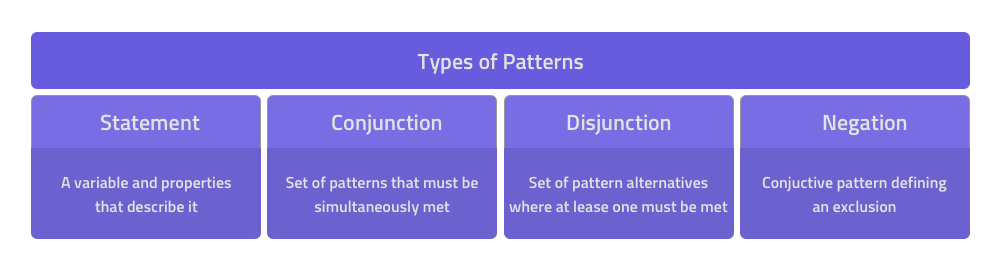
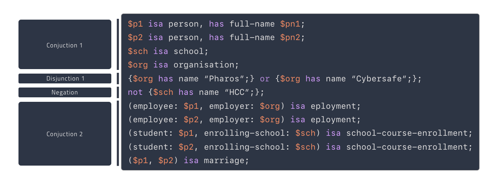

# Matching patterns

TypeDB uses patterns to read and write data in a database, and to read the types in its schema. 
In [TypeQL](../../11-query/00-overview.md), a `match`, `get`, `insert` or `delete` keyword followed by one or more 
patterns is a clause, with one or more clauses forming a query.

These clauses can be combined to create four different types of queries:

- Reading schema and data

  - [Get](05-read.md#get-query) (match-get) query — to read data or schema types.

- Writing data

  - [Insert](04-write.md#insert-query) (match-insert) query — to insert data.
  - [Delete](04-write.md#delete-query) (match-delete) query — to delete data.
  - [Update](04-write.md#update) (match-delete-insert) query — to delete and then insert data.

A `match` clause is optional for Insert queries, but required for Get, Delete and Update queries.

<div class="note">
[Note]
While the `match` clause can be used to read types from a schema, the [define](02-schema.md#define) and 
[undefine](02-schema.md#undefine) clauses must be used to write them.
</div>

<div class="note">
[Important]
If a `match` clause is **not** combined with a `get`, `insert` or `delete` clause, TypeDB will assume it is a get query and 
add an implicit `get` clause to return all variables defined in the `match` clause.
</div>

## Patterns overview

At the core of each query sits a query pattern that describes a subset of data of our particular interest. Here we 
examine the structure of query patterns closer. In general, patterns can be thought of as different arrangements of 
statement collections. TypeQL statements constitute the smallest building blocks of queries. Let’s have a close look 
at the constructs of a typical statement.



- A TypeQL variable is prefixed with a dollar sign `$`. Most statements start with a variable (`V`) providing a 
  reference to a concept or multiple concepts. For more information on variables please see [Variables](#variables) 
  section.

- The variable is followed by a comma-separated list of constraints (`p1`, `p2`, `p3`) describing the concepts the 
  variable refers to. Here we can see that all the concepts that variable `$p` refers to, must be of type `person`. The 
  matched instances are expected to own an attribute of type `full-name` with the value of `Masako Holley`. Additionally, 
  we require the concepts to own an attribute of type `email` with any value. We assign an extra `$email` variable to 
  those emails owned by the `$p`. Consequently, after performing a match on this statement, we should obtain all 
  sets of concepts that satisfy our statement.

- We mark the end of the statement with a semicolon (`;`).

## Variables

Variables can:

- reference both data and schema concepts.
- reference all (zero, one or many) concepts that comply with constraints described in a query patterns.

<div class="note">
[Important]
TypeQL is **declarative**. When writing TypeQL patterns for queries, we simply describe a **set of requirements** for 
the information we would like to match (retrieve to perform [get](05-read.md#get-query)/
[insert](04-write.md#insert-query)/[delete](04-write.md#delete-query)), rather than writing an algorithm of how 
should it be obtained. Once we specify the target information to match, the TypeQL query processor will take care of 
finding an optimal way to retrieve it.
</div>

There is some freedom in forming and composing our statements. For example, as shown below, we could write our single
statement with three constraints:

<!-- test-ignore -->
```typeql
$p isa person, has full-name 'Masako Holley', has email $email;
```

However, we can also use separate patterns to achieve the same result:

<!-- test-ignore -->
```typeql
$p isa person;
$p has full-name 'Masako Holley';
$p has email $email;
```

Lastly, to create a viable query from that statement, we need to add the keyword `match` at the beginning. After that 
it is ready to be sent to the TypeDB server in a data read transaction to a database with an appropriate schema.

<div class="note">
[Note]
If you want to run these and other examples from our documentation, make sure you have completed the 
[Quickstart guide](../01-start/03-quickstart.md) to set up the database with relevant schema and dataset.
</div>

<!-- test-ignore -->
```typeql
match
  $p isa person;
  $p has full-name 'Masako Holley';
  $p has email $email;
```

<div class="note">
[Note]
All indentation and line breaking is optional in TypeQL. You can even try using a single line or a completely random 
indentation for all your queries, but that will make it harder to read them (for humans).
</div>

## Pattern syntax

### Schema

The patterns below can be used to find types and roles defined in a database’s schema.

| **What we are looking for in a schema** | **Pattern syntax**                                      |
|-----------------------------------------|---------------------------------------------------------|
| type                                    | `$<var_label> type <type>`                              |
| subtype                                 | `$<var_label> sub[!] <type>`                            |
| role types in a relation                | `$ <var_label> <relation> relates $<var_label>`         |
| players types in a relation             | `$<var_label> plays <relation>:<role>`                  |
| owners of attribute type                | `$<var_label> owns <attr-type>`                         |
| attribute subtype                       | `$<var> sub[!] <attribute-type> [, value <value-type>]` |

### Data

The patterns below can be used to find data in a database.

| **What we are looking for in data** | **Pattern syntax**                                                                                                             |
|-------------------------------------|--------------------------------------------------------------------------------------------------------------------------------|
| instance                            | `$<var_label> isa[!] <type> [, <has-attribute expression>...]`                                                                 |
| attribute                           | `$<var_label> [isa[!] <attr-type>] (contains "<text>" &#124; like "<regex>" &#124; <value>) [, <has-attribute expression>...]` |
| relation                            | `[$<var_label>] ([<role>:] $<var_label> [, [<role>:] $<var_label>]...) isa <relation-type> [, <has-attribute expression>...]`  |
| has-attribute expression            | `has <attr-type> ($<var_label> &#124; [<comparison-operator>] <value> )`                                                       |
| comparison                          | `$<var_label> [<comparison-operator>] <value>`                                                                                 |
| equal                               | `$<var_label> is $<var_label>`                                                                                                 |

### Comparison operators

The following operators are supported for comparing attribute values: `=`, `!=`, `>`, `>=`, `<` and `<=`.

### Combining patterns



By arranging statements together, we can express more complex pattern scenarios and their corresponding data.

- Statement: simplest possible arrangement — a single basic building block as [explained above](#patterns-overview).
- Conjunction: a set of patterns where to satisfy a match, all patterns must be matched. We use conjunctions by default 
  just by separating the partaking patterns with semicolons `;`.
- Disjunction: a set of patterns where to satisfy a match, at least one pattern must be matched. We form
  disjunctions by enclosing the partaking patterns within curly braces `{}` and joining them together with the 
  keyword `or`.
- Negation: a conjunctive pattern that explicitly defines conditions that must not to be met. We form negations by 
  defining the pattern of interest inside a `not {};` block.

## Match clause

### Schema queries

A `match` clause can be used to find types or roles in a database schema.

#### Type matching

##### All types

Use a `subtype` pattern with type `thing` to find all types defined in a schema.

<!-- test-ignore -->
```typeql
match $t sub thing;
```

<div class="note">
[Warning]
The `thing` built-in type will be deprecated in TypeDB version 3.0. Consider using `entity`, `attribute`, or `relation` 
built-in type instead. To produce the same result as the above example, use the following query:

<!-- test-ignore -->
```typeql
match $t sub $a;
```

</div>

##### Specific type or nested subtype

Use a `subtype` pattern to find a specific type and all of its subtypes.

<!-- test-ignore -->
```typeql
match $o sub object;
```

The above query finds the `object` type and all of its nested subtypes: direct (i.e. `resource` and `resource-collection`) 
and indirect (i.e. `file`, `interface`, `directory` and `application`).

##### Direct subtypes

Use a `subtype` pattern with an exclamation mark (`!`) to find the direct subtypes of a specific type.

<!-- test-ignore -->
```typeql
match $o sub! object;
```

The above query finds all direct subtypes of the `object` type (i.e. `resource` and `resource-collection`).

##### Attribute types (by value type)

Use an `attribute subtype` pattern to find all attribute types with a specific value type.

<!-- test-ignore -->
```typeql
match $a sub attribute, value boolean;
```

The above query finds all attribute types that have a `boolean` value type.

##### Specific type

Use a `type` pattern to find a specific type, excluding any nested subtypes (direct or indirect).

<!-- test-ignore -->
```typeql
match $o type object;
```

The above query returns the `object` type, and none of its nested subtypes (direct or indirect).

##### Players of a specific role

Use a "players types in a relation" pattern to find all types that place a specific role in a specific relation type.

<!-- test-ignore -->
```typeql
match $p plays permission:permitted-subject;
```

The above query finds all types that can play the `permitted-subject` role in the `permission` relation type.

##### Owners of a specific attribute type

Use an `owners of attribute type` pattern to find all types that own a specific attribute type.

<!-- test-ignore -->
```typeql
match $o owns full-name;
```

The above query finds all types that own the `full-name` attribute.

#### Role matching

Use the `role types in a relation` pattern to find all roles in a specific relation.

<!-- test-ignore -->
```typeql
match permission relates $r;
```

The above query finds all the roles defined in the `permission` relation type (`permission:permitted-access` and 
`permission:permitted-subject`).

### Data queries

A `match` clause can be used to find data in a database.

#### All data

Use an `instance` pattern with type `thing` to find all entities, relations and attributes.

<!-- test-ignore -->
```typeql
match $t isa thing;
```

<div class="note">
[Note]
All `entity` types, `relation` types, `attribute` types and `roles` subtype the `thing` type.
</div>

<div class="note">
[Warning]
The `thing` built-in type will be deprecated in TypeDB version 3.0. Consider using `entity`, `attribute`, or `relation` 
built-in type instead. To produce the same result as the above example, use the following query:

<!-- test-ignore -->
```typeql
match $t isa $a; {$a type entity;} or {$a type relation;} or {$a type attribute;};
```

</div>

#### Entity matching

##### Specific type or nested subtype

Use an `instance` pattern to find all entities of a specific entity type (and of all its subtypes).

<div class="note">
[Note]
The `isa` keyword will return all direct and indirect instances (instances of all subtypes of the given type). 
To limit results to only direct instances of the given type use `isa!` instead. See the [example](#specific-type) below.
</div>

<!-- test-ignore -->
```typeql
match $p isa person;
```

The above query returns all entities of the `person` entity and any of its nested subtypes.

##### Specific type

Use an `instance` pattern with an exclamation mark (`!`) to find all entities of a specific type only 
(and none of its nested subtypes).

<!-- test-ignore -->
```typeql
match $u isa! user;
```

The above query finds all `user` entities. It excludes any entities whose type is a nested subtype of `user`, 
so `person` entities would not be included.

##### Owners of a specific attribute type

Use an `instance` pattern with `has-attribute expression` pattern to find all entities that own an attribute of a 
specific type.

<!-- test-ignore -->
```typeql
match $p isa person, has full-name $n;
```

The above query finds all `person` entities that own a `full-name` attribute.

##### Owners of specific attribute types (multiple)

Use an `instance` pattern with multiple `has-attribute expressions` to find all entities that own a specific set of 
attributes, each of a specific type.

<!-- test-ignore -->
```typeql
match $p isa person, has full-name $n, has email $email, has credential $cr;
```

The above query finds all `person` entities that have `full-name`, `email` and `credential` attributes.

##### Owners of a specific attribute (by type and value)

Use an `instance` pattern with `has-attribute expression` pattern to find all entities that own a specific attribute 
with a specific value.

<!-- test-ignore -->
```typeql
match $p isa person, has full-name “Kevin Morrison”;
```

The above query finds all `person` entities that have a `full-name` attribute with a value of “Kevin Morrison”.

##### Owners of a specific attribute (by type and value range)

Use an `instance` pattern with a `has-attribute expression` containing a comparison operator to find all entities that 
have a specific attribute whose value is within a specific range.

<!-- test-ignore -->
```typeql
match $f isa file, has size-kb < 100;
```

However, if the attribute value itself is required in the query response, combine a `has-attribute expression` 
(with no comparison operation) with a separate `comparison` pattern.

<!-- test-ignore -->
```typeql
match
  $f isa file, has size-kb $s;
  $s < 100;
```

#### Relation matching

The pattern used to find relations is different from the one used to find entities because relations have role players 
(entities, other relations and/or attributes).

##### Role players

Use a `relation pattern` witch matched role player to find all relations of a specific type that relate a 
specified instance.

<!-- test-ignore -->
```typeql
match
  $p isa person, has full-name "Kevin Morrison";
  $pe (permitted-subject: $p) isa permission;
```

The above query finds all `person` entities (`$p`) owning a `full-name` attribute with a value of `Kevin Morrison` 
and then it finds all `permission` relations (`$pe`) in which those entities `$p` play the `permitted-subject` role.

##### Owners of a specific attribute (with value)

Use a `relation pattern` with a `has-attribute expression` to find all relations of a specific type and which have a 
specific attribute with a specific value.

<!-- test-ignore -->
```typeql
match $pe (permitted-subject: $p, permitted-access: $ac) isa permission, has validity "True";
```

The above query finds all `permission` relations which have a `validity` attribute whose value is “True”.

##### With no relation variable

The relation variable can be omitted when only the role players are needed.

<!-- test-ignore -->
```typeql
match (permitted-subject: $p, permitted-access: $ac) isa permission;
```

##### With no role names

The names of a relation’s roles can be omitted.

<!-- test-ignore -->
```typeql
match $pe ($p, $ac) isa permission;
```

#### Attribute matching

There are multiple ways to find attributes depending on the use case.

##### Value

Use a variable and an attribute value to find all attributes with a specific value.

<!-- test-ignore -->
```typeql
match $x "Masako Holley";
```

The above query finds all attributes with a value of “Masako Holley”, regardless of their type.

##### Type and value

Combine an `attribute` pattern with a `comparison` pattern to find all attributes of a specific type and with a 
specific value.

<!-- test-ignore -->
```typeql
match
  $n isa full-name;
  $n "Masako Holley";
```

Or use this compact form:

<!-- test-ignore -->
```typeql
match $n "Masako Holley" isa full-name;
```

The above queries finds all `full-name` attributes with a value of `Masako Holley`.

##### Value containing

Use an `attribute` pattern with `contains` keyword to find all attributes whose value contains specific string.

<!-- test-ignore -->
```typeql
match $name contains "Masako";
```

The above query finds all attributes whose value contains the text `Masako`, regardless of their type.

##### Value matching regex

Use an `attribute` pattern with `like` keyword, and a regular expression to find all attributes whose value matches 
the specified regular expression.

<!-- test-ignore -->
```typeql
match $x like "(Masako Holley|Kevin Morrison)";
```

The above query finds all attributes whose value is `Masako Holley` or `Kevin Morrison`, regardless of their type.

#### Equality

Use an `equal` pattern to check if two variables represent the same instance (or instances).
That not only means equality by type and value but literary being the same instance(s) of data in a database. 
It is often helpful in negation.

<!-- test-ignore -->
```typeql
match
  $x isa person;
  $y isa person;
  not { $x is $y; };
```

The above query returns pairs of users that are not the same user.

#### Conjunctions

By default, a collection of patterns in a `match` clause, divided by semicolons, constructs a conjunction of patterns.

<!-- test-ignore -->
```typeql
match
  $p isa person, has full-name "Kevin Morrison";
  $o isa object, has path $o-path;
  $ac(accessed-object: $o) isa access;
  $pe(permitted-subject: $p, permitted-access: $ac) isa permission;
```

The above example uses conjunction to ensure all patterns are matched:

1. Find all `person` entities (`$p`) that have a `full-name` attribute whose value is `Kevin Morrison`.
2. Find all `object` entities (`$o`) that have a `path attribute` (`$o-path`).
3. Find all `access` relations (`$ac`) where `$o` plays the `accessed-object` role.
4. Find all `permission` relations (`$pe`) where `$p` plays the `permitted-subject` role, `$ac` the `permitted-access` role.

The `object` entities are limited to those which play the `accessed-object` role in `access` relations, themselves 
limited to those which play the `permitted-access` role in `permission` relations, themselves limited to those in 
which matching `person` entities plays the `permitted-subject` role.

#### Disjunctions

To include patterns in the form of a disjunction, we need to wrap each pattern in `{}` and place the `or` keyword 
in between them.

<!-- test-ignore -->
```typeql
match
  $p isa person, has full-name $n;
  { $n contains "Masako"; } or { $n contains "Kevin"; };
get $p;
```

The above query uses disjunctions to ensure one of two patterns are matched:

1. Finds all `person` entities that have a `full-name` attribute ($n).
2. Checks to see if `$n` contains the text “Masako” **OR** if `$n` contains the text “Kevin”:
   - If either statement is true, there is a match.
   - If neither statement is true, there is NO match.

The `person` entities are limited to those that have a `full-name` attribute whose value contains `Masako` or `Kevin`.

#### Complex example

To better illustrate the possibilities, we will now look at an example of a more complex pattern.



The pattern is a conjunction of five different pattern types:

1. **Conjunction 1** specifies the variables for two `person` instances, their `full-names`, `action` and `file` that 
   has path `README.md`, specifies their types.
2. **Disjunction** specifies that the actions of interest are either `modify_file` or `view_file`.
3. **Negation 1** specifies that person `$p1` shall not have `full-name` with value of `Masako Holley`.
4. **Negation 2** specifies that person `$p2` shall not have `full-name` with value of `Masako Holley`.
5. **Conjunction 2** defines the pattern requiring the `file` to have `access` with `action` that we specified earlier, 
   and both instances of `person` to have a `permission` to the specified `access`.

In short, the above example finds pairs of people who are both have permission to access the same file 
with a path of `README.md`. The pattern additionally specifies both of them to not have name `Masako Holley` and
the access to be either `modify_file` or `view_file`.

## Query examples

### How to send a query

The easiest way to send a query to the TypeDB server is to use [TypeDB Studio](../../02-clients/01-studio.md) to do so. 
See the [Quickstart guide](../01-start/03-quickstart.md) for instructions on how to do this.

Alternatively, you can use any other [TypeDB Client](../../02-clients/00-clients.md) to handle server connection, 
sessions, transactions, etc.

Among the list of clients, there are TypeDB drivers for different programming languages. Sending a query in one of 
those should be as easy as calling a function. But it might require additional efforts to control session and 
transaction. For example, see how to send a query in some of the most popular programming languages: 
[Java](../../02-clients/03-java.md), 
[Node.js](../../02-clients/05-nodejs.md), 
[Python](../../02-clients/04-python.md).

### Schema

Use the example below to send a `get` query to a database schema (querying for types).

**Get query**

Get all attributes owned by `user` type and any of its subtypes:

<!-- test-ignore -->
```typeql
match
  $u sub user, owns $a; 
get $a;
```

**Insert query** – Use [define](02-schema.md#define) instead.

**Delete query** – Use [undefine](02-schema.md#undefine) instead.

**Update** – Use [define](02-schema.md#define) and [undefine](02-schema.md#undefine) instead.

### Data

Use the examples below to try different types of queries to a database data (querying for data instances).

#### Get query

To read data from a database use get query.

<!-- test-ignore -->
```typeql
match 
  $u isa user, has credential $cr; 
get $cr;
```

The above example matches all instances of the `user` type and all its subtypes that have `credential` attribute. 
Get clause filters the result so only the `credential` attributes will be returned.

For more information on how to read data please see the [Reading data](05-read.md) page.

#### Insert query

To write new data to a database use insert query.

<!-- test-ignore -->
```typeql
match
  $p isa person, has full-name "Bob";
insert
  $p has email "bob@vaticle.com";
```

The above example matches all instances of the `person` type and all its subtypes that have `full-name` attribute 
with value of `Bob`. Then it inserts the data that all matched instances of `person` have `email` attribute with 
value of `bob@vaticle.com`.

For more information on how to write data please see the [Writing data](04-write.md#insert-query) page.

#### Delete query

To delete data from a database use delete query.

<!-- test-ignore -->
```typeql
match
  $p isa person, has email "bob@vaticle.com";
delete
  $p isa person;
```

The above example matches all instances of the `person` type and all its subtypes that have `email` attribute 
with value of `bob@vaticle.com`. Then it deletes the matched instances of `person`.

For more information on how to delete data please see the [Writing data](04-write.md#delete-query) page.

#### Update

To update data in a database we use a combined `match-delete-insert` query.

<!-- test-ignore -->
```typeql
match
  $p isa person, has full-name "Masako Holley", has email $email;
delete
  $p has $email;
insert
  $p has email "m.holley@vaticle.com";
```

The above example matches all instances of the `person` type and all its subtypes that have `full-name` attribute 
with value of `Masako Holley` and have `email` attribute (assigning the `$email` variable). It proceeds with 
deleting the ownership of any `email` attributes that the matched `person` instances have. Finally, it inserts 
the data that all matched instances of `person` have `email` attribute with value of `m.holley@vaticle.com`.

For more information on how to update data please see the [Writing data](04-write.md#update) page.

### Complex query example

A `match` clause can only address data or types that already exist in a database.

The **declarative** nature of the TypeQL means that if one of the `match` clause patterns can’t find any instances 
in a database that might or might not lead to an empty response.

For example:

<!-- test-ignore -->
```typeql
match
  $p isa person, has full-name $p-fname;
  $o isa object, has path $o-path;
  $a isa action, has action-name "view_file";
  $ac(accessed-object: $o, valid-action: $a) isa access;
  $pe(permitted-subject: $p, permitted-access: $ac) isa permission;
  $p-fname = "Kevin Morrison";
```

The above query does the following:
1. Finds all `person` entities (`$p`) that have `full-name` attribute with the value of `$p-fname` variable, that is 
   later set as string `Kevin Morrison`. There is actually only one such person in the **IAM database** by default.
2. Finds all `object` entities (`$o`) that have `path` attribute (`$o-path`). The value of the attribute is not 
   limited but assigned a variable `$o-path`.
3. Finds all `action` entities (`$a`) that have `action-name` attribute with the value of `view_file`. There is 
   actually only one such action in the **IAM database** by default.
4. Finds all `access` relations (`$ac`) that relate `$o` (as `accessed-object` role) to `$a` (as `valid-action` role).
5. Finds all `permission` relations (`$pe`) that relate `$p` (as `permitted-subject` role) to `$ac` (as `permitted-access` role).
6. States that `$p-fname` variable equals by value to a string `Kevin Morrison`.

This `match` clause can be a part of any query. For example, by appending a `delete $pe isa permission` statement 
we can create a delete query that deletes all access to action `view_file` on all objects with any path attribute 
owned for a person `Kevin Morrison`.

If we change the value of the `$p-fname` variable to something non-existent in the database we are querying then 
`match` clause will return no results. Appending the same `delete` statement to such `match` clause would create a 
useless query that can’t delete anything because can’t find any data to delete.

<div class="note">
[Note]
By default, without any other keywords added after a `match` clause, it performs as a get query and returns all 
variables, mentioned in the `match` clause.
</div>


[//]: # (One particular instance)

[//]: # ()
[//]: # (TypeDB assigns an auto-generated id to each data instance. Although this id is generated by TypeDB solely for internal use, it is indeed possible to find an instance with its TypeDB internal id. To do so, we use the `iid` keyword followed by the iid assigned to the instance by TypeDB.)

[//]: # ()
[//]: # (match $x iid 0x966e80018000000000000000;)

[//]: # ()
[//]: # (NOTE: You shouldn’t use this feature in your business logic.)


