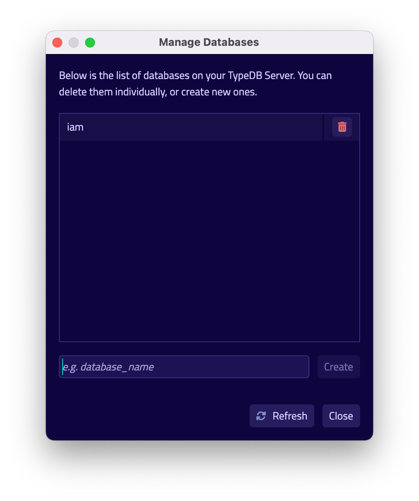

TypeDB Studio is an IDE specifically designed to work with 
[TypeQL](../../11-query/00-overview.md) query language and TypeDB databases.

It has unique set of functions and abilities to help with development using TypeDB:

- Friendly graphical user interface (GUI) to design schemas and queries for TypeDB databases.
- Syntax highlighting for TypeQL.
- Connection to TypeDB servers, including handling transactions.
- Types explorer for a TypeDB database.
- Query execution, including schema and data, read and write transactions.
- Local query validation with constraints of an actual database schema before sending the query to server.
- Graph visualization for query responses.

## Get TypeDB Studio

TypeDB Studio is available for the following OS:

- Linux
- MacOS
- Windows

### Requirements

To use TypeDB Studio you need to download, install and launch a compatible version of TypeDB first. So, the only 
requirement is:

- A [TypeDB Server](../01-start/02-installation.md) instance running locally on the default port (1729).

<div class="note">
[Note]
This guide is written for local TypeDB server on default port, but we can use any local TypeDB instance to proceed as long as 
we use compatible TypeDB Studio version and adjust settings accordingly.
</div>

<div class="note">
[Important]
We recommend using the latest versions of TypeDB and TypeDB Studio. In case you need to use some other version of TypeDB 
make sure to use compatible version of TypeDB Studio. Usually this means that versions of both products should be equal.
</div>

### Download & Install

You can use a package manager to download and install TypeDB Studio. For example, on MacOS you can use Homebrew:

<!---
Add tabs for every OS and commands.
-->

```
brew tap vaticle/tap
brew install --cask vaticle/tap/typedb-studio
```

Alternatively you can visit the [Download Centre](https://vaticle.com/download#typedb-studio) to download and install 
the compatible release of Studio.

### Launch TypeDB Studio

You can start TypeDB Studio as any other GUI application on your OS.

## Connect to TypeDB Server

At the top right-hand corner click `Connect to TypeDB`.


Fill in the address of your TypeDB Server. By default, it's: `localhost:1729`. Click the Connect button.


Once you've connected successfully, the connection manager will reflect this in with the status field in
the bottom left-hand corner. Additionally, the address will be reflected in the top right-hand corner of Studio.

## Create a Database


Go to the databases manager by clicking on the database icon in the top left-hand corner.


Enter your database name then hit 'Create'.



Now you've successfully created a database. You can select it by clicking the dropdown menu titled 'Select Databases' 
immediately right of the databases icon.

## Create a Project Folder

Studio will store queries you save in a project folder on you local machine, so you don't need to rewrite all your 
queries each time you open Studio. To open a project folder click on the open folder icon left of the database icon or 
on the Open Project button in the Project section on the left (under the database icon).


## Write a Schema

Create a new file by clicking the '+' icon in the section right of the project view.


Copy your schema code (in TypeQL) and paste it into the Studios text editor.


Make sure your session and transaction types are set to `schema` and `write` respectively.
These can be found to the right of the database selector.
Then click the green play button to run the queries.


Finally, commit your transaction by clicking the green tick.


You will get a notification pop-up with a transaction confirmation or an error.

## Reading a Schema

To read a complete database schema you need to make sure session and transaction types are set to `schema` and `read` 
respectively first.

Paste the following request to the text editor:

```typeql
match $s sub thing;
```

Then click the green play button to run the query.

As a result of a `read` transaction you will get an error or a response.

An error will be shown as a pop-up and the output block under the text editor will show detailed information on what 
went wrong.

In case of a successful `read` transaction you will get a response. If the response contains ConceptMap (returns some 
data) you will see a Graph tab with visualization of the response data.

## Write & Read Data

The process is exactly the same as with writing and reading a schema. 
Just make sure session and transaction types are set to `data` and `write` / `read` respectively first.
