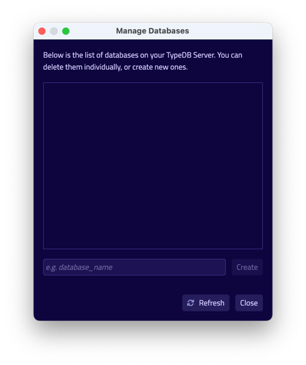
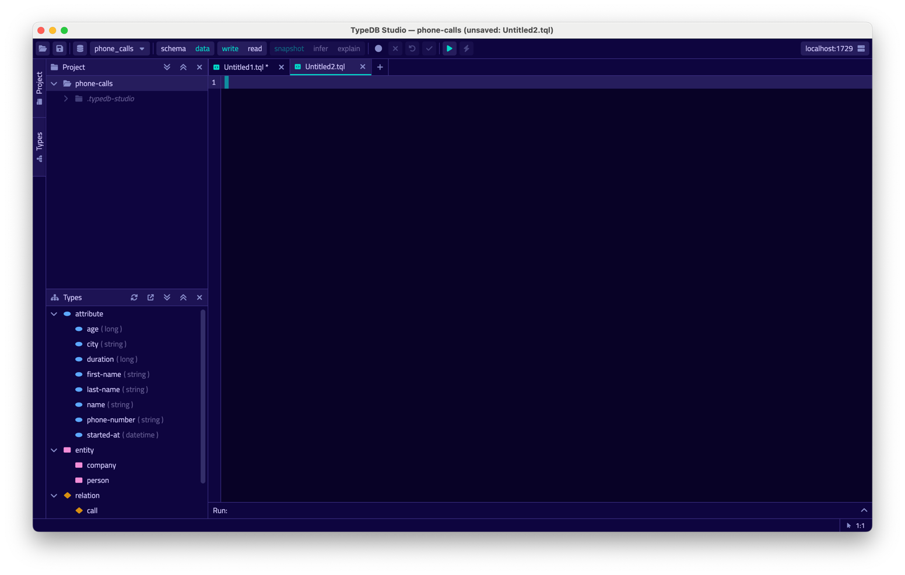
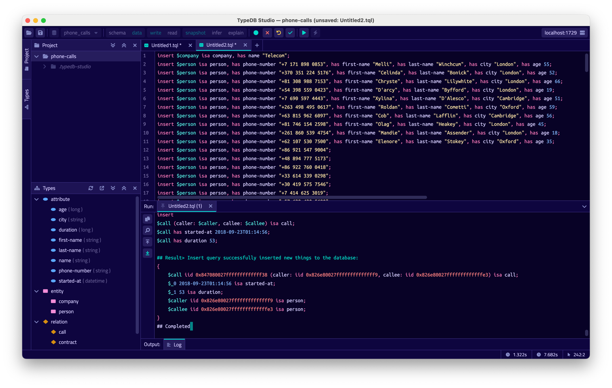

TypeDB Studio is our own special IDE to work with 
[TypeQL](../../11-query/00-overview.md) query language and TypeDB databases.

It has unique set of functions and abilities to help with development using TypeDB:

- Friendly graphical user interface (GUI) to design schemas and queries for TypeDB databases.
- Syntax highlighting for TypeQL.
- Connect to TypeDB server, including handling transactions.
- Explore types of a TypeDB database.
- Execute queries, including schema and data transactions.
- Validate queries locally within constraints of an actual database schema before sending them to server.
- Visualise query responses as graphs.

## Requirements
- A [TypeDB Server](../01-start/02-installation.md) instance running locally on the default port (1729).

## Run TypeDB Studio

You need to download, install and launch a compatible version of TypeDB Studio. We recommend using the latest versions 
of TypeDB and TypeDB Studio. In case you need to use some other version of TypeDB make sure to use compatible version
of TypeDB Studio. Usually this means that versions of both products should be equal.

### Download & Install

TypeDB Studio is available for the following OS:
- Linux
- MacOS
- Windows

You can use packet manager to download and install TypeDB Studio. For example, on MacOS you can use Homebrew:

```
brew tap vaticle/tap
brew install --cask vaticle/tap/typedb-studio
```

Alternatively you can visit the [Download Centre](https://vaticle.com/download#typedb-studio) to download and install 
the compatible release of Studio.

### Launch TypeDB Studio

You can start TypeDB Studio as any other GUI application on your OS.

## Connecting to TypeDB Server

Once you launch TypeDB Studio you will see a graphical user interface. At the top right-hand corner and click 
`Connect to TypeDB`.

<div class="slideshow">

[slide:start]
[header:start][header:end]
[body:start][body:end]
[footer:start]This is the connection manager. Fill in the address of your TypeDB Server. By default, it's: 
`localhost:1729`.[footer:end]
[slide:end]

[slide:start]
[body:start][body:end]
[footer:start]Once you've connected successfully, the connection manager will reflect this in with the status field in the bottom left-hand corner. Additionally, the address will be reflected in the top right-hand corner of Studio.[footer:end]
[slide:end]
</div>

Now Studio is connected to your TypeDB instance.

## Creating a Database
Now Studio and TypeDB Server are connected, but you haven't set up any databases. To do so, go to the databases icon in 
the top left-hand corner.

<div class="slideshow">

[slide:start]
[header:start][header:end]
[body:start][body:end]
[footer:start]This icon opens the database manager.[footer:end]
[slide:end]

[slide:start]
[body:start][body:end]
[footer:start]This is the database manager. Enter your database name then hit 'Create'. For the purposes of this example, we will use the name `iam`.[footer:end]
[slide:end]

[slide:start]
[body:start][body:end]
[footer:start]Now you've successfully created a database named `iam`![footer:end]
[slide:end]
</div>

Select the database you just created by clicking the dropdown menu titled 'Select Databases' immediately right of the databases icon.

## Creating a Project Folder
We've created a database, so now would be a good time to set up a project folder. Studio will store queries you save here, so you don't need to rewrite all your queries each time you open Studio.

<div class="slideshow">

[slide:start]
[header:start][header:end]
[body:start][body:end]
[footer:start]This is the project view. Open a local folder where you'd like to store your queries and other data associated with this project.[footer:end]
[slide:end]

[slide:start]
[header:start][header:end]
[body:start][body:end]
[footer:start]Your newly created folder should look something like this.[footer:end]
[slide:end]

</div>

## Writing a Schema
You may have noticed that now you have connected to TypeDB and opened a project folder, Studio has sprung to life. Now we need to write a 'schema' to our database.
You can learn more about what a schema is and how to write one [here](/docs/schema/overview). In short, a schema is a description of the structure of your data and how various entities relate to each other.

For now, we've got a pre-made schema for you to use. We've also got data and queries for this later, so keep following along if you want to get the full experience from this guide.

```typeql
define

```

This schema represents a simple subset of the data a telecom provider might store.
- A `call` is a phone call that took place over a duration and started at a given time, relating the person who called and the person who picked up (caller and callee respectively.)
- A `company` is a provider in a contract, and has a name.
- A `contract` is a relation between a customer and a provider.
- A `mutual-caller` is a relation between two callees who share a common caller.
- A `person` is a person. They have a first and last name, a phone number, a city they reside in and an age. They 'play' a caller, a callee or a customer in our schema.

Now, lets write this schema to our newly created database.

<div class="slideshow">

[slide:start]
[body:start][body:end]
[footer:start]Create a new file by clicking the '+' icon in the section right of the project view. It should look like this.[footer:end]
[slide:end]

[slide:start]
[body:start][body:end]
[footer:start]Copy the above schema and paste it into this file.[footer:end]
[slide:end]

[slide:start]
[body:start][body:end]
[footer:start]Now, make sure your session and transaction types are set to `schema` and `write` respectively. These can be found to the right of the database selector. Then click the green play button to run the query.[footer:end]
[slide:end]

[slide:start]
[body:start][body:end]
[footer:start]Finally, commit your transaction by clicking the green tick.[footer:end]
[slide:end]

</div>

You'll notice the types view has updated to reflect our schema write once committed.

## Inserting Data

Here's some sample data that complies with our schema.

```typeql

```
<div class="slideshow">

[slide:start]
[body:start][body:end]
[footer:start]Create another file by clicking the '+' icon again.[footer:end]
[slide:end]

[slide:start]
[body:start][body:end]
[footer:start]Copy the above queries into this new file.[footer:end]
[slide:end]

[slide:start]
[body:start][body:end]
[footer:start]Ensure your session and transaction settings are set to `data` and `write` respectively, then click the green play button.[footer:end]
[slide:end]

[slide:start]
[body:start][body:end]
[footer:start]Finally, commit your transaction by clicking the green tick.[footer:end]
[slide:end]

</div>

## Query the Data

Everything is in place, and we can start writing queries for our data. Open one final file and set your session and transaction types to `data` and `read` respectively.


Get a quick visualisation of the data with the following query:
```typeql
match $x isa thing;
``` 
This query gets every attribute, entity and relation.