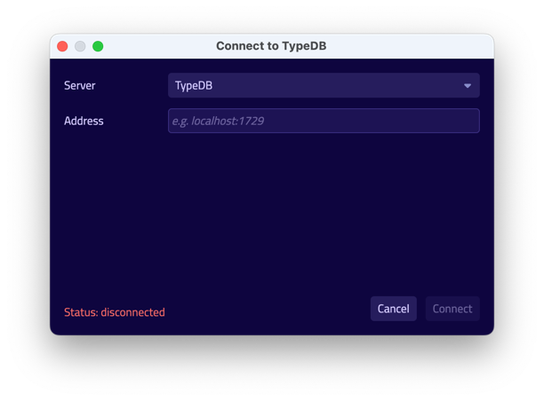
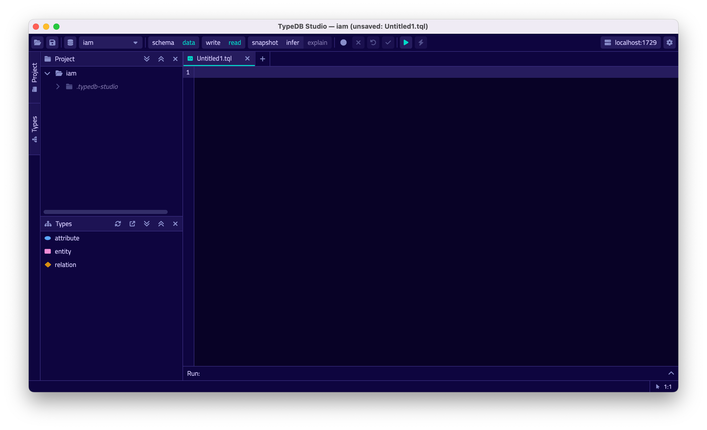
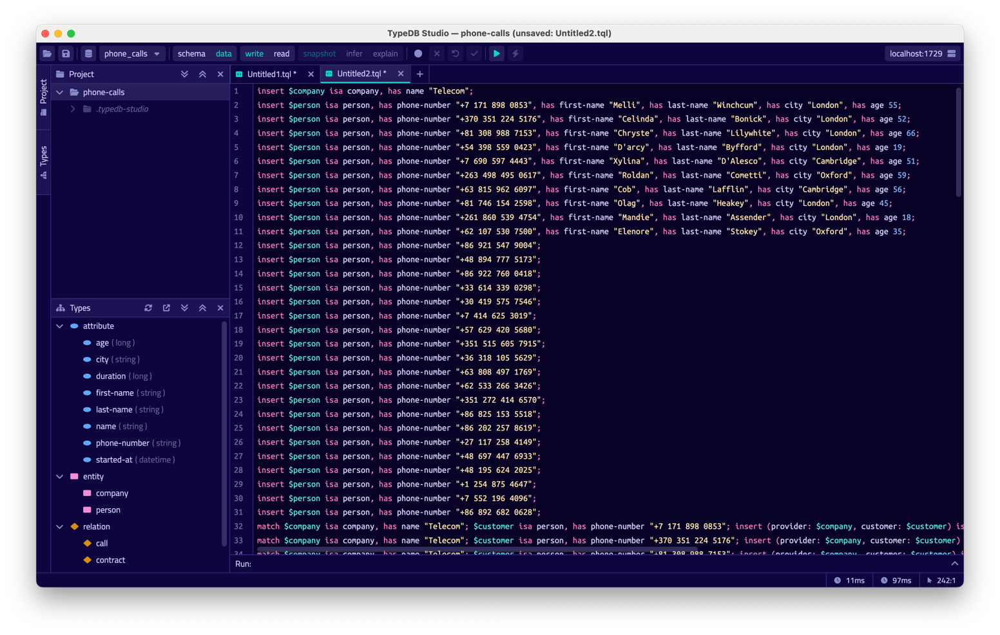
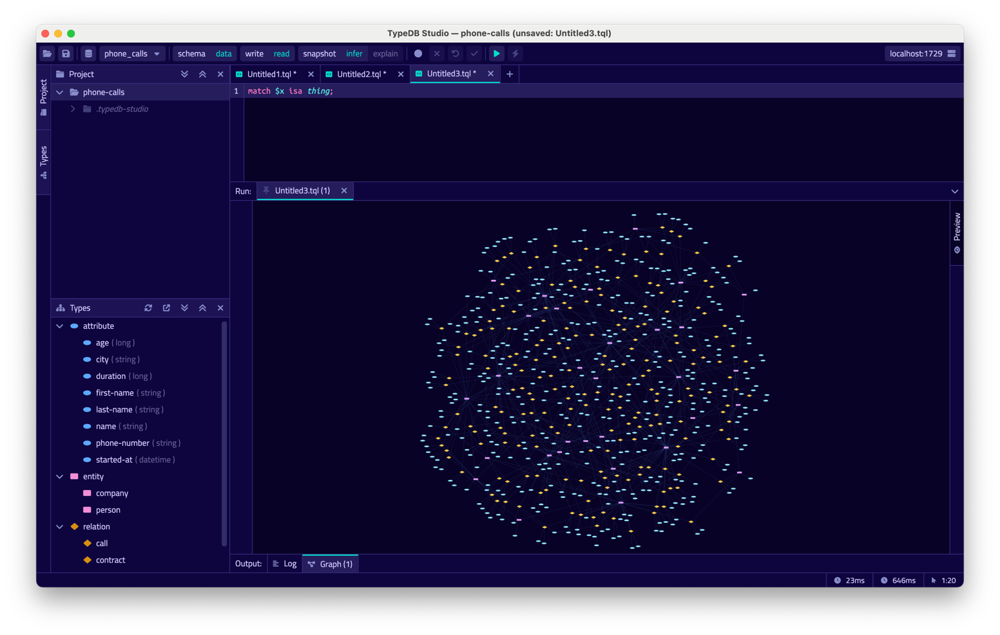

TypeDB Studio is an IDE specifically designed to work with 
[TypeQL](../../11-query/00-overview.md) query language and TypeDB databases.

It has unique set of functions and abilities to help with development using TypeDB:

- Friendly graphical user interface (GUI) to design schemas and queries for TypeDB databases.
- Syntax highlighting for TypeQL.
- Connection to TypeDB servers, including handling transactions.
- Types explorer for a TypeDB database.
- Query execution, including schema and data, read and write transactions.
- Local query validation with constraints of an actual database schema before sending the query to server.
- Graph visualization for query responses.

## Quickstart guide

To try TypeDB Studio we recommend completing this brief guide below.

## Requirements

Before trying TypeDB Studio we need to make sure we have TypeDB installed and launched. So, the only requirement to 
proceed with this guide is:

- A [TypeDB Server](../01-start/02-installation.md) instance running locally on the default port (1729).

<div class="note">
[Note]
This guide is written for local TypeDB server on default port, but we can use any local TypeDB instance to proceed as long as 
we use compatible TypeDB Studio version and adjust settings accordingly.
</div>

## Run TypeDB Studio

You need to download, install and launch a compatible version of TypeDB Studio. 

<div class="note">
[Important]
We recommend using the latest versions of TypeDB and TypeDB Studio. In case you need to use some other version of TypeDB 
make sure to use compatible version of TypeDB Studio. Usually this means that versions of both products should be equal.
</div>

### Download & Install

TypeDB Studio is available for the following OS:

- Linux
- MacOS
- Windows

You can use a package manager to download and install TypeDB Studio. For example, on MacOS you can use Homebrew:

<!---
Add tabs for every OS and commands.
-->

```
brew tap vaticle/tap
brew install --cask vaticle/tap/typedb-studio
```

Alternatively you can visit the [Download Centre](https://vaticle.com/download#typedb-studio) to download and install 
the compatible release of Studio.

### Launch TypeDB Studio

You can start TypeDB Studio as any other GUI application on your OS.

## Connect to TypeDB Server

Once you launch TypeDB Studio you will see a graphical user interface. At the top right-hand corner and click 
`Connect to TypeDB`.

<div class="slideshow">

[slide:start]
[header:start][header:end]
[body:start][body:end]
[footer:start]This is the connection manager. Fill in the address of your TypeDB Server. By default, it's: 
`localhost:1729`.[footer:end]
[slide:end]

[slide:start]
[body:start][body:end]
[footer:start]Once you've connected successfully, the connection manager will reflect this in with the status field in 
the bottom left-hand corner. Additionally, the address will be reflected in the top right-hand corner of Studio.
[footer:end]
[slide:end]
</div>

Now Studio is connected to your TypeDB instance.

## Create a Database

Now Studio and TypeDB server are connected, but you haven't set up any databases. To do so, go to the databases manager
by clicking on the database icon in the top left-hand corner.

<div class="slideshow">

[slide:start]
[header:start][header:end]
[body:start][body:end]
[footer:start]This icon opens the database manager.[footer:end]
[slide:end]

[slide:start]
[body:start][body:end]
[footer:start]This is the database manager. Enter your database name then hit 'Create'. For the purposes of this 
example, we will use the name `iam`.[footer:end]
[slide:end]

[slide:start]
[body:start][body:end]
[footer:start]Now you've successfully created a database named `iam`![footer:end]
[slide:end]
</div>

Now that we have `iam` database, select it by clicking the dropdown menu titled 'Select Databases' immediately right of 
the databases icon.

## Create a Project Folder

Studio will store queries you save in a project folder on you local machine, so you don't need to rewrite all your 
queries each time you open Studio. To open a project folder click on the Open Project button in the 
Project section on the left (under the database icon).

<div class="slideshow">

[slide:start]
[header:start][header:end]
[body:start][body:end]
[footer:start]This is the project view. Open a local folder where you'd like to store your queries and other data 
associated with this project.[footer:end]
[slide:end]

[slide:start]
[header:start][header:end]
[body:start][body:end]
[footer:start]Your newly created folder should look something like this.[footer:end]
[slide:end]

</div>

## Write a Schema

After connecting to a database and opening a project folder Studio now ready for work.

Let's start with writing a [schema](../../09-schema/00-overview.md) to our database.
In short, a schema is a model of your data describing constraints on the data and how various concepts relate to each 
other.

For the purpose of this quickstart guide, we've got a pre-made schema to use. We've also got a miniature dataset and 
queries for this schema.

<!---
#todo Update all requests below with the latest IAM schema and data
-->

```typeql
define

subject sub entity,
    abstract,
    owns credentials,
    plays group-membership:group-member,
    plays group-ownership:group-owner,
    plays object-ownership:object-owner,
    plays permission:permitted-subject;

user sub subject;

user-group sub subject,
    plays group-membership:user-group,
    plays group-ownership:owned-group;

object sub entity,
    abstract,
    plays collection-membership:collection-member,
    plays object-ownership:owned-object,
    plays access:accessed-object;

resource sub object;

resource-collection sub object,
    plays collection-membership:resource-collection;

action sub entity,
    abstract,
    plays set-membership:set-member,
    plays access:valid-action;

operation sub action;

operation-set sub action,
    plays set-membership:operation-set;

group-membership sub relation,
    relates user-group,
    relates group-member;

collection-membership sub relation,
    relates resource-collection,
    relates collection-member;

set-membership sub relation,
    relates operation-set,
    relates set-member;

group-ownership sub relation,
    relates owned-group,
    relates group-owner;

object-ownership sub relation,
    relates owned-object,
    relates object-owner;

access sub relation,
    relates accessed-object,
    relates valid-action,
    plays permission:permitted-access;

permission sub relation,
    relates permitted-subject,
    relates permitted-access;

credentials sub attribute,
    value string;
```

This schema represents a simple subset of the data an Identity and Access Management (IAM) solution might store.

<!--- 
#todo Add a link to the IAM example description/repository
-->

- A `subject` is an entity that tries to access some object.
- An `object` is an entity that can be accessed.
- A `user` is a subtype of a `subject`.
- A `resource` is a subtype of an `object`.
- A `credentials` is an attribute of with a string value that stores authentication data.
- An `access` is a relation that connects an accessed object and a valid action.

Now, lets write this schema to our newly created database. Follow the instructions on the slides below to do so.

<div class="slideshow">

[slide:start]
[body:start][body:end]
[footer:start]Create a new file by clicking the '+' icon in the section right of the project view. It should look like this.[footer:end]
[slide:end]

[slide:start]
[body:start][body:end]
[footer:start]Copy the above schema and paste it into this file.[footer:end]
[slide:end]

[slide:start]
[body:start][body:end]
[footer:start]Now, make sure your session and transaction types are set to `schema` and `write` respectively. 
These can be found to the right of the database selector. 
Then click the green play button to run the queries.[footer:end]
[slide:end]

[slide:start]
[body:start][body:end]
[footer:start]Finally, commit your transaction by clicking the green tick.[footer:end]
[slide:end]

</div>

The types view has updated to reflect our schema write.

## Insert Data

The following TypeQL request will insert some sample data that complies with our schema.

<!-- test-ignore -->
```typeql

```

Follow the steps illustrated below to execute request and load sample data.

<div class="slideshow">

[slide:start]
[body:start][body:end]
[footer:start]Create another file by clicking the '+' icon again.[footer:end]
[slide:end]

[slide:start]
[body:start][body:end]
[footer:start]Copy the above queries into this new file.[footer:end]
[slide:end]

[slide:start]
[body:start][body:end]
[footer:start]Ensure your session and transaction settings are set to `data` and `write` respectively, then click the 
green play button.[footer:end]
[slide:end]

[slide:start]
[body:start][body:end]
[footer:start]Finally, commit your transaction by clicking the green tick.[footer:end]
[slide:end]

</div>

## Read the Data

We can start writing queries to read our data. Open one final file and set your session and transaction types to `data` 
and `read` respectively.



Get a quick visualisation of the data with the following query:

```typeql
match $x isa thing;
``` 

This query should return all instances of every attribute, entity and relation.
