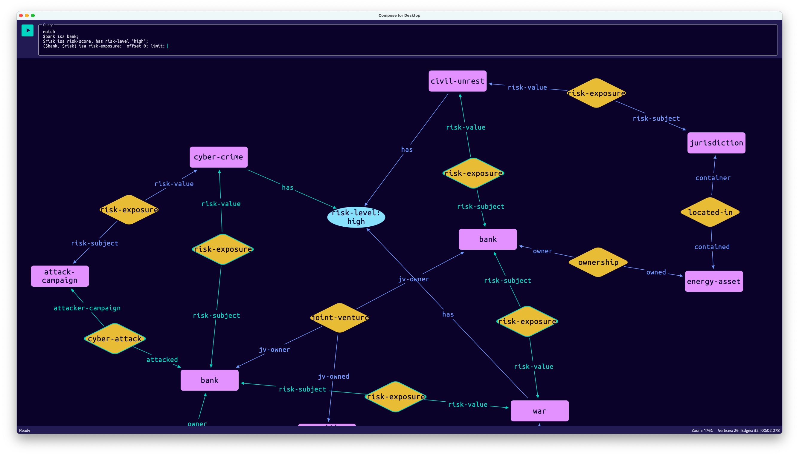

### An Overview

In this Quickstart guide, we go through step-by-step process of creating and interacting with a TypeDB database 
representing a Identity and Access Management solution. This exact database with both 
[schema](../../09-schema/00-overview.md) and [data](../../11-query/00-overview.md) is used in the most 
examples of TypeDB documentation. That's why by completing this quickstart guide you will prepare an environment to 
successfully execute most requests explored later on in this documentation.

In the process, we learn about the constructs of the TypeDB Schema, visualise the knowledge graph, perform read and 
write queries and explore the power of automated reasoning and analytics with TypeDB.

<!--- #todo Consider rewriting -->

### First step: Run TypeDB
To create and interact with TypeDV databases we need working TypeDB server. 

1. [Install TypeDB](02-install-and-run.md#system-requirements) 
2. [Start the TypeDB Server](02-install-and-run.md#start-the-typedb-server).


### Second step: Prepare The Schema
A [TypeDB schema](../09-schema/00-overview.md) is the blueprint of a TypeDB knowledge graph. The code presented below is only a part of the schema for the social network knowledge graph that represents the concepts of `friendship`.

```typeql
define

title sub attribute, value string;

event-date sub attribute, abstract, value datetime;
approved-date sub event-date;

## an abstract relation, only to be subtyped by other relations
request sub relation,
  abstract,
  owns approved-date,
  relates subject,
  relates requester,
  relates respondent;

friendship sub relation,
    relates friend,
    plays friend-request:friendship,
    plays friendship-list:listed;

## an example of subtyping in TypeDB
friend-request sub request,
    relates friendship as subject,
    relates friend-requester as requester,
    relates friend-respondent as respondent;

friendship-list sub relation,
    owns title,
    relates owner,
    relates listed;

person sub entity,
    plays friendship:friend,
    plays friend-request:friend-requester,
    plays friend-request:friend-respondent,
    plays friendship-list:owner;
```

The code you see above is TypeQL. TypeQL is the language for the TypeDB knowledge graph. Whether it's through the [TypeDB Console](../02-console/01-console.md), [Studio](../07-studio/00-overview.md) or one of the [TypeDB Clients](../03-client-api/00-overview.md), TypeDB accepts instructions and provides answers only in its own language - TypeQL.

### Download and Load the Complete Schema
First, download the [`social-network/schema.tql`](../files/social-network/schema.tql){:target="_blank"} which contains the complete schema for the social network knowledge graph. Now, we need to load this schema into a [database](../06-management/01-database.md). To do this, we use the [TypeDB Console](../02-console/01-console.md).

<div class="note">
[Note]
Feel free to study the content of `social-network-schema.tql`. The definitions have been divided into multiple sections for better understandability, with each section containing the (commented-out) query for visualisation of the corresponding section in [TypeDB Studio](../07-studio/00-overview.md).
</div>

<div class="note">
[Note]
On write windows-style paths, you'll have to use `\\` to escape the backslash characters. With Unix-style paths you can use single forwardslash `/`.
</div>

While in the unzipped directory of the TypeDB distribution, via terminal, open the console:

```
./typedb console
```
Create a database called `social_network`:
```
> database create social_network
```
Open a schema write transaction:
```
> transaction social_network schema write
```
Inside that transaction, load the schema from file using the `source` command:
```
social_network::schema::write> source path-to-the-social-network/schema.tql
social_network::schema::write> commit
```

### Load the Dataset
Download the [`social-network/data.tql`](../files/social-network/data.tql){:target="_blank"} and load it into the same database. In the already opened console, create a data write transaction to the `social_network` database and use the `source` command to load the data from file:

```
> transaction social_network data write
social_network::data::write> source path-to-the-social-network/data.tql
social_network::data::write> commit
```

As you may have guessed, `social-network-data.tql` contains a series of [TypeQL insert queries](../11-query/03-insert-query.md) that creates data instances in the social network knowledge graph. In a real-world application, it's more likely that we have the data in some data formats such as CSV, JSON or XML. In such a case, we need to use one of the [TypeDB Clients](../03-client-api/00-overview.md) to [migrate](../08-examples/00-overview.md#a-hands-on-walkthrough) the dataset into the target database.

### Query the Knowledge Graph
Now that we have some data in our social network knowledge graph, we can go ahead and retrieve some information from it. To do this, we can use the [TypeDB Console](../02-console/01-console.md), [TypeDB Studio](../07-studio/00-overview.md) or one of the [TypeDB Clients](../03-client-api/00-overview.md).

Let's see an example of running [TypeQL get queries](../11-query/02-get-query.md) via each of these interfaces.

#### Retrieve the full name of everyone who has travelled to a location using [TypeDB Console](../02-console/01-console.md)

Using the open console, open a read transaction for the `social_network` database:
```
> transaction social_network data read
social_network::data::read>
```

At the prompt, write this query to retrieve the desired results.
```typeql
match $tra (traveler: $per) isa travel; (located: $tra, location: $loc) isa localisation; $loc has name "French Lick"; $per has full-name $fn; get $fn;
```

The result contains the following answers:
<!-- test-ignore -->
```typeql
{$fn "Solomon Tran" isa full-name;}
{$fn "Julie Hutchinson" isa full-name;}
{$fn "Miriam Morton" isa full-name;}
```

#### Visualise all risky banks 

<div class = "note">
[Warning]
TypeDB Workbase is currently in the process of being replaced with a more performant application: TypeDB Studio, which is available as an alpha release on [github](https://github.com/vaticle/typedb-studio/releases)
</div>



#### Retrieve all employments using [Client Java](../02-clients/03-java.md)

<!-- test-example SocialNetworkQuickstartQuery.java -->
```java
package com.vaticle.doc.examples;

import com.vaticle.typedb.client.TypeDB;
import com.vaticle.typedb.client.api.TypeDBClient;
import com.vaticle.typedb.client.api.TypeDBOptions;
import com.vaticle.typedb.client.api.TypeDBSession;
import com.vaticle.typedb.client.api.TypeDBTransaction;

import static com.vaticle.typeql.lang.TypeQL.*;

import com.vaticle.typeql.lang.query.*;
import com.vaticle.typedb.client.api.answer.ConceptMap;

import java.util.stream.Stream;

import java.util.List;

public class SocialNetworkQuickstartQuery {
    public static void main(String[] args) {
        TypeDBClient client = TypeDB.coreClient("localhost:1729");
        try (TypeDBSession session = client.session("social_network", TypeDBSession.Type.DATA)) {
            
            TypeDBOptions options = TypeDBOptions.core().infer(true); // enable reasoning
            try (TypeDBTransaction transaction = session.transaction(TypeDBTransaction.Type.WRITE, options)) {
                
                TypeQLMatch query = match(
                        var().rel("employer", var("org")).rel("employee", var("per")).isa("employment"),
                        var("per").has("full-name", var("per-fn")),
                        var("org").has("name", var("org-n"))
                );

                Stream<ConceptMap> answers = transaction.query().match(query);

                answers.forEach(answer -> {
                    System.out.println(answer.get("per-fn").asAttribute().getValue());
                    System.out.println(answer.get("org-n").asAttribute().getValue());
                    System.out.println(" - - - - - - - - ");
                });
            }
        }
    }
}
```

#### Lazily retrieve all photos and videos that have been found funny by women using [Client Python](../02-clients/04-python.md)

<!-- test-example social_network_quickstart_query.py -->
```python
from typedb.client import *

with TypeDB.core_client("localhost:1729") as client:
    with client.session("social_network", SessionType.DATA) as session:
      options = TypeDBOptions.core()
      options.infer = True # enable reasoning
      with session.transaction(TransactionType.READ, options) as transaction:
        query = '''
          match
            $pos isa media;
            $fun isa emotion;
            $fun "funny";
            $per has gender "female";
            (emotion: $fun, to: $pos, by: $per) isa reaction;
          get $pos, $fun;
        '''
        answer_iterator = transaction.query().match(query)
        for answer in answer_iterator:
          print(answer.get("pos").get_iid())
          print(answer.get("fun").get_value()) # get attribute value
```

#### Retrieve the average salary of all employees at Pharos using [Client Node.js](../02-clients/05-nodejs.md)

<!-- test-example socialNetworkQuickstartQuery.js -->
```javascript
const { TypeDB, SessionType, TransactionType, TypeDBOptions } = require("typedb-client");

async function getAverageSalaryAt (orgName) {
    const client = TypeDB.coreClient("localhost:1729");
	const session = await client.session("social_network", SessionType.DATA);
	const options = TypeDBOptions.core({infer: true}); // enable reasoning
	const transaction = await session.transaction(TransactionType.READ, options)
	const query = `
		match
			$org isa organisation, has name "${orgName}";
			($org, $per) isa employment, has salary $sal;
		get $sal; mean $sal;
	`
	const answer = await transaction.query.matchAggregate(query);
	if (answer.isNumber()) {
		console.log(answer.asNumber());
	} else {
	  console.log(`No one works at ${orgName}`);
	}

	await transaction.close();
	await session.close();
	client.close();
}

getAverageSalaryAt("Pharos"); // asynchronous call
```

### Insert and Delete Data
We can create and delete instances of data in a TypeDB knowledge graph by running [insert](../11-query/03-insert-query.md) and [delete](../11-query/04-delete-query.md) queries. Let's give them a try using the Console.

#### Insert an instance of type person
<!-- ignore-test -->
```typeql
insert $per isa person, has full-name "Johny Jimbly Joe", has gender "male", has email "johnyjj@gmail.com";
```

<!-- test-ignore -->
```typeql
commit
```

<div class="note">
[Important]
Any manipulation made in the schema or the data instances, is not persisted to the original database until we run the `commit` command.
</div>

#### Associate the newly added person with a nickname

```typeql
match $per isa person, has email "johnyjj@gmail.com"; insert $per has nickname "JJJ";
```
<!-- test-ignore -->
```typeql
commit
```

#### Delete the newly added person
<!-- ignore-test -->
```typeql
match $per isa person, has full-name "Johny Jimbly Joe"; delete $per isa person;
```

<!-- test-ignore -->
```typeql
commit
```

### Store Knowledge
TypeDB is capable of reasoning over data to infer new knowledge, commonly known as automated reasoning or inference. Inference in a TypeDB knowledge graph is made via pre-defined [Rules](../09-schema/03-rules.md).

Let's look at some simple examples of how TypeDB uses rules for reasoning over explicit data. Let's say we want to find out what content a particular person has permission to view. 

```typeql
define
  
content-permission sub relation,
  relates grantee,
  relates content;
```

As you can see in the `social_network_data.tql` file, no instance of `content-permission` was ever inserted. It's only through rules that allows TypeDB to infer this knowledge and know the answer to the following question at query time (if running in Console, make sure you start with transaction with `--infer true` to enable reasoning!)

```typeql
match 
$p isa person, has email "julie.hutchinson@gmail.com"; 
(grantee: $p, content: $c)isa content-permission; 
get $c;
```

Have a look at the `social_network_data.tql` file, there are a number of rules written to give permission to view content, based on how or where the content was shared. 

Let's look at another rule:

```typeql
define

mutual-friendship sub relation,
  relates mutual-friend,
  relates one-degree-friend;

rule people-have-mutual-friends:
  when {
	($p1, $p2) isa friendship;
	($p2, $p3) isa friendship;
  } then {
	(one-degree-friend: $p1, one-degree-friend: $p3, mutual-friend: $p2) isa mutual-friendship;
  };
```

We can query for people who have friends in common, like so (again with reasoning enabled):

```typeql
match 
$p isa person, has email "julie.hutchinson@gmail.com"; 
$p2 isa person, has full-name $name; 
(one-degree-friend: $p2, mutual-friend: $p)isa mutual-friendship; 
get $p2, $name;
```

Similar to the first rule, the answer we're asking for here, was never injected into the knowledge graph and is being inferred at query time by TypeDB.

### Where Next?

- [TypeDB Schema](../09-schema/00-overview.md)
- [TypeQL Queries](../11-query/00-overview.md)
- [Studio](../07-studio/00-overview.md)
- [Examples](../08-examples/00-overview.md)
