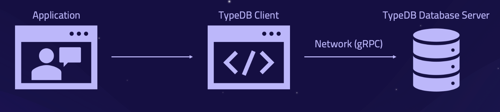

# Clients

## Overview

A TypeDB Client is meant to be used for the purpose of managing databases and performing operations (querying) with a
database schema and data on the TypeDB server. A client uses `gRPC` to interact with a TypeDB server and provides 
more user-friendly interface: API, GUI or CLI.

Here is a list of existing TypeDB Clients:

- Software tools:
  - [TypeDB Studio](01-studio.md)
  - [TypeDB Console](02-console.md)
- [TypeDB drivers](#typedb-drivers) — libraries to connect to a TypeDB server with an application. There are:
  - Native drivers:
    - [Java](java/01-java-overview.md)
    - [Python](python/01-python-overview.md)
    - [Node.js](node-js/01-node-js-overview.md)
  - [Community drivers](06-other-languages.md)

If you can't find a suitable client, consider [creating a new client](07-new-client.md).

## Architecture

All TypeDB Clients share a common architecture. Simply put, the main components of any TypeDB Client are the classes 
and methods to establish a connection to a TypeDB database, execute queries and parse responses.

Specific information on the classes and methods provided in the API reference, but the syntax may vary for different 
programming languages.

## Software tools

To work with TypeDB databases we can use one of the standalone software tools:

1. [TypeDB Studio](01-studio.md) (GUI).
2. [TypeDB Console](02-console.md) (CLI).

Both tools are complete software products that can be used to connect to TypeDB and interact with it.

TypeDB Studio is mostly remarkable for its friendly graphical user interface, types explorer and graph visualization.
TypeDB Console is a powerful CLI tool often used to manage TypeDB server and its databases.

## TypeDB drivers

If we are developing our own application (software) we can use one of the libraries (or drivers) that are available for 
some popular programming languages.

The following TypeDB Drivers are officially supported and actively maintained by the Vaticle. They 
usually support latest TypeDB features and receive continuous bug fixes and improvements.

- [Java](java/01-java-overview.md)
- [Node.js](node-js/01-node-js-overview.md)
- [Python](python/01-python-overview.md)

We also have some community projects for [other Languages](06-other-languages.md)

### What is a TypeDB driver?

A TypeDB Driver, is a library used to connect to a TypeDB server. If we are building an 
application that uses a TypeDB database, we would need a TypeDB driver at our application layer to handle the
database operations.

### Async Queries

Invoking a TypeQL query sends the query to the TypeDB server, where it will be completed in the background. Local 
processing can take place while waiting for responses to be received. Take advantage of these asynchronous queries to 
mask network round-trip costs and increases your throughput. For example, if you are performing 10 match queries in a 
transaction, it's best to send them all to the server _before_ iterating over any of their answers.

Queries that return answers, such as [get](../0001-typedb/02-dev/05-read.md#get-query), return them as Futures, Streams 
or Iterators depending on the Client used and the query type. These can then be awaited, or iterated, to retrieve the 
answers as they are computed.

[Important]
When a transaction is committed or closed, all of its asynchronous queries are completed first.

### Investigating Answers

Depending on the type of the query carried out by a transaction, we retrieve different forms of answers. For more 
information see the [Response interpretation](../0001-typedb/02-dev/07-response.md) page. 

Quite often in a response form a TypeDB server we can get a ConceptMap that maps variables used in a query to 
instances of data from a database. To process this information we use methods, provided by a TypeDB Driver. 
The API provided by Driver can be used to obtain more information about the retrieved concept and its 
surroundings. 
For more information see the [API](../0001-typedb/02-dev/08-api.md) page in TypeDB Documentation.
For exact syntax reference see the reference pages related to:

- [Java](java/04-java-api-ref.md)
- [Node.js](node-js/04-node-js-api-ref.md)
- [Python](python/04-python-api-ref.md)

For examples see the API pages related to:

- [Java](java/01-java-overview.md)
- [Node.js](node-js/01-node-js-overview.md)
- [Python](python/01-python-overview.md)
