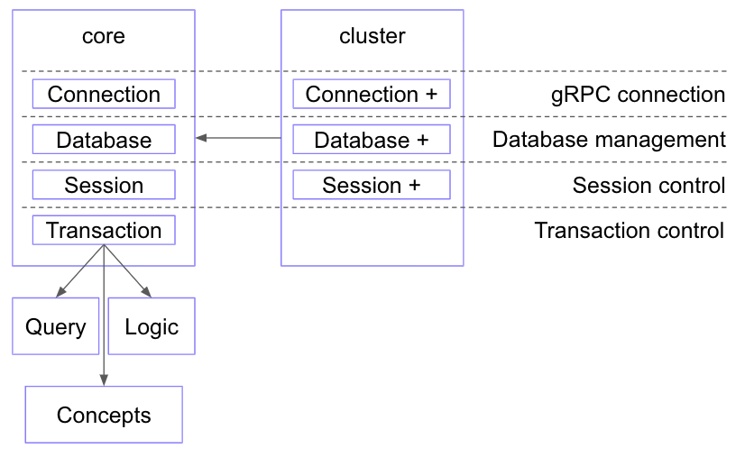

# Clients

## Overview

A TypeDB Client is meant to be used for the purpose of managing databases and performing operations (querying) with a
database schema and data on the TypeDB server. A client uses `gRPC` to interact with a TypeDB server and provides 
more user-friendly interface: API, GUI or CLI.

Here is a list of existing **TypeDB Clients**:

- Software tools:
  - [TypeDB Studio](01-studio.md)
  - [TypeDB Console](02-console.md)
- [TypeDB drivers](#typedb-drivers) — libraries to connect to a TypeDB server with an application. There are:
  - Native drivers:
    - [Java](java/01-java-overview.md)
    - [Python](python/01-python-overview.md)
    - [Node.js](node-js/01-node-js-overview.md)
  - [Community drivers](06-other-languages.md)

If you can't find a suitable client, consider [creating a new client](07-new-client.md).

## Architecture of a TypeDB Client

All TypeDB Clients share a common architecture. A TypeDB Client needs a `gRPC` client library to communicate with 
the server.

A TypeDB Client provides a human or machine interface and interacts with TypeDB server, but also it performs query 
validation, local processing, load-balancing (TypeDB Cloud only) and authentication (TypeDB Cloud only).

The following schema is the dependency graph of a typical TypeDB Client.

Simply put, the main components of any TypeDB Client are the classes 
and methods to establish a connection to a TypeDB database, execute queries and parse responses. Software tools 
take care of internal processes and provide a user-friendly interface for user (graphical or console). Language 
specific libraries (or so called TypeDB Drivers) provide more direct access to the classes and methods via TypeDB API.

Specific information on the classes and methods provided in the API reference, but the syntax may vary for different 
programming languages:

- [Java Driver API reference](java/04-java-api-ref.md),
- [Python Driver API reference](python/04-python-api-ref.md),
- [Node.js Driver API reference](node-js/04-node-js-api-ref.md).

## Software tools

To work with TypeDB databases we can use one of the standalone software tools:

1. [TypeDB Studio](01-studio.md) (GUI).
2. [TypeDB Console](02-console.md) (CLI).

Both tools are complete software products that can be used to connect to TypeDB and interact with it. They take care 
of connection, session and transaction management, automate query sending and process the query response.

TypeDB Studio is mostly remarkable for its friendly graphical user interface (**GUI**), types explorer, type browser, 
and graph visualization. For more information on how to use it see the [TypeDB Studio](01-studio.md) page or the
[Quickstart guide](../0001-typedb/01-start/03-quickstart.md).

TypeDB Console is a powerful command line (**CLI**) tool often used to manage TypeDB server and its databases. For more 
information on how to use it see the [TypeDB Console](02-console.md) page.

## TypeDB Drivers

A TypeDB Driver, is a library used to connect to a TypeDB server. If we are building an 
application that uses a TypeDB database, we would need a TypeDB driver at our application layer to handle the
database operations. TypeDB Drivers are available for some of the most popular programming languages.

The following TypeDB Drivers are officially supported and actively maintained by the Vaticle. They 
usually support latest TypeDB features and receive continuous bug fixes and improvements.

- [Java](java/01-java-overview.md)
- [Node.js](node-js/01-node-js-overview.md)
- [Python](python/01-python-overview.md)
- [Rust](https://github.com/vaticle/typedb-client-rust) (Under development)

We also have some community projects for [other Languages](06-other-languages.md) and provide support for creating your 
own [new client](07-new-client.md).
