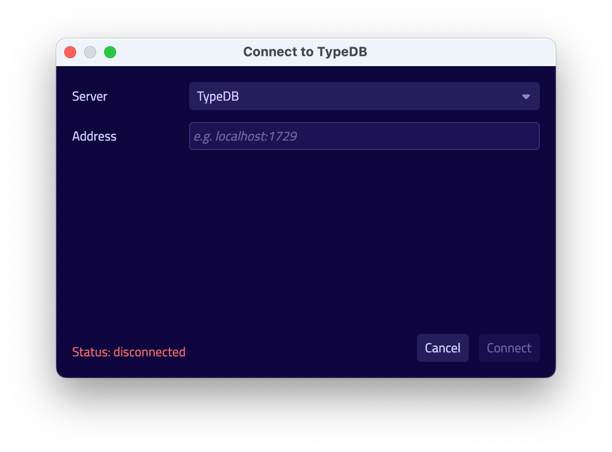
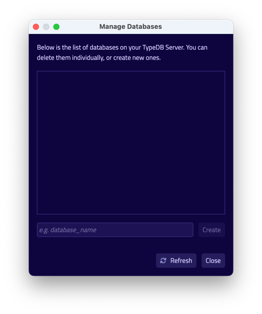
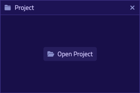
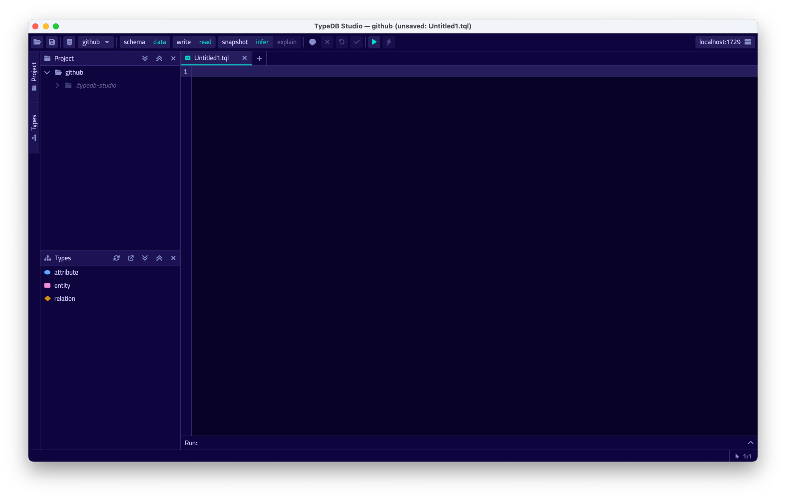
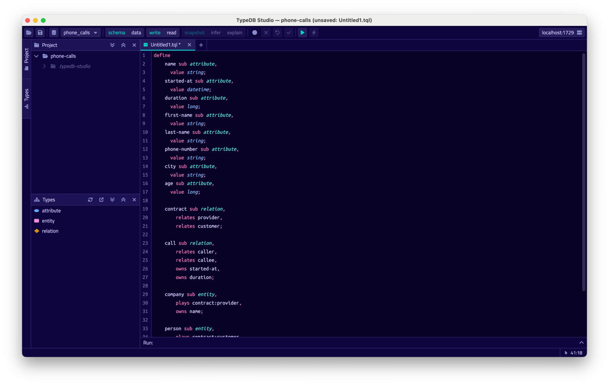
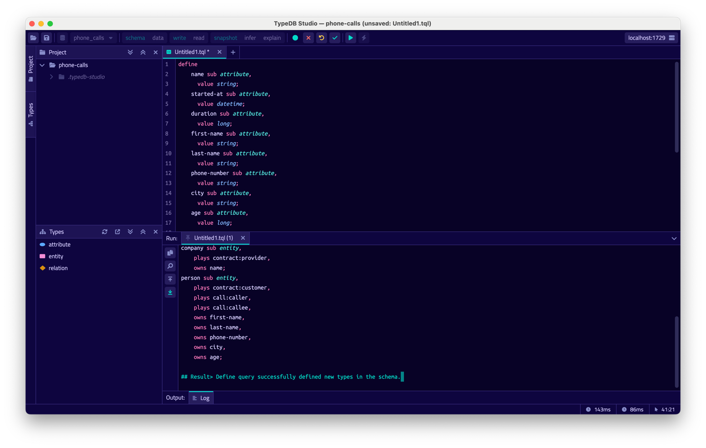
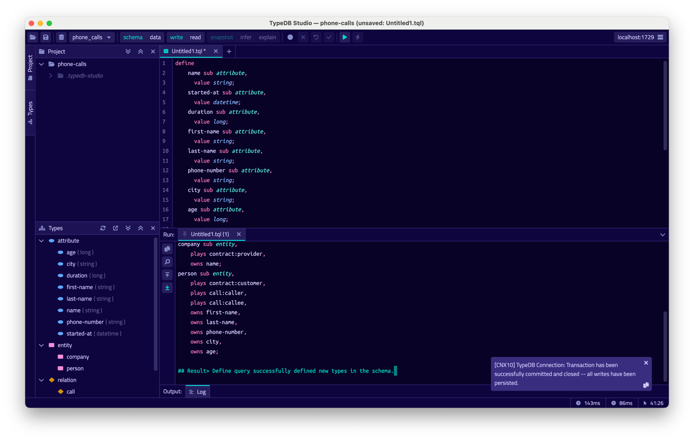
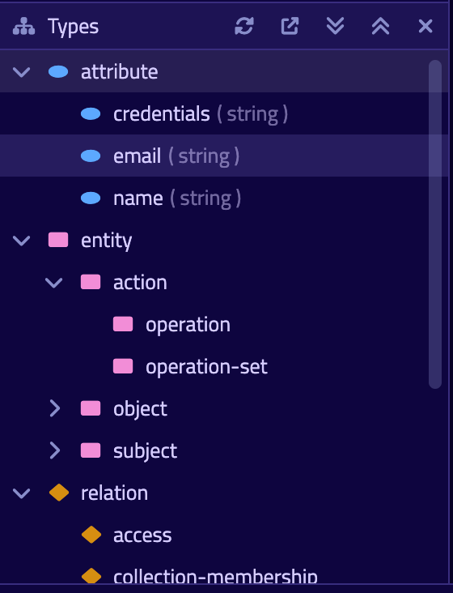
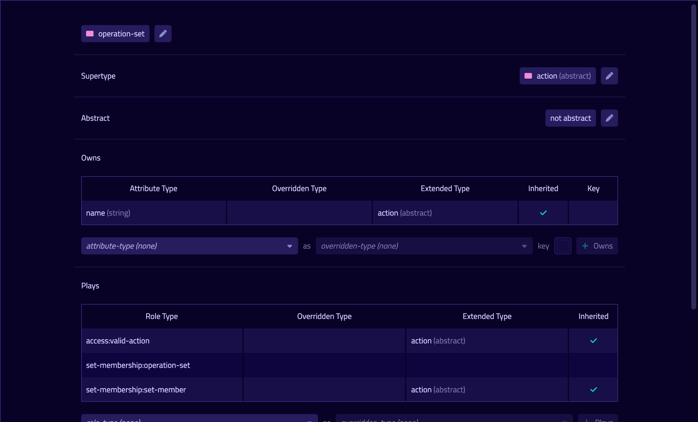

TypeDB Studio is an IDE specifically designed to work with 
[TypeQL](../11-query/00-overview.md) query language and TypeDB databases.

It has unique set of functions and abilities to help with development using TypeDB:

- Friendly graphical user interface (GUI) to design schemas and queries for TypeDB databases.
- Syntax highlighting for TypeQL.
- Connection to TypeDB servers, including handling transactions.
- Types explorer for a TypeDB database.
- Query execution, including schema and data, read and write transactions.
- Local query validation with constraints of an actual database schema before sending the query to server.
- Graph visualization for query responses.

## Get TypeDB Studio

TypeDB Studio is available for the following OS:

- Linux
- MacOS
- Windows

### Requirements

To use TypeDB Studio we need to download, install and launch a compatible version of TypeDB first. So, the only 
requirement is:

- Working [TypeDB Server](../0001-typedb/01-start/02-installation.md) instance.

<div class="note">
[Note]
The default TypeDB settings are to run server on `localhost` with port number `1729`.
</div>

<div class="note">
[Important]
We recommend using the latest versions of TypeDB and TypeDB Studio. In case we need to use some other version of TypeDB 
make sure to use compatible version of TypeDB Studio. Usually this means that versions of both products should be equal.
</div>

### Download & Install

We can use a package manager to download and install TypeDB Studio. For example, on MacOS we can use Homebrew:

<!---
Add tabs for every OS and commands.
-->

```
brew tap vaticle/tap
brew install --cask vaticle/tap/typedb-studio
```

Alternatively we can visit the [Download Centre](https://vaticle.com/download#typedb-studio) to download and install 
the compatible release of TypeDB Studio.

### Launch TypeDB Studio

We can start TypeDB Studio as any other GUI application on the OS we are using.

## Connect to TypeDB Server

At the top right-hand corner click `Connect to TypeDB`.



Fill in the address of the TypeDB Server. By default, it's: `localhost:1729`. Click the Connect button.


Once we've connected successfully, the connection manager will reflect this in with the status field in
the bottom left-hand corner. Additionally, the address will be reflected in the top right-hand corner of Studio.

## Disconnect from TypeDB server

At the top right-hand corner click `Connect to TypeDB`.


## Create a Database


Go to the databases manager by clicking on the database icon in the top left-hand corner.



Enter the name for the new database and hit 'Create'.


Now we've successfully created a database. We can select it by clicking the dropdown menu titled 'Select Databases' 
immediately right of the databases icon.

## Create a Project Folder

Studio will store queries we save in a project folder on local machine, so we don't need to rewrite all queries each 
time we open Studio. To open a project folder click on the open folder icon left of the database icon or 
on the Open Project button in the Project section on the left (under the database icon).



<div class="note">
[Note]
If the Project section is not showing try hitting Project button on the left edge of the TypeDB Studio screen.
</div>

## Write a Schema

Create a new file by clicking the '+' icon in the section right of the project view.



Write or insert the schema code (in TypeQL) into the Studios text editor.



Make sure session and transaction types are set to `schema` and `write` respectively.
These can be found to the right of the database selector.
Then click the green play button to run the queries.



Finally, commit the transaction by clicking the green tick.



As a result we get a notification pop-up with a transaction confirmation or an error.

## Reading a Schema

To read a complete database schema we need to make sure session and transaction types are set to `schema` and `read` 
respectively first.

Insert the following request to the text editor:

```typeql
match $s sub thing;
```

Then click the green play button to run the query.

As a result of a `read` transaction we will get an error or a response.

Errors shown as a pop-up and the output block under the text editor shows detailed information on what went wrong.

In case of a successful `read` transaction we get a response. If the response contains ConceptMap (returns some 
data), we will see a Graph tab with visualization of the response data.

## Write & Read Data

The process is exactly the same as with writing and reading a schema. 
Just make sure session and transaction types are set to `data` and `write` / `read` respectively first.

## Types explorer

Under the Project section that shows the Project folder TypeDB has Types section that shows all types of the schema of 
the current database. 

<div class="note">
[Note]
If the Types section is not showing try hitting Types button on the left edge of the TypeDB Studio screen.
</div>

All types are divided in three top level types:

- Attribute
- Entity
- Relation



All types displayed in the exact structure they were created (subtypes inside their parents). We can easily collapse or 
expand all the types in the structure tree by clicking the associated buttons on the top of the Types Section with 
arrows pointing down or up respectively.

### Export schema

We can export schema of the database by clicking Export Schema button (second in row from left to right) on the top of 
the Types section. It creates a new tab with inserted TypeQL code that creates the exact schema that is in the current 
database.

### Types browser

By double-clicking any type we can open the type browser window that shows all information about the selected type and
allows us to easily edit the type. 



We can rename the type, change its supertype, abstract property, see all the related types (owned attributes or owners, 
played roles and subtypes). By clicking on one of the related types we can see all information about it.

### Rename a type

We can rename a type in two ways:

- Open the type browser window by double-clicking on the type. At the very top click on the pencil icon immediately 
  right from the type name. Edit the name in the Label field and press Rename button to finalize.
- Right-click on the type in the types explorer list. Click on the Rename Type option. Edit the name in the Label field 
  and press Rename button to finalize.

<div class="note">
[Note]
Renaming a type in any of this two ways will update the relevant type references in the schema and will not lead to 
loosing existing data. All existing instances of the type will be available under the new types name.
</div>

### Delete a type

We can delete a type in two ways:

- Open the type browser window by double-clicking on the type. At the very bottom click on the delete button and press 
  Confirm button. Commit the transaction with the green tick at the top of the Studio window.
- Right-click on the type in the types explorer list. Click on the Delete option and press Confirm button. Commit the 
  transaction with the green tick at the top of the Studio window.

<div class="note">
[Note]
In some cases Delete option and button can be disabled. That means there are some conditions that prevent us from 
deleting this type. For example, we can't 
[delete a type that has a subtype](../../09-schema/01-concepts.md#undefine-a-supertype). See 
[more](../../09-schema/01-concepts.md#undefine) on these conditions.
</div>
