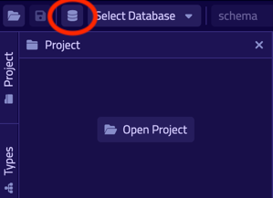

# TypeDB Studio

TypeDB Studio is an IDE specifically designed to work with 
[TypeQL]() query language and TypeDB databases.

It has unique set of functions and abilities to help with development using TypeDB:

- Friendly graphical user interface (GUI) to design schemas and queries for TypeDB databases.
- Syntax highlighting for TypeQL.
- Connection to TypeDB servers, including handling transactions.
- Types explorer for a TypeDB database.
- Query execution, including schema and data, read and write transactions.
- Local query validation with constraints of an actual database schema before sending the query to server.
- Graph visualization for query responses.

## Installation

### Requirements

TypeDB Studio do not require any additional packages to be installed prior the installation, but it needs a TypeDB 
server to perform most it's functions. We can use either remote or local TypeDB server.

<div class="note">
[Note]
The default TypeDB settings are to run server listening for `localhost` connections with port number `1729`.
</div>

<div class="note">
[Important]
We recommend using the latest version of TypeDB server and a [compatible](#version-compatibility) version of TypeDB 
Studio. 
</div>

### Download & install

Download TypeDB distributive/package for your particular OS from the 
[Download page](https://vaticle.com/download#typedb-studio. 

Follow proper installation procedure of the OS in use.

<div class="note">
[Important]
Make sure to grant access for installation wizard to install TypeDB Studio in case any security prompts will appear.
</div>

<div class="note">
[Note]
For **macOS** TypeDB Studio can be installed via homebrew:

```
brew tap vaticle/tap
brew install --cask vaticle/tap/typedb-studio
```
</div>

## Prepare for work

Right after starting TypeDB Studio we can see its main window as it is shown below.


To use most of TypeDB Studio functions we need to connect to a TypeDB server and 
choose a project directory.

The main blocks of the graphical interface (GUI) are (marked with respected numbers on the image above):

1. Projects panel
2. Types browser
3. Text-editor panel
4. Toolbar

### Connect to TypeDB server

At the top right-hand corner click the [**Connect to TypeDB**] button. It will open a windows with the same name and 
the connection settings as shown below.


Fill in the address of the TypeDB Server. By default, it's: `localhost:1729`. Click the [**Connect**] button.


Once we've connected successfully, the connection manager will reflect this in with the green status field in
the bottom left-hand corner, as shown above. You can close the window with connection. 

<div class="note">
[Note]
When Studio connected to a TypeDB server it will display the server address at the top right corner instead of the 
label of the `Connect to TypeDB` button.
</div>

### Disconnect from TypeDB server

At the top right-hand corner click the button with the server address in it.

In the `Connect to TypeDB` window click on the [**Disconnect**] button.

### Create a database

Make sure TypeDB Studio is connected to a TypeDB server and click on the [**Manage Databases**] button (with a 
database icon) as shown below.



Enter the name for the new database at the text field at the bottom of the `Manage Databases` window and hit 
[**Create**].


Our database appeared at the list of databases. Now we can close the `Manage Databases` window by clicking the 
[**Close**] button.


### Select active database

TypeDB Studio lets us work with one database at a time. Thus, to perform any query we need to choose a database 
first. 

We can select it by clicking the dropdown menu at the toolbar titled [**database (none)**] or with a name of 
previously selected database. It is the only dropdown menu in the toolbar and is located immediately right of the 
databases icon.

<div class="note">
[Note]
If the dropdown menu isn't active it usually means that we didn't connect to a server yet.
</div>

After selecting the database to work with from a list of all databases on the server Studio connected with, we will 
see types hierarchy of the selected database in the Types browser (bottom left of the screen). For example, for any 
empty database (with no schema defined) it will show only the base types:

- attribute
- entity
- relation

### Open a project folder

Studio stores queries we save on a local machine in a project folder, so we don't need to rewrite all queries each 
time we open Studio. To select a project folder click on the open folder icon left of the database icon or 
on the [**Open Project**] button in the `Projects` panel on the left (under the database icon).


<div class="note">
[Note]
If the Project panel is not displayed try clicking Project button on the left edge of the TypeDB Studio window.
</div>

## Basic operations

### File operations

#### Create a new file

To create a new file we use the button with the plus (`+`) icon. It is located at the top of the Text-editor panel 
under the Toolbar. It's horizontal position adjusted for the number of tabs opened in the text-editor — the 
button with plus icon will always stay at the right end of the tabs of the Text-editor.

depends on the contents of the Text-editor tabs. If there are no tabs 
opened in the Text-editor panel, then the button will be on the left side (top left corner of the Text-editor panel).


See image below.


### Write & Read a Schema


Create a new file by clicking the `+` icon in the section right of the project view.


Write or insert the schema code (in TypeQL) into the Studios text editor.


Make sure session and transaction types are set to `schema` and `write` respectively.
These can be found to the right of the database selector.
Then click the green play button to run the queries.


Finally, commit the transaction by clicking the green tick.


As a result we get a notification pop-up with a transaction confirmation or an error.

### Reading a Schema

To read a complete database schema we need to make sure session and transaction types are set to `schema` and `read` 
respectively first.

Insert the following request to the text editor:

```typeql
match $s sub thing;
```

Then click the green play button to run the query.

As a result of a `read` transaction we will get an error or a response.

Errors shown as a pop-up and the output block under the text editor shows detailed information on what went wrong.

In case of a successful `read` transaction we get a response. If the response contains ConceptMap (returns some 
data), we will see a Graph tab with visualization of the response data.

### Write & Read Data

The process is exactly the same as with writing and reading a schema. 
Just make sure session and transaction types are set to `data` and `write` / `read` respectively first.

## Types explorer capabilities

Under the Project section that shows the Project folder TypeDB has Types section that shows all types of the schema of 
the current database. 

<div class="note">
[Note]
If the Types panel is not displayed try hitting Types button on the left edge of the TypeDB Studio window.
</div>

All types are divided in three top level types:

- Attribute
- Entity
- Relation


All types displayed in the exact structure they were created (subtypes inside their parents). We can easily collapse or 
expand all the types in the structure tree by clicking the associated buttons on the top of the Types Section with 
arrows pointing down or up respectively.

### Export schema

We can export schema of the database by clicking Export Schema button (second in row from left to right) on the top of 
the Types section. It creates a new tab with inserted TypeQL code that creates the exact schema that is in the current 
database.

<div class="note">
[Warning]
The export schema button doesn't include rules into its output. That will be fixed in some of the next versions of 
the TypeDB Studio. 
</div>


### Types browser

By double-clicking any type we can open the type browser window that shows all information about the selected type and
allows us to easily edit the type. 


We can rename the type, change its supertype, abstract property, see all the related types (owned attributes or owners, 
played roles and subtypes). By clicking on one of the related types we can see all information about it.

### Rename a type

We can rename a type in two ways:

- Open the type browser window by double-clicking on the type. At the very top click on the pencil icon immediately 
  right from the type name. Edit the name in the Label field and press Rename button to finalize.
- Right-click on the type in the types explorer list. Click on the Rename Type option. Edit the name in the Label field 
  and press Rename button to finalize.

<div class="note">
[Note]
Renaming a type in any of this two ways will update the relevant type references in the schema and will not lead to 
loosing existing data. All existing instances of the type will be available under the new types name.
</div>

### Delete a type

We can delete a type in two ways:

- Open the type browser window by double-clicking on the type. At the very bottom click on the delete button and press 
  Confirm button. Commit the transaction with the green tick at the top of the Studio window.
- Right-click on the type in the types explorer list. Click on the Delete option and press Confirm button. Commit the 
  transaction with the green tick at the top of the Studio window.

<div class="note">
[Note]
In some cases Delete option and button can be disabled. That means there are some conditions that prevent us from 
deleting this type. For example, we can't 
[delete a type that has a subtype](../../09-schema/01-concepts.md#undefine-a-supertype). See 
[more](../../09-schema/01-concepts.md#undefine) on these conditions.
</div>

## Version Compatibility

|      Studio      |      TypeDB      |  TypeDB Cluster  |
|:----------------:|:----------------:|:----------------:|
| 2.14.1 to 2.14.2 | 2.14.1 to 2.14.2 |      2.14.1      |
|      2.11.0      |      2.11.1      | 2.11.1 to 2.11.2 |
