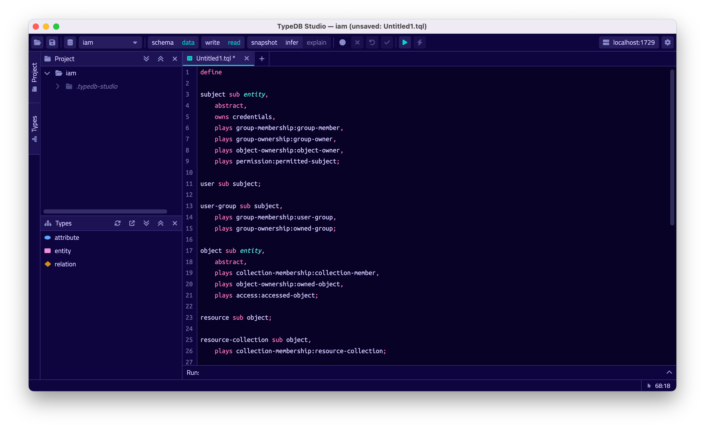

# TypeDB Studio

TypeDB Studio is an IDE specifically designed to work with 
[TypeQL]() query language and TypeDB databases.

It has unique set of functions and abilities to help with development using TypeDB:

- Friendly graphical user interface (GUI) to design schemas and queries for TypeDB databases.
- Syntax highlighting for TypeQL.
- Connection to TypeDB servers, including handling transactions.
- Types explorer for a TypeDB database.
- Query execution, including schema and data, read and write transactions.
- Local query validation with constraints of an actual database schema before sending the query to server.
- Graph visualization for query responses.

## Installation

### Requirements

TypeDB Studio do not require any additional packages to be installed prior the installation, but it needs a TypeDB 
server to perform most it's functions. We can use either remote or local TypeDB server.

<div class="note">
[Note]
The default TypeDB settings are to run server listening for `localhost` connections with port number `1729`.
</div>

<div class="note">
[Important]
We recommend using the latest version of TypeDB server and a [compatible](#version-compatibility) version of TypeDB 
Studio. 
</div>

### Download & install

Download TypeDB distributive/package for your particular OS from the 
[Download page](https://vaticle.com/download#typedb-studio. 

Follow proper installation procedure of the OS in use.

<div class="note">
[Important]
Make sure to grant access for installation wizard to install TypeDB Studio in case any security prompts will appear.
</div>

<div class="note">
[Note]
For **macOS** TypeDB Studio can be installed via homebrew:

```
brew tap vaticle/tap
brew install --cask vaticle/tap/typedb-studio
```
</div>

## Prepare for work

Right after starting TypeDB Studio we can see its main window as it is shown below.


To use most of TypeDB Studio functions we need to connect to a TypeDB server and 
choose a project directory.

The main blocks of the graphical interface (GUI) are (marked with respected numbers on the image above):

1. Projects panel
2. Types browser
3. Text-editor panel
4. Toolbar

### Connect to TypeDB server

At the top right-hand corner click the [**Connect to TypeDB**] button. It will open a windows with the same name and 
the connection settings as shown below.


Fill in the address of the TypeDB Server. By default, it's: `localhost:1729`. Click the [**Connect**] button.


Once we've connected successfully, the connection manager will reflect this in with the green status field in
the bottom left-hand corner, as shown above. You can close the window with connection. 

<div class="note">
[Note]
When Studio connected to a TypeDB server it will display the server address at the top right corner instead of the 
label of the `Connect to TypeDB` button.
</div>

### Disconnect from TypeDB server

At the top right-hand corner click the button with the server address in it.

In the `Connect to TypeDB` window click on the [**Disconnect**] button.

### Create a database

To create a new database make sure TypeDB Studio is connected to a TypeDB server and click on the [**Manage 
Databases**] button (with a database icon) as shown below.


Enter the name for the new database at the text field at the bottom of the `Manage Databases` window and hit 
[**Create**].


Our database appeared at the list of databases. Now we can close the `Manage Databases` window by clicking the 
[**Close**] button.


### Select active database

TypeDB Studio lets us work with one database at a time. Thus, to perform any query we need to choose a database 
first. 

We can select it by clicking the dropdown menu at the toolbar titled [**database (none)**] or with a name of 
previously selected database. It is the only dropdown menu in the toolbar and is located immediately right of the 
databases icon.

<div class="note">
[Note]
If the dropdown menu isn't active it usually means that we didn't connect to a server yet.
</div>

After selecting the database to work with from a list of all databases on the server Studio connected with, we will 
see types hierarchy of the selected database in the Types browser (bottom left of the screen). For example, for any 
empty database (with no schema defined) it will show only the base types:

- attribute
- entity
- relation

### Open a project directory

TypeDB Studio stores queries we save on a local machine in a project directory, so we don't need to rewrite all queries 
each time we open Studio. To select a project directory click on the open folder icon left of the database icon or 
click on the [**Open Project**] button in the `Projects` panel on the left (under the database icon).


<div class="note">
[Note]
If the Project panel is not displayed try clicking Project button on the left edge of the TypeDB Studio window.
</div>

## Basic operations

### File operations

#### Create a new file

To create a new file use the button with the plus (`+`) icon. It is located at the top of the Text-editor panel 
under the Toolbar. It's horizontal position adjusted for the number of tabs opened in the text-editor — the 
button with plus icon will always stay at the right end of the tabs of the Text-editor.

Upon clicking on the plus button a new tab will be opened with the default filename. For new files by default 
filename consists of `Untitled` word, followed by a number, starting from `1` and a file extension of `.tql`.


This file will be stored at the hidden folder in the current project directory until it will be saved with some 
other name and path.

#### Open an existing file

You can open any existing file in the current Project directory by double-clicking on the file in the 
Project panel. I will create a new tab in the Text-editor panel with the contents of the file.

#### Save a file

Any file edited in the Text-editor panel is auto saved with a small delay. That includes new files that wasn't 
assigned a specific name yet. Those are saved into the hidden folder with their default names. That way if we close 
TypeDB Studio the all files will be persisted and upon starting the Studio again all files in the hidden folder will 
be opened automatically.

Upon manual save those Untitled files will be saved with the specified filename and path and deleted from the hidden 
folder.

To save file manually use the [**Save Current File**] button at the left end of the toolbar.

### Query design

One of the most important functions of TypeDB Studio is to provide an environment to design and debug queries to 
TypeDB databases. For that we have the Text-editor panel with TypeQL syntax highlighting and the Toolbar with 
transaction controls.

#### Text-editor panel

Text-editor panel doesn't have a visible title, but it's the biggest area in the middle of the TypeDB Studio that is 
being used to work with text information. It does have tabs at the top to switch between different opened files.

The currently selected file's content displayed in the main section with lines numeration at the left edge of the 
Text-editor panel.

All text in the Text-editor panel will be displayed with TypeQL syntax highlighting.

In the bottom right corner of TypeDB Studio window there is an indicator for cursor location that contains the line 
number and current symbol position in that line.

You can activate the following functions from the context menu available by right-clicking inside the Text-editor 
main section:

- Copy/Cut/Paste
- Find/Replace
- Run File/Run Selection
- Increase/Decrease/Reset Text Size

#### Run panel

Under the Text-editor panel there is the Run panel, but it is collapsed by default. To expand it perform any query or 
just click on the reversed tick icon in the bottom right corner of TypeDB Studio window, above the cursor location 
indicator.

Run panel has 2 sets tabs:

- Tabs at the top of the Run panel are for different query attempts. 
  
  By default, every query sent will overwrite the 
  existing tab, but if you enable the pin icon at the beginning of the tab name - the tab will become pinned and 
  stay. A new tab will appear on the right from the last pinned one upon next query execution.

- Tabs at the bottom of the Run panel are for different results for the currently selected query attempt (tab at the 
  top of the Run panel). These include the `Log` tab with direct textual Studio output and the `Graph` tabs (one per 
  every query statement in the Text-editor panel) with graph visualization of response.

### Transaction control

To execute a query written in the Text-editor panel we have the Toolbar elements right from the database selection 
drop-down menu. See below.


From left to right:

- [Session](../0001-typedb/02-dev/01-connect.md#sessions) type switch:
  - `schema` — to use schema session type
  - `data` — to use data session type
- [Transaction](../0001-typedb/02-dev/01-connect.md#transactions) type switch:
  - `write` — to use write transaction
  - `read` — to use read transaction
- `snapshot` — enables snapshot feature that encapsulates transaction in a snapshot of a database's data until the 
  transaction committed or closed. Write transactions are always snapshoted. Only available for read transactions.
- `infer` — enable [inferring data](../0001-typedb/02-dev/06-infer.md) by rules. Only available for read 
  transactions.
- `explain` — enable [explanations](../0001-typedb/02-dev/06-infer.md#explain-query) mechanics by providing 
  `explainables` methods for results.
- Circle icon — transaction activity indicator. Green if there is a transaction opened by TypeDB Studio at this 
  moment. Grey if there is no opened transaction. Rotating animation — TypeDB Studio processing the results 
  (including additional API calls).
- X icon — close active transaction without committing the results.
- U-turn icon — revert the transaction results without closing it.
- Tick icon — commit the transaction.
- "Play" icon (triangle) — Run query or queries in the active tab of the Text-editor panel. It will open a 
  transaction (with the session type and transaction type specified in the Toolbar on the left) and execute the TypeQL 
  code against the selected database.
- Lighting icon — stop query execution after the next result.

#### Run query

Make sure TypeDB Studio [connected](#connect-to-typedb-server) to a TypeDB Server, 
database [selected](#select-active-database) and Project directory [opened](#open-a-project-directory).

1. Write a new or open an existing file with query to run.

   

2. Choose the correct session (schema/data) type and transaction (read/write) type to run the query by clicking on 
   those options on the Toolbar switches.

3. Run query by clicking on the "play" button. 

   

4. If it's the `write` transaction type — wait for transaction control options to be ready and commit or close the 
   transaction.

As a result we get a notification pop-up with a transaction confirmation (see example below) or an error.


<!-- #todo Add some example with IAM --->

## Types explorer capabilities

Under the Project panel that shows the Project directory TypeDB has Types section that shows all types of the schema of 
the current database. 

<div class="note">
[Note]
If the Types panel is not displayed try hitting Types button on the left edge of the TypeDB Studio window.
</div>

All types are divided in three top level types:

- Attribute
- Entity
- Relation


All types displayed in the exact structure they were created (subtypes inside their parents). We can easily collapse or 
expand all the types in the structure tree by clicking the associated buttons on the top of the Types Section with 
arrows pointing down or up respectively.

### Export schema

We can export schema of the database by clicking Export Schema button (second in row from left to right) on the top of 
the Types section. It creates a new tab with inserted TypeQL code that creates the exact schema that is in the current 
database.

<div class="note">
[Warning]
The export schema button doesn't include rules into its output. That will be fixed in some of the next versions of 
the TypeDB Studio. 
</div>

### Types browser

By double-clicking any type we can open the type browser window that shows all information about the selected type and
allows us to easily edit the type. 


We can rename the type, change its supertype, abstract property, see all the related types (owned attributes or owners, 
played roles and subtypes). By clicking on one of the related types we can see all information about it.

### Rename a type

We can rename a type in two ways:

- Open the type browser window by double-clicking on the type. At the very top click on the pencil icon immediately 
  right from the type name. Edit the name in the Label field and press Rename button to finalize.
- Right-click on the type in the types explorer list. Click on the Rename Type option. Edit the name in the Label field 
  and press Rename button to finalize.

<div class="note">
[Note]
Renaming a type in any of this two ways will update the relevant type references in the schema and will not lead to 
loosing existing data. All existing instances of the type will be available under the new types name.
</div>

### Delete a type

We can delete a type in two ways:

- Open the type browser window by double-clicking on the type. At the very bottom click on the delete button and press 
  Confirm button. Commit the transaction with the green tick at the top of the Studio window.
- Right-click on the type in the types explorer list. Click on the Delete option and press Confirm button. Commit the 
  transaction with the green tick at the top of the Studio window.

<div class="note">
[Note]
In some cases Delete option and button can be disabled. That means there are some conditions that prevent us from 
deleting this type. For example, we can't 
[delete a type that has a subtype](../../09-schema/01-concepts.md#undefine-a-supertype). See 
[more](../../09-schema/01-concepts.md#undefine) on these conditions.
</div>

## Settings

To configure TypeDB Studio open the **Manage Preferences** window by clicking on the button with the gear icon in the 
top right corner of the TypeDB Studio window.

TypeDB Studio has the following settings available:

- Graph Visualiser
  - Enable Graph Output — Turns on visualization of query results as graphs on a separate tab of the Run panel. 
    Default value: **On**.
- Project Manager
  - Set Ignored Paths — All paths mentioned here will be invisible in any Project directory opened in Studio. 
    Default value: `.git`.
- Query Runner
  - Default Match Query Limit — Limits the maximum number of results to be returned from a get query to a database 
    if no limit explicitly stated in the query. Default value: **1000**.
- Text Editor
  - Enable Autosave — Enables autosave function for files opened in TypeDB Studio. Default value: **On**.

## Version Compatibility

|      Studio      |      TypeDB      |  TypeDB Cluster  |
|:----------------:|:----------------:|:----------------:|
| 2.14.1 to 2.14.2 | 2.14.1 to 2.14.2 |      2.14.1      |
|      2.11.0      |      2.11.1      | 2.11.1 to 2.11.2 |
