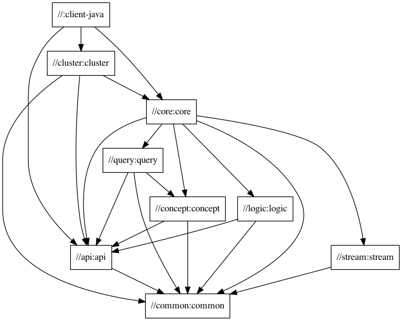
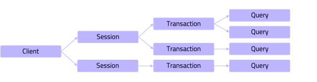
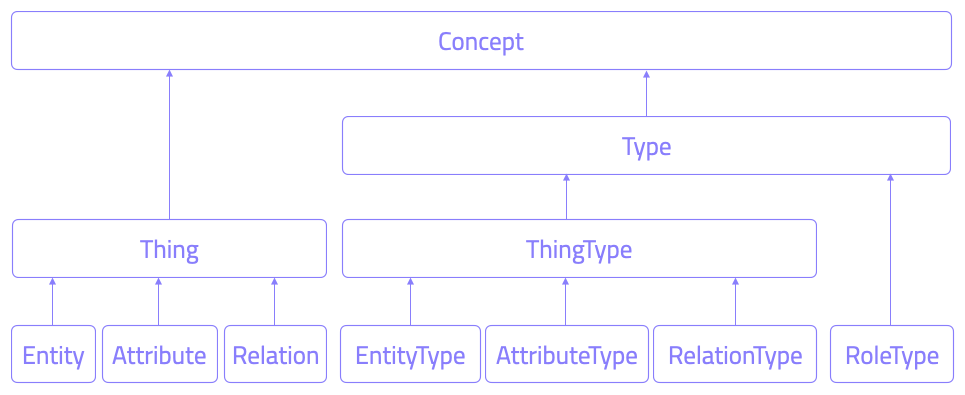

# Developing a new TypeDB Client

## Introduction

Vaticle maintains official TypeDB Tools (TypeDB Studio and Console) and Drivers for Java, Python, and NodeJS. All our 
other TypeDB Clients or Drivers are community-built.

It's possible to build a TypeDB Client for any language. A TypeDB Client fundamentally is a lightweight frontend
to the TypeDB server. This page is a guide for the components and protocols that need to be implemented.

## gRPC

[gRPC](https://grpc.io/) is the network call framework that TypeDB uses. A TypeDB client needs a gRPC client library 
to communicate with the server. Most languages have gRPC libraries.

Architecturally, gRPC is an alternative to HTTP (say, REST API or websockets). In TypeDB's client-server architecture,
performance is critical, and gRPC fits well with TypeDB's scaling model. It establishes a long-lasting connection,
much like a websocket. Payloads are encoded in the Protocol Buffer format, which is both efficient and strongly typed:

```protobuf
// Example message from typedb-protocol: note that each field has a restricted data type (string, int64 etc.)
message Attribute {
  message Value {
    oneof value {
      string string = 1;
      bool boolean = 2;
      int64 long = 3;
      double double = 4;
      // time since epoch in milliseconds
      int64 date_time = 5;
    }
  }
}
```

## TypeDB protocol

[Protocol Buffers](https://developers.google.com/protocol-buffers) is the encoding used to serialise network messages.
Proto definition files can be compiled into server-side and client-side libraries using a Protobuf Compiler.
In our case, we only need client-side library compilation. Most languages have Protobuf compilers available.

TypeDB's protobuf definitions can be found at https://github.com/vaticle/typedb-protocol.
During development, it's sufficient to manually copy-paste from this repository and do a one-time compilation.
A more reliable method is to import the Protocol repo via a package manager and compile it at build time.
TypeDB's build system, [Bazel](https://bazel.build/), offers one approach. If you'd like to use a different package 
manager, the TypeDB team may also be able to help by setting up a distribution channel for your language's compiled 
protobuf files. If this is the case, please get in touch.

## TypeDB Client architecture

TypeDB Clients adhere to a common architecture. This greatly reduces the workload of
maintaining them, so we also recommend community contributions to follow the same basic structure.

### Code structure

The following diagram shows all the packages (directories) in Java Driver and their dependency graph:



The entry point is the root package, in this case named `client-java`.
`api` is where we declare all the available client methods – basically all the interfaces.
`core` holds the basic building blocks: client, session, transaction.
Then we have `query` for querying, `concept` for the API to be able to process concepts, `logic` for reasoning.

There are many places you could start building a client. In the 
[How to build a new TypeDB Client](../0001-typedb/04-tutorials/02-new-client.md) tutorial, we start by 
attempting to make a single gRPC call to TypeDB, and create a database.

### Connection and databases

To instantiate a client we need to be able to establish a network connection to a single TypeDB server or a TypeDB 
cluster.

This connection opens us basic features of [database](../0001-typedb/02-dev/01-connect.md#databases) management, user 
management (TypeDB Cloud only) and enables us to open a session.

### Session and transaction

To query schema and data, we need to open a Session and Transaction of the appropriate types. For example, you can't 
modify schema in a data session.

A Session is essentially a long-lasting tunnel from a client to a database. However, we implement that with just simple 
RPC calls - Open and Close. 

Sessions consume server resources, and may hold locks. If a client disconnects (say, by crashing) the server needs a 
way to know. So, we use a pulse mechanism. Every 5 seconds, a TypeDB client sends a Session Pulse to inform the 
server that the client is still alive. If no pulse is received in 30 seconds, the server times out the session, 
freeing up its resources for use elsewhere.

Once a Session is open, we can open a Transaction inside it to read and write to the database. This is implemented 
with a bidirectional streaming RPC. Rather like a websocket, it’s a long-lasting tunnel that allows the client and 
server to talk to each other.

TypeDB clients support multiple layers of concurrency. A Client can have many Sessions, and a Session can have many 
Transactions, and a Transaction can perform many Queries.



## Inside a transaction stream

Inside a transaction stream, the client sends requests, and the server is expected to respond to the client's 
requests in a timely manner.

Each request must have the same message type. This is `Transaction.Client`, defined in 
[typedb-protocol](https://github.com/vaticle/typedb-protocol/blob/master/common/transaction.proto):

```protobuf
// typedb-protocol/common/transaction.proto
message Transaction {

  message Client {
    repeated Req reqs = 1;
  }

  message Req {
    bytes req_id = 1;
    map&lt;string, string&gt; metadata = 2;
    oneof req {
      Open.Req open_req = 3;
      Stream.Req stream_req = 4;
      Commit.Req commit_req = 5;
      Rollback.Req rollback_req = 6;
      QueryManager.Req query_manager_req = 7;
      ConceptManager.Req concept_manager_req = 8;
      LogicManager.Req logic_manager_req = 9;
      Rule.Req rule_req = 10;
      typedb.protocol.Type.Req type_req = 11;
      Thing.Req thing_req = 12;
    }
  }
}
```

Each **request message** is suffixed with `.Req`, and has a matching `.Res` (or `.ResPart`) to represent the server's 
response to that message.

Now, there are two basic patterns to the communications; _single_ responses and _streamed_ responses, both of which 
are illustrated below.


Here, `Define.Req` and `Match.Req` are both types of `QueryManager.Req`, and `Type.Create.Req` and `GetThing.Req` are 
types of `ConceptManager.Req`.

### Handling streamed responses

For requests such as TypeQL Match queries, the responses can be very long, so TypeDB breaks them up into parts.
We issue `Match.Req`, and get back multiple `Match.ResPart`s, which each contain some answers to the query.

Getting all the answers may be costly in terms of server resources, and it can be wasteful if the client exits early.
So we only auto-stream up to a certain limit, called the **prefetch size**, then we send a special message called 
“Continue”.
If the client needs more answers, it should respond with a `Stream.Req`.
That tells the server to continue streaming, and, when there are no answers left, it sends a `Stream.ResPart` 
with `state = DONE`. 

In a client, the Match response is typically represented as a Stream or Iterator. Seeing “DONE” from the server 
signals the end of iteration. The iterator implementation varies a bit by language. In Java, Streams are in-built; 
in Python we use an Iterator, and in NodeJS we use an Async Iterator. Use whatever is most natural in your language.

### Handling concurrent requests

Concurrent queries create a slight complication, since all the responses go down the same gRPC stream. We handle them
by attaching a Request ID (`req_id`) to each request, and, whenever a Request is made, we create a Response 
Collector – essentially a bucket, or queue, that holds responses for this Query.

The queue fills up as answers are received from the server, and it gets emptied as the user iterates over these answers.

### Request batching

Loading bulk data may potentially require millions of INSERT queries, and gRPC can only send so many in a given 
timeframe. To mitigate this, we use request batching - see the `RequestTransmitter` class in any official client.
It collects all requests in a 1ms time window, bundles them into a single gRPC message, and dispatches it. 

## Exploring query answers

See the [Response interpretation](../0001-typedb/02-dev/07-response.md) page to find information of possible 
response to different query types.

The `ConceptMap` objects returned by a [Get query](../0001-typedb/02-dev/05-read.md#get-query) can contain  
any type of `Concept`. This `Concept` class hierarchy is reflected in a TypeDB Client implementation and class 
structure.



<div class="note">
[Warning]
The `thing`, `thingtype`, and `type` base types will be deprecated in TypeDB version 3.0. 

Concepts hierarchy will be simplified for the Concept term to include Entity, Attribute, Relation, EntityType, 
AttributeType, RelationType, and RoleType directly. 
</div>

Implementing all concept methods for TypeDB API is not complicated, but it is quite long as there are a 
lot of methods. Concept methods either return single or streamed responses. `ThingType.getInstances` is an example 
of a Streamed Concept method.

## TypeDB Cloud Client

TypeDB Cloud uses clusters of TypeDB servers that run as a distributed network of database servers which communicate 
internally to form a consensus when querying. If one server has an outage, we can recover from the issue by falling 
back to another server. To enable this, TypeDB Client constructs 1 Core client per TypeDB server (cluster node):


Suppose we open a Transaction to, say, Node 1, but we don’t get a response.

In TypeDB, that would be a non-recoverable error. In TypeDB Cluster, the Cluster client simply reroutes the request 
to a different Core client, which sends the request to its linked server. In this way, the client recovers from the 
failure and continues running as normal.

## Behavioral testing

The recommended way to test a TypeDB Client is by using the 
[TypeDB Behaviour spec](https://github.com/vaticle/typedb-behaviour).
It’s written in a language-agnostic syntax named [Gherkin](https://cucumber.io/docs/gherkin/reference/).
Tests consist of named steps. To run the tests in a new client, you just need to implement the steps.
This means you can test your client without having to write a single test!

```gherkin
# To run the test, implement each step: e.g. "connection create database: {name}"
Scenario: commit in a read transaction throws
    When connection create database: typedb
    Given connection open schema session for database: typedb
    When session opens transaction of type: read
    Then transaction commits; throws exception
```

## Conclusion

A client is considered production-ready once it passes all the [tests](#behavioral-testing) and adheres to the 
TypeDB architecture.

Check the [How to build a new TypeDB Client](../0001-typedb/04-tutorials/02-new-client.md) 
tutorial to see some examples. For more information see the source codes of our TypeDB Drivers:
[Java](https://github.com/vaticle/typedb-client-java),
[Python](https://github.com/vaticle/typedb-client-python),
[Node.js](https://github.com/vaticle/typedb-client-nodejs).

Do get in touch with the Vaticle team on [Discord](https://vaticle.com/discord). 
We're happy to help speed up the development process.
This will also enable us to add your project into the [TypeDB Open Source Initiative](https://typedb.org).
