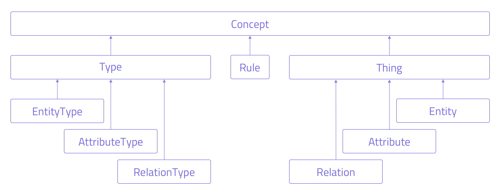

## Concept Architecture
Anything in Grakn, whether a concept type or a data instance, is a [Concept](../04-concept-api/01-concept.md). The diagram below, illustrates how the Concept superclass is inherited by its direct and indirect descendants.

**Type** refers to a Concept Type as defined in the [schema](../09-schema/00-overview.md#grakn-data-model).

**Thing** refers to an instance of data that is an instantiation of a Concept Type.

**Rule** refers to a [Graql Rule](../09-schema/03-rules.md).

## Local and Remote Concept API

The Concept API architecture is implemented in 2 ways in each client: **local** and **remote**. The concepts share the same overall structure, but only a small set of methods are available on the *local* concepts.

The benefit of using local concepts is that time spend waiting for round-trips to the server is eliminated: all of the information required is fetched in one go during the query. Calls to methods on the *remote* concept API must make at least one full round-trip to the server to fetch a result, which will include at least the network latency between your client and the Grakn server.

As an example, if you were to make 1,000 calls method calls Remote Concept API and your latency (ping) between client is 10ms, you would spend a total of 10 seconds waiting for network round-trips.

Where efficiency is a concern, especially when dealing with large numbers of results, we recommend that you include the required information to fetch in the query, rather than using the Remote Concept API.

In order to make use of this benefit, *queries always return local concepts* so that the pre-fetched information is available. Since the behaviour of remote methods is slightly different and involves binding, *local* concepts must be converted to *remote* concepts before remote methods are available. Please read the following sections for more information on how to convert local concepts to remote ones.

### Local Concept API

For the *local* Concept API, each concept must contain all of the information that can be returned from the concept API methods from the point that it is created. This information will not be updated as the concept changes on the server, so it may become out of date once the transaction has ended or if changes have been made during the transaction. Local concepts are not bound to a transaction, so they can be safely used even after the transaction, session or client has been closed; local concepts never perform network operations.

When reading the Concept API documentation, look for the **(Local)** tag to indicate that a method is available on *both local and remote* concepts. All other methods are only available on remote concepts and will fail if used on local concepts.

[Important]
Whilst **(Local)** methods are available on both local and remote concepts, the local concept version will return the value at the time that the concept was first fetched (when the query was executed), but the remote concept version will always fetch the latest version from the server.

### Remote Concept API

The remote concept API allows a user to make simple requests to the Grakn server to discover information connected to a specific concept, or to make modifications to a concept. **All** remote concept operations require a network call to the Grakn server, which will block for a full round-trip.

Remote concepts must be linked to a **Transaction** in order to make calls. When remote concepts are returned by a Transaction method or a Remote Concept API method, they will inherit the same Transaction as the transaction/concept the method was called on. *When the Transaction is closed, the remote concept methods can no longer be used **except for the `id()` method***.

Some remote concept methods are update, insert or delete operations, and will therefore fail if used on a concept that is linked to a *Read* transaction.

[Important]
The interaction behaviour between remote concepts and results streaming is not well defined: this means that streamed query or method results may or may not see updates made using the concept API.

### Converting Local Concepts to Remote Concepts

All local concepts have the method `asRemote(tx)`, where the `tx` parameter is a Transaction to use for the remote concept version of this local concept, and the returned value is the remote concept. See the `asRemote` method documentation for more details.

In the sections that follow, we learn about the methods available on [Concept](../04-concept-api/01-concept.md), [Type](../04-concept-api/02-type.md#type-methods), [EntityType](../04-concept-api/02-type.md#entitytype-methods), [AttributeType](../04-concept-api/02-type.md#attributetype-methods), [RelationType](../04-concept-api/02-type.md#relationtype-methods), [Thing](../04-concept-api/04-thing.md#thing-methods), [Attribute](../04-concept-api/04-thing.md#attribute-methods), [Relation](../04-concept-api/04-thing.md#relation-methods) and [Rule](../04-concept-api/03-rule.md).
