## Deploy Grakn on AWS

As illustrated below, deploying [Grakn KGMS on Amazon Web Services](https://aws.amazon.com/marketplace/pp/B07H8RMX5X) is a straight-forward process.

<div class="tabs light">

[tab:CloudFormation]
<div class="slideshow">

[slide:start]
[header:start]Visit KGMS on AWS[header:end]
[body:start]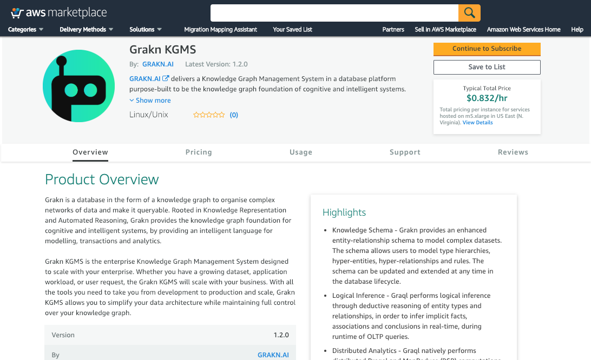[body:end]
[footer:start]Visit the [KGMS listing on AWS Marketplace](https://aws.amazon.com/marketplace/pp/B07H8RMX5X).[footer:end]
[slide:end]

[slide:start]
[header:start]Subscribe[header:end]
[body:start]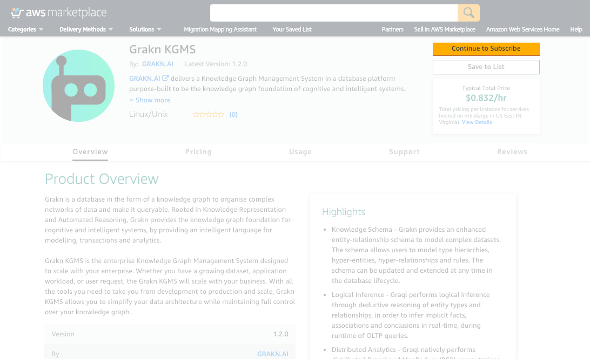[body:end]
[footer:start]Click on **Continue to Subscribe**.[footer:end]
[slide:end]

[slide:start]
[header:start]Accept Terms[header:end]
[body:start]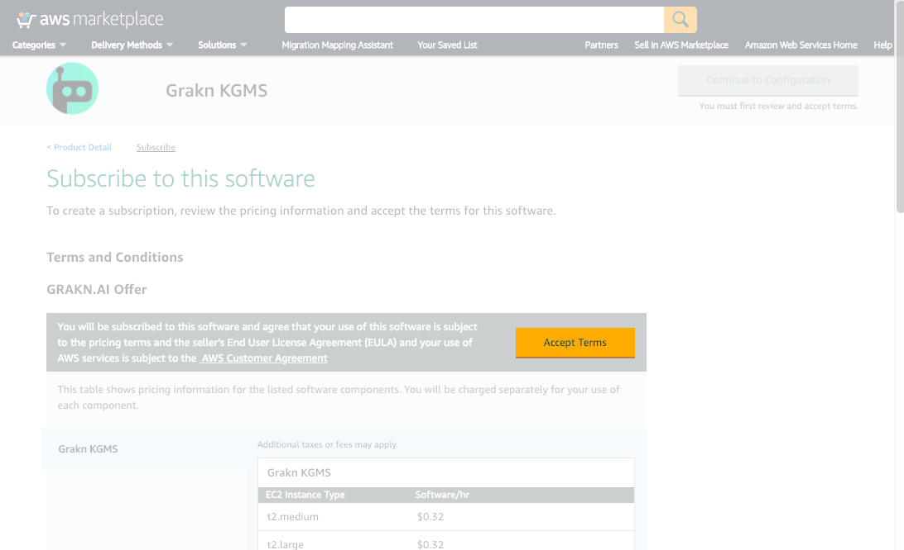[body:end]
[footer:start]Review the pricing information and click on **Accept Terms** to continue.[footer:end]
[slide:end]

[slide:start]
[header:start]Subscribing[header:end]
[body:start]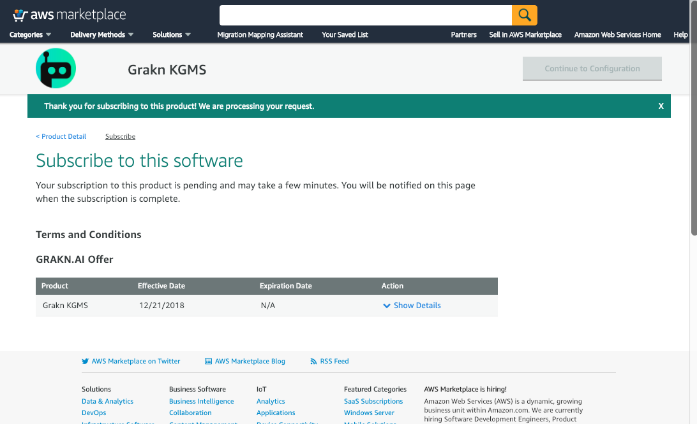[body:end]
[footer:start]We now need to wait while Amazon processes our request to subscribe to Grakn KGMS.[footer:end]
[slide:end]

[slide:start]
[header:start]Configure[header:end]
[body:start]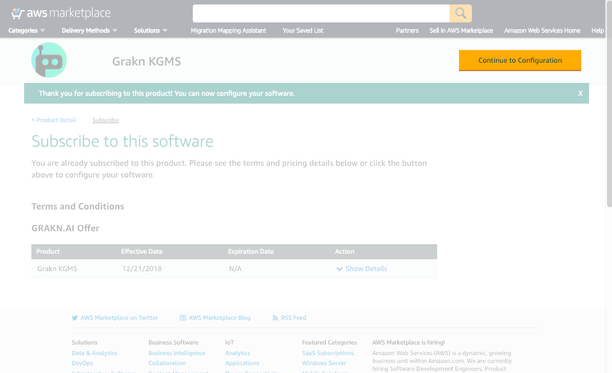[body:end]
[footer:start]Click on **Continue to Configuration**[footer:end]
[slide:end]

[slide:start]
[header:start]Select CloudFormation[header:end]
[body:start]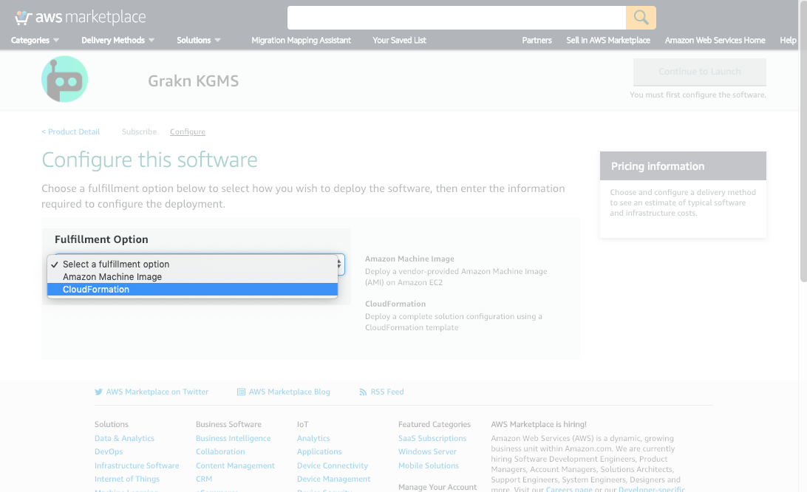[body:end]
[footer:start]Select _CloudFormation_ as the _Fulfillment Option_.[footer:end]
[slide:end]

[slide:start]
[header:start]Confirm Configuration[header:end]
[body:start]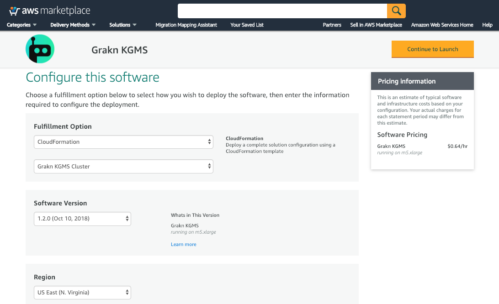[body:end]
[footer:start]We can now adjust the configuration based on our needs.[footer:end]
[slide:end]

[slide:start]
[header:start]Continue to Launch[header:end]
[body:start]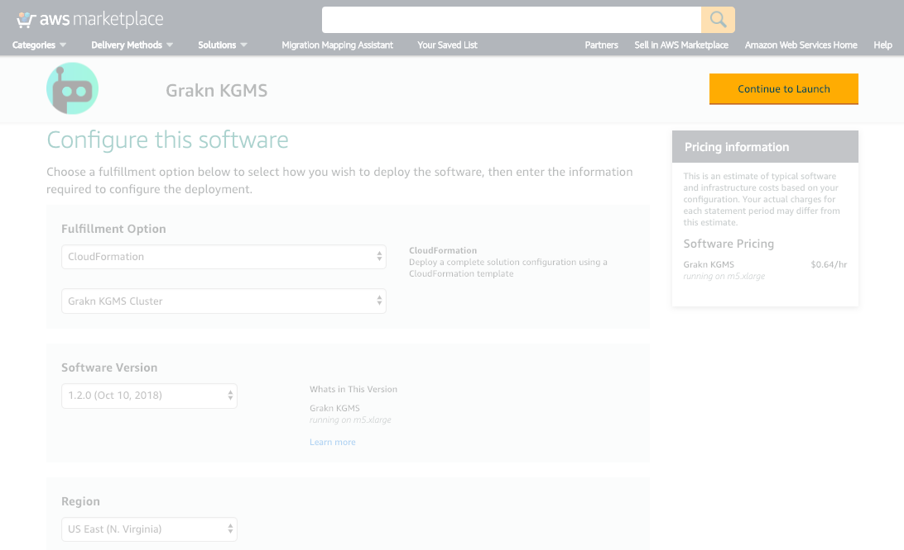[body:end]
[footer:start]Click on **Continue to Launch**.[footer:end]
[slide:end]

[slide:start]
[header:start]Action: CloudFormation[header:end]
[body:start]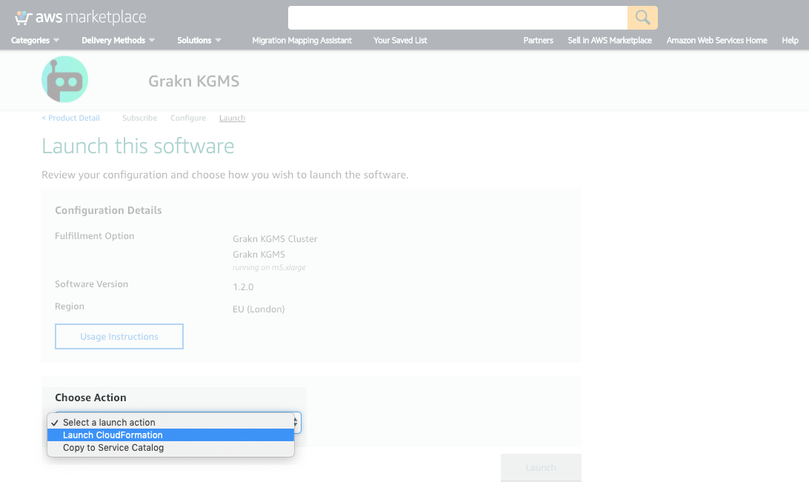[body:end]
[footer:start]Select _Launch CloudFormation_ as the _Action_.[footer:end]
[slide:end]

[slide:start]
[header:start]Launch[header:end]
[body:start]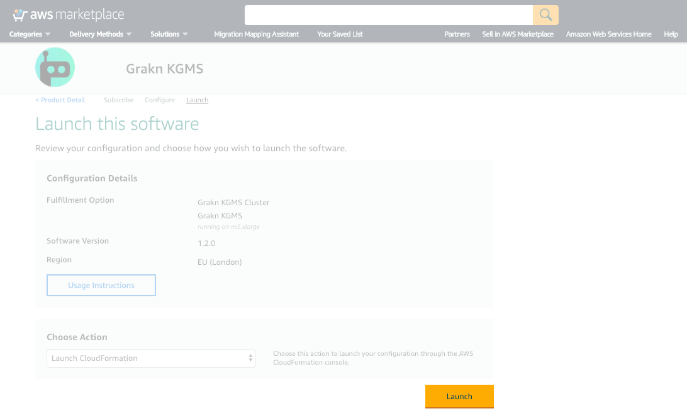[body:end]
[footer:start]Select _Launch CloudFormation_ as the _Action_.[footer:end]
[slide:end]

[slide:start]
[header:start]Select Template[header:end]
[body:start]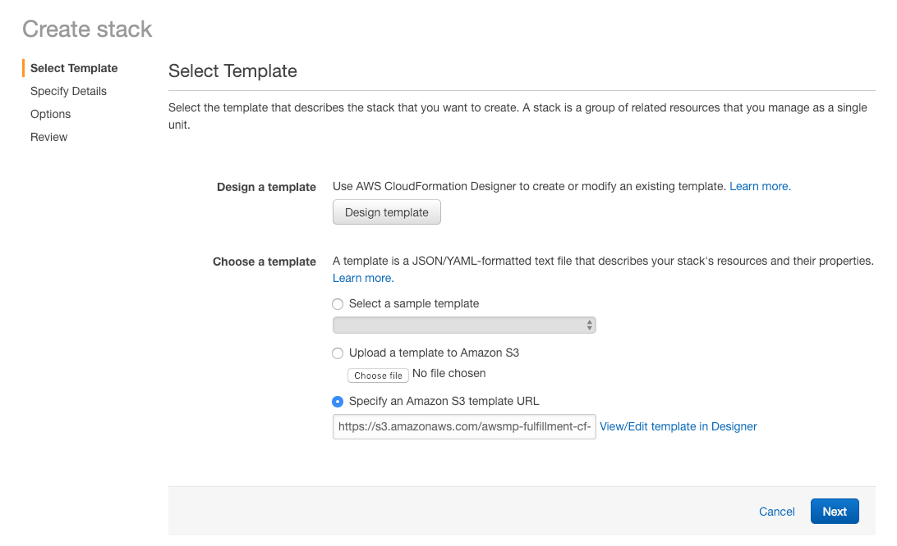[body:end]
[footer:start]We can select a template of our choice or simply click on **Next** to continue with the pre-selected template.[footer:end]
[slide:end]

[slide:start]
[header:start]Specify Details[header:end]
[body:start]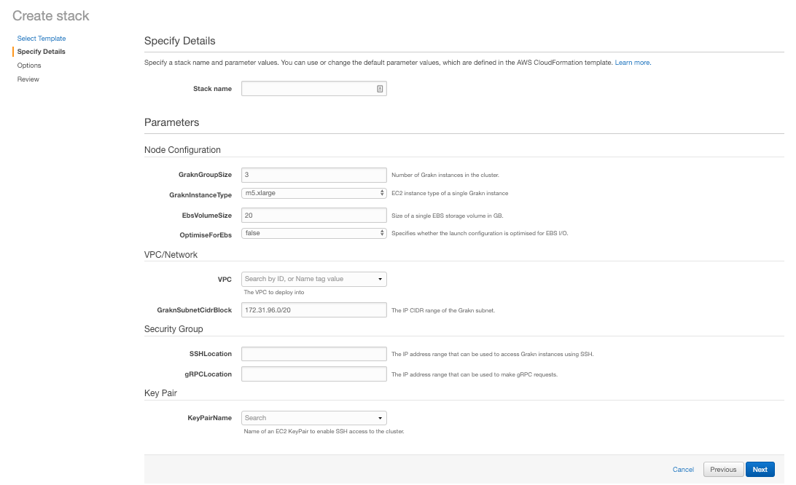[body:end]
[footer:start]Specify the stack details and parameters and click on **Next** to continue. Note that all fields are required.[footer:end]
[slide:end]

[slide:start]
[header:start]Specify Options[header:end]
[body:start]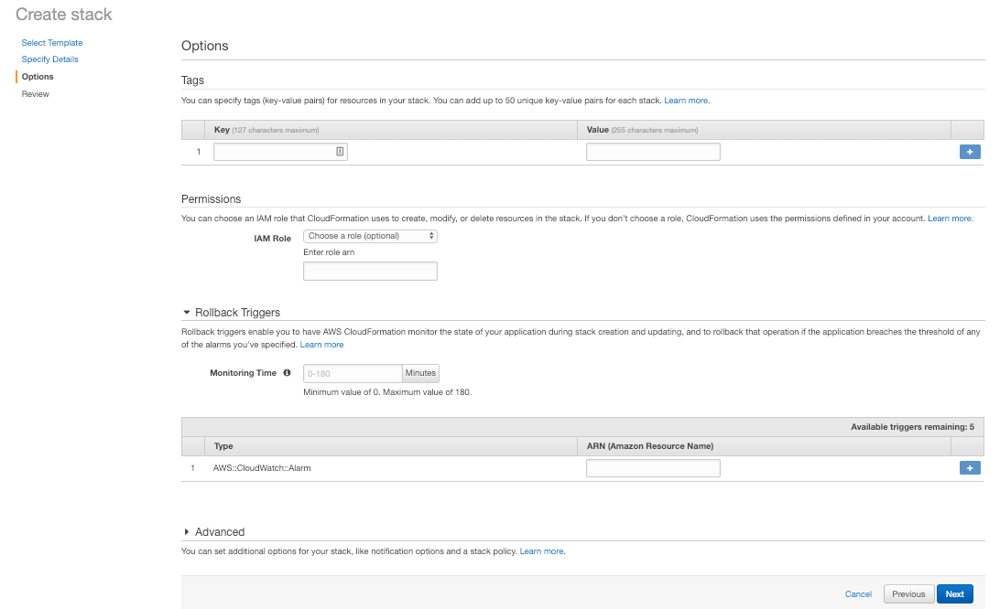[body:end]
[footer:start]Explore and specify the available options to your liking and click on **Next** to continue.[footer:end]
[slide:end]

[slide:start]
[header:start]Review & Confirm[header:end]
[body:start]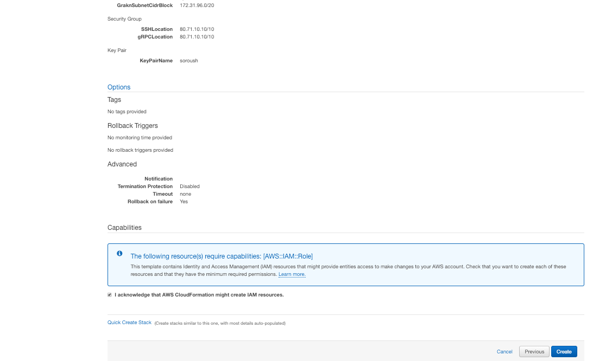[body:end]
[footer:start]Review all details and options for verification and click on **Create** to continue.[footer:end]
[slide:end]

[slide:start]
[header:start]Wait for Stack Creation[header:end]
[body:start]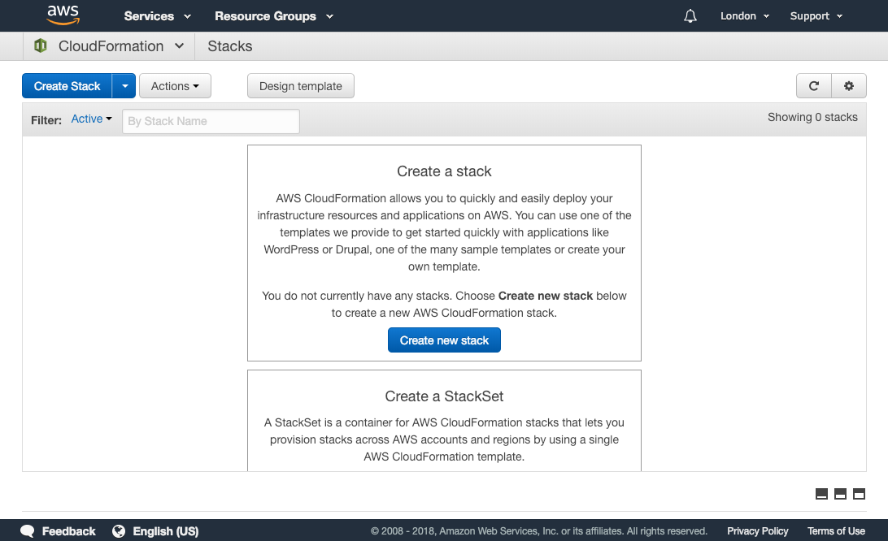[body:end]
[footer:start]Once the stack creation form is successfully submitted, we be redirected to the Stacks page. Although it may seem as the stack has not been created, Amazon is processing the stack creation and after a short while ...[footer:end]
[slide:end]

[slide:start]
[header:start]View the Stack[header:end]
[body:start]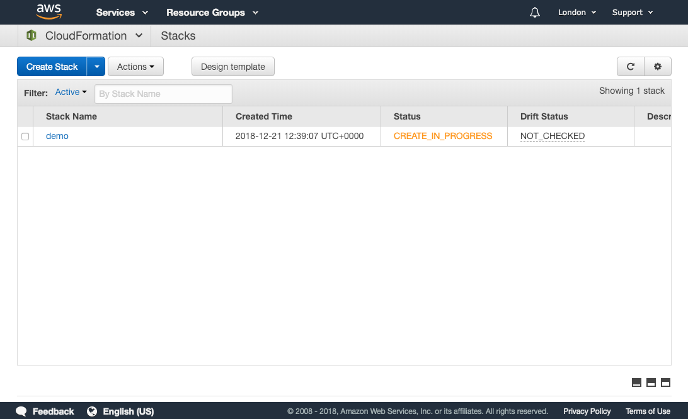[body:end]
[footer:start]The newly created stack is displayed and we can click on its name to view its status and details.[footer:end]
[slide:end]

</div>

## Run Grakn
Once the deployment is complete, a Grakn Cluster starts automatically. There is no need for starting Grakn Servers manually.

<div class="note">
[Important]
Once deployed, it takes some time for the cluster to fully bootup and synchronise. Allow approximately **two minutes per cluster node**. To check the status of the cluster bootup, you can perform a [cluster health check](#cluster-health-check).
</div>

## Default Credentials
As part of the deployment, AWS produces the default password with username being `grakn`. The screenshots below walk you through spotting the generated password. we need these credentials to access the Graql and Grakn consoles.

<div class="slideshow">

[slide:start]
[header:start]View the Stack Details[header:end]
[body:start]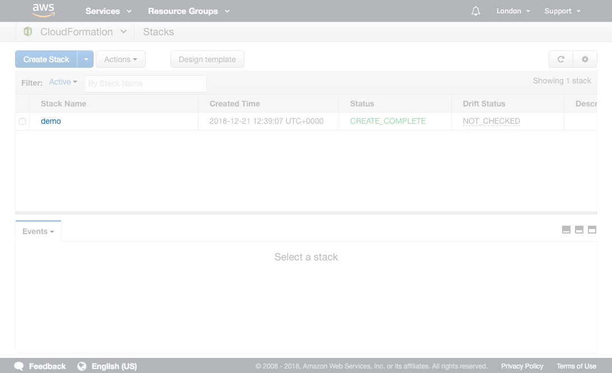[body:end]
[footer:start]Click on the stack's name to view its details.[footer:end]
[slide:end]

[slide:start]
[header:start]Expand Outputs[header:end]
[body:start]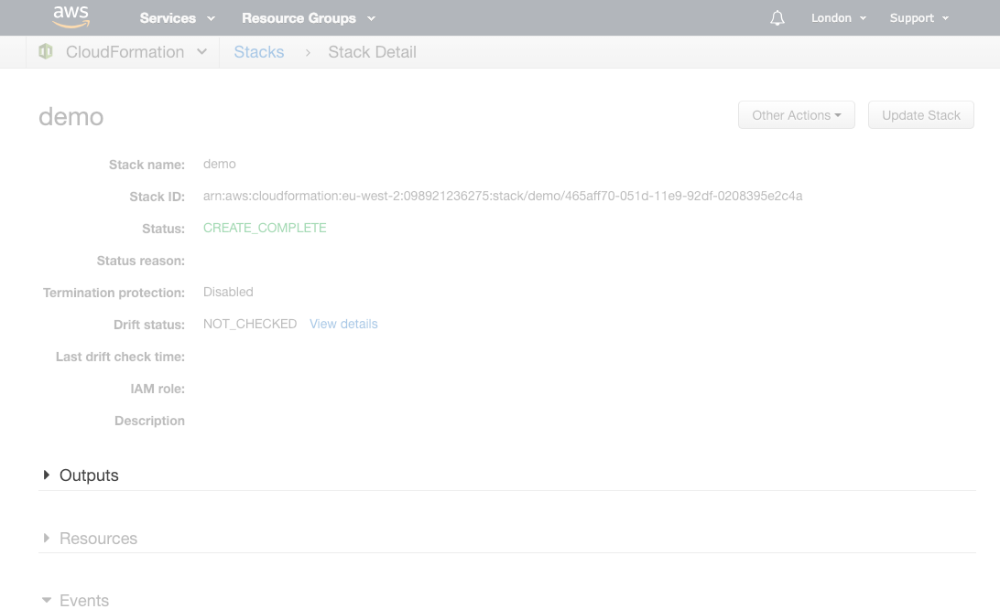[body:end]
[footer:start]Expand _Outputs_.[footer:end]
[slide:end]

[slide:start]
[header:start]Expand Outputs[header:end]
[body:start]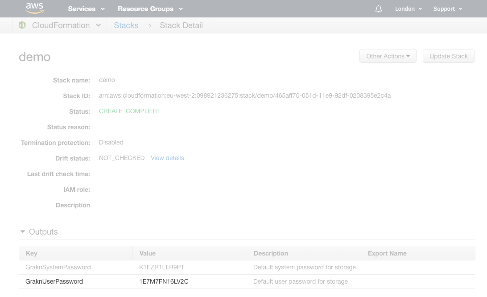[body:end]
[footer:start]The password for username `grakn` is the value of the `GraknUserPassword`.[footer:end]
[slide:end]

</div>

We strongly encourage changing the default password. To do this, we need to first [access Grakn Console](#accessing-grakn-console) and then [update the user](../06-management/02-users.md#update-a-user) `grakn` giving it a new secured password.

## Scale the Cluster
Grakn cluster is deployed within an Auto Scaling Group which allows us to adjust the number of instances in the cluster in a straight-forward manner.
Auto Scaling Groups group together EC2 instances that share similar characteristics and are treated as a logical grouping for the purposes of instance scaling and management.

<div class="slideshow">

[slide:start]
[header:start]Navigate to Auto Scaling Groups[header:end]
[body:start]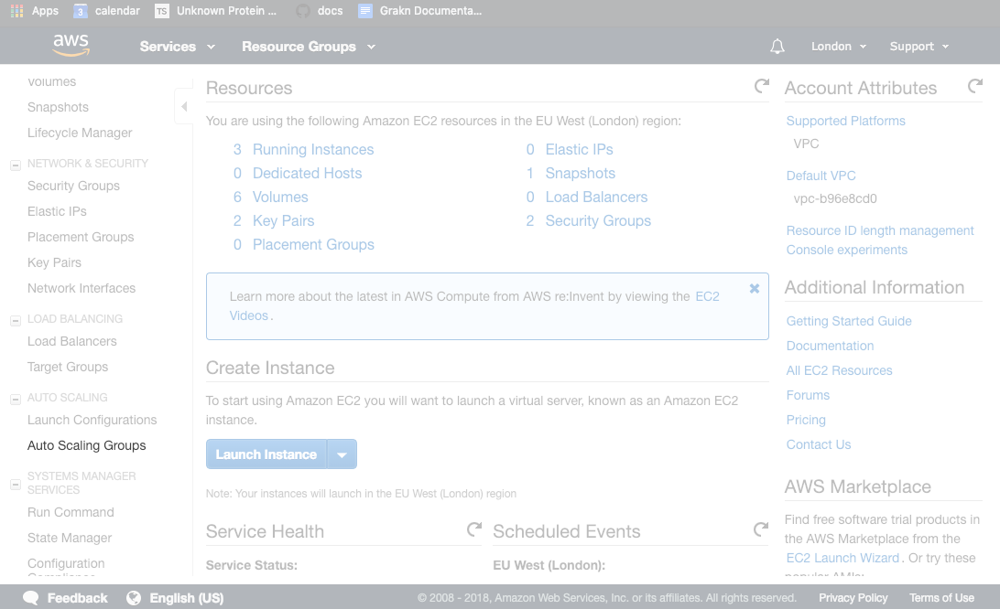[body:end]
[footer:start]In the AWS Console, click on **Auto Scaling Groups** under _Auto Scaling_.[footer:end]
[slide:end]

[slide:start]
[header:start]Edit the Cluster[header:end]
[body:start]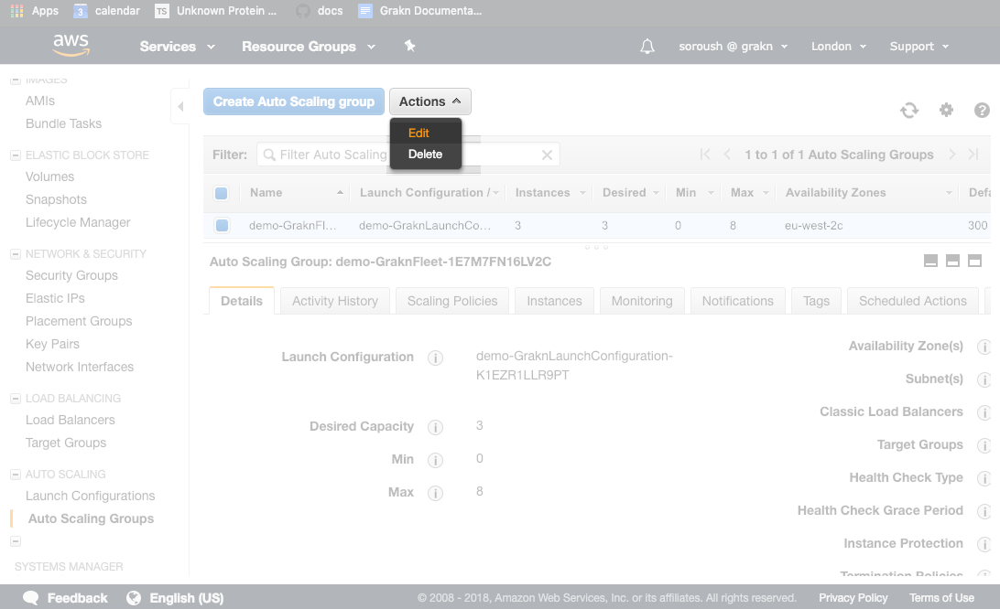[body:end]
[footer:start]Having selected the Grakn Cluster, click on **Edit** under _Actions_.[footer:end]
[slide:end]

[slide:start]
[header:start]Modify Desired Capacity[header:end]
[body:start]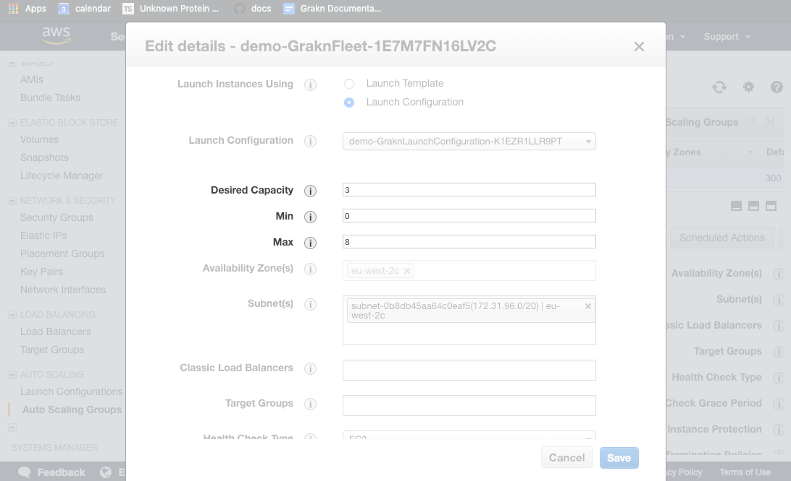[body:end]
[footer:start]We can now change the values of _Desired Capacity_ as well as _min_ and _max_. For more information, refer to [AWS Documentation on Auto Scaling Groups](https://docs.aws.amazon.com/autoscaling/ec2/userguide/AutoScalingGroup.html).[footer:end]
[slide:end]

</div>

## Stop a Grakn Instance
By design, it is not possible to stop an instance belonging to an Auto Scaling Group. When a Scaling Policy triggers the removal of an instance, Auto Scaling always terminates the instance.
As a result, a different procedure is needed for stopping instances.

<div class="note">
[Important]
Before we proceed, we must make sure that the minimum capacity of the Auto Scaling Group that the instance belongs to, is smaller than the current instance count. For instance, if we have three instances running, in order to stop one, the minimum capacity must be at most two. Otherwise, new instances are created in place of the stopped instance.
</div>

### 1. Install the AWS Command Line Interface
Follow the instructions here (https://aws.amazon.com/cli/) to install the AWS CLI. Upon installation run `aws configure` via terminal.

### 2. Detach the instance from the Auto Scaling Group
```
aws autoscaling detach-instances --instance-ids &lt;id-of-the-instance-to-be-detached&gt; --region &lt;region-name&gt;" --auto-scaling-group-name &lt;name-of-the-auto-scaling-group-that-the-instance-belongs-to&gt; --should-decrement-desired-capacity
```

### 3. Stop the detached instance
```
aws ec2 stop-instances --instance-ids &lt;id-of-the-detached-instanced-to-be-stopped&gt;
```

## Restart a Grakn Instance

Having [installed and configured the AWS CLI](#install-the-aws-command-line-interface), we need to first start the instance and then attach it to the right Auto Scaling Group.

### 1. Start the instance
```
aws ec2 start-instances --instance-ids &lt;id-of-the-instance-to-be-restarted&gt;
```

### 3. Attach the instance to the Auto Scaling Group
```
aws autoscaling attach-instances --instance-ids &lt;id-of-the-instance-to-be-stopped&gt; --region "&lt;region-name&gt;" --auto-scaling-group-name &lt;name-of-the-auto-scaling-group-that-the-instance-belongs-to&gt;
```

For more information check out AWS documentation on [Starting and Stopping Instances](https://docs.aws.amazon.com/AWSEC2/latest/UserGuide/Stop_Start.html), [Attaching Instances](https://docs.aws.amazon.com/autoscaling/ec2/userguide/attach-instance-asg.html) and [Detaching Instances](https://docs.aws.amazon.com/autoscaling/ec2/userguide/detach-instance-asg.html).

[tab:end]

[tab:Grakn KGMS AMI]

<div class="slideshow">

[slide:start]
[header:start]Visit KGMS on AWS[header:end]
[body:start][body:end]
[footer:start]Visit the [KGMS listing on AWS Marketplace](https://aws.amazon.com/marketplace/pp/B07H8RMX5X).[footer:end]
[slide:end]

[slide:start]
[header:start]Subscribe[header:end]
[body:start][body:end]
[footer:start]Click on **Continue to Subscribe**.[footer:end]
[slide:end]

[slide:start]
[header:start]Accept Terms[header:end]
[body:start][body:end]
[footer:start]Review the pricing information and click on **Accept Terms** to continue.[footer:end]
[slide:end]

[slide:start]
[header:start]Subscribing[header:end]
[body:start][body:end]
[footer:start]We now need to wait while Amazon processes our request to subscribe to Grakn KGMS.[footer:end]
[slide:end]

[slide:start]
[header:start]Configure[header:end]
[body:start][body:end]
[footer:start]Review the Click on **Continue to Configuration**[footer:end]
[slide:end]

[slide:start]
[header:start]Select CloudFormation[header:end]
[body:start]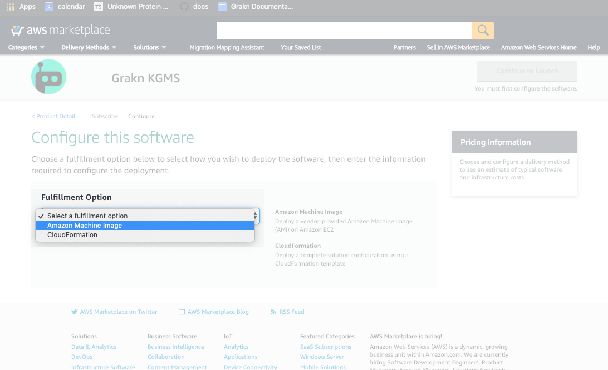[body:end]
[footer:start]Select _Amazon Machine Image_ as the _Fulfillment Option_.[footer:end]
[slide:end]

[slide:start]
[header:start]Confirm Configuration[header:end]
[body:start]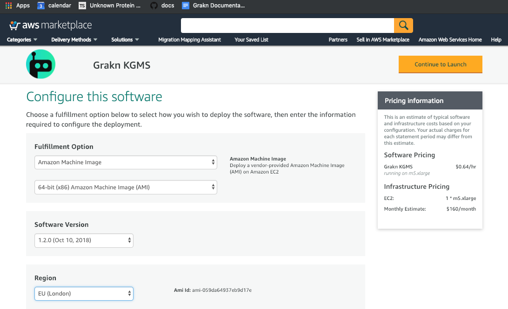[body:end]
[footer:start]We can now adjust the configuration based on our needs.[footer:end]
[slide:end]

[slide:start]
[header:start]Continue to Launch[header:end]
[body:start]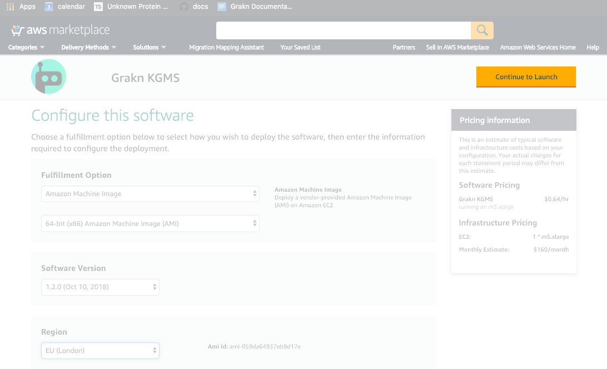[body:end]
[footer:start]Click on **Continue to Launch**.[footer:end]
[slide:end]

[slide:start]
[header:start]Action: CloudFormation[header:end]
[body:start]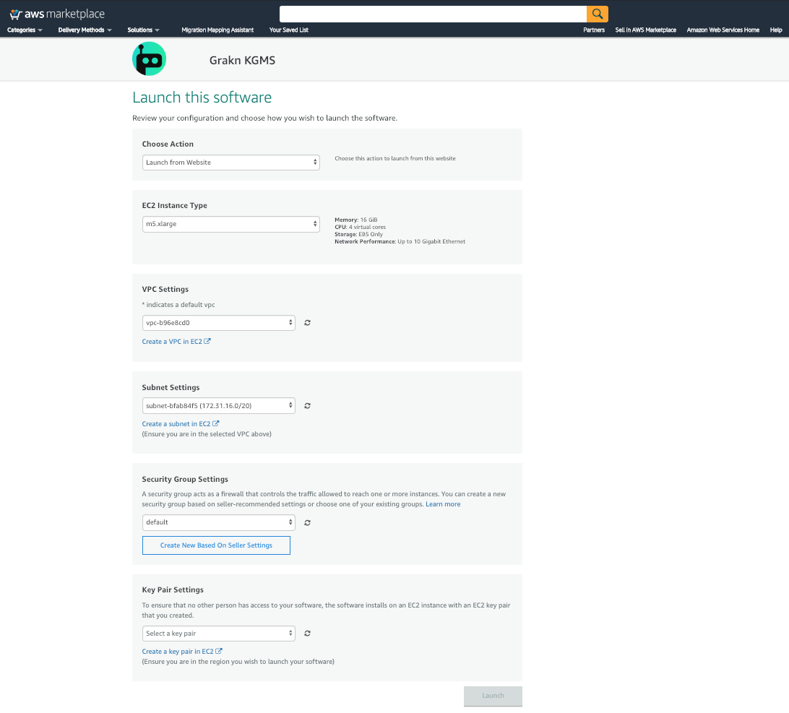[body:end]
[footer:start]Select _Launch From Website as the _Action_ and fill in the rest of the form. Once happy with all the options, click on **Launch** to continue.[footer:end]
[slide:end]

[slide:start]
[header:start]Launch[header:end]
[body:start]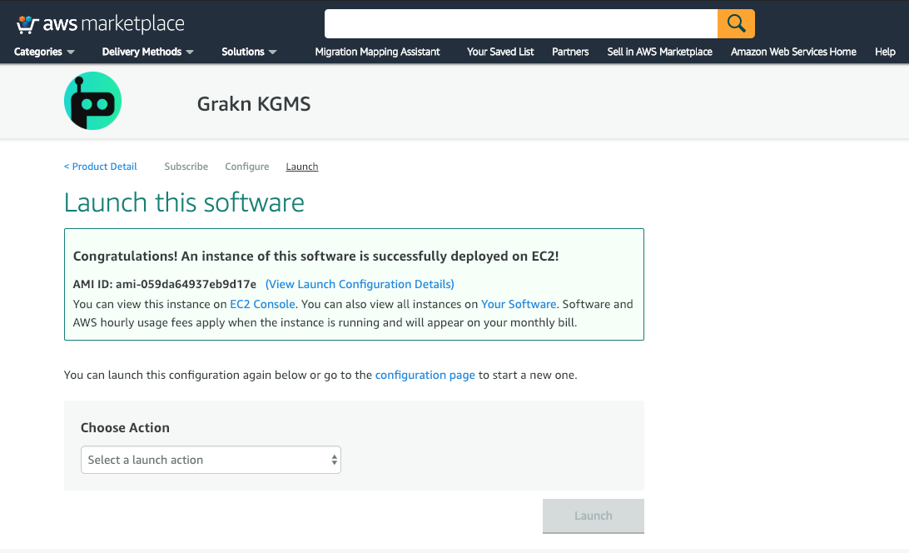[body:end]
[footer:start]An instance of Grakn is now deployed on EC2.[footer:end]
[slide:end]

[slide:start]
[header:start]Select Template[header:end]
[body:start]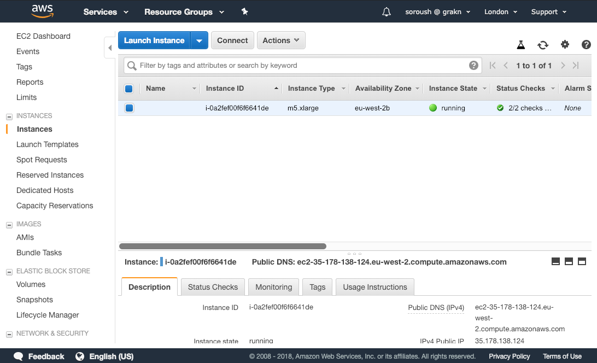[body:end]
[footer:start]By navigating to the [EC2 Console](https://console.aws.amazon.com/ec2/v2/home), we can view the running instance..[footer:end]
[slide:end]
</div>

## Run Grakn
Once the deployment is complete, Grakn starts automatically. There is no need for starting Grakn Servers manually.

## Default Credentials
When deploying an AMI, the default password is the instance id with username being `grakn`.

[tab:end]
</div>

## Log into a node
For a more direct interaction with the database, we need to log into one of the cluster nodes. To do so, we need to run the `ssh` as shown below.

```
ssh -i <path to the private key> ubuntu@<grakn instance DNS name or IP address>
```

The private key in question is the one that was specified as the `KeyPairName` stack parameter.

We can retrieve the DNS name or IP address by navigating to list of EC2 instances on AWS as illustrated below.
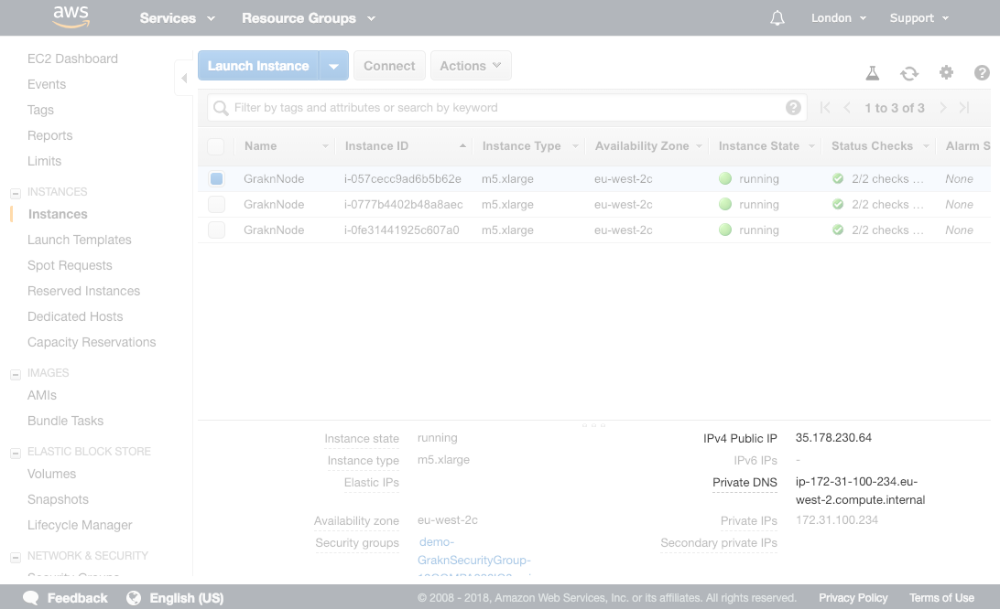


## Cluster Health Check
While [logged into a node](#logging-into-a-node), run `grakn cluster status`. This outputs the list of all nodes, as shown below, with the first column indicating the Status (**U**p/**D**own) and State (**N**ormal/**L**eaving/**J**oining/**M**oving).

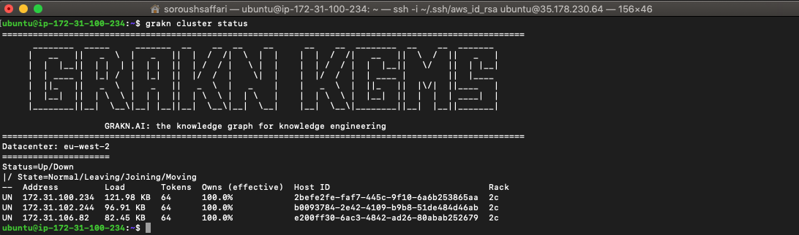

## Access Grakn Console
While [logged into a node](#logging-into-a-node), run `grakn console start`. This requires us to enter our credentials. If this is our first login, we need to enter the [default credentials](#default-credentials). Once authenticated, we are in the Grakn Console where, for instance, we may manage [authentication](../06-management/02-users.md).

## Access Graql Console
While [logged into a node](#logging-into-a-node), we can enter the [Grakn Console](../02-running-grakn/02-console.md) where we can interact with and perform [queries](../11-query/00-overview.md) on our [keyspaces](../06-management/01-keyspace.md).

## Configuring Grakn
To ensure Grakn behaves according to your specific needs, you may [configure Grakn](../02-running-grakn/03-configuration.md). One important attribute in Grakn configuration file, is the [path to the data directory](../02-running-grakn/03-configuration.md#where-data-is-stored).

## Sign up For Enterprise Support
As a user of Grakn KGMS on Google Cloud, you are entitled to [premium enterprise support](...).

<hr style="margin-top: 40px">

## Best Practices
Amazon Web Services offers a wide range of compute options. What follows is a set of generic recommendations for an optimal choice.

### Compute options
The optimum machine choice offering a good balance between CPU and memory should be equipped with at least 4 vCPUs and 8 GB of RAM.
Using machines with additional RAM above a 25 GB threshold is not expected to yield significant performance improvements.
Having these bounds in mind, the following machines are recommended because they offer a balanced set of system resources for a range of workloads:
- General Purpose:
    - t2.xlarge,
    - t2.2xlarge,
- Memory Optimised:
    - m5.xlarge,
    - m4.xlarge,
    - m3.xlarge,
- Compute Optimised:
    - c5.xlarge,
    - c5.2xlarge,
    - c4.xlarge,
    - c4.2xlarge,
    - c3.xlarge,
    - c3.2xlarge,

For more information, please visit the [AWS EC2 Instance Types](https://aws.amazon.com/ec2/instance-types)