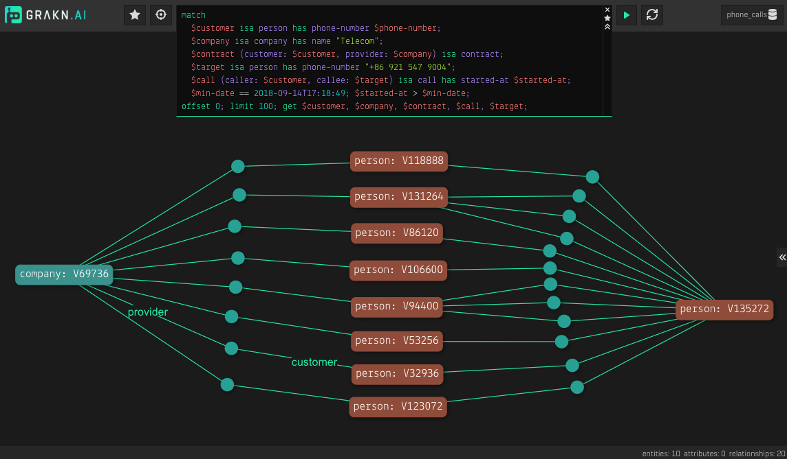
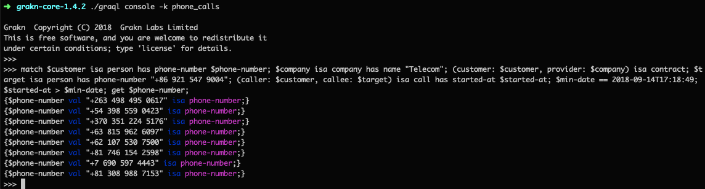
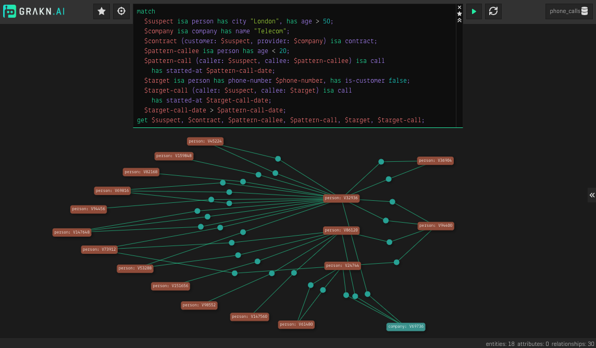
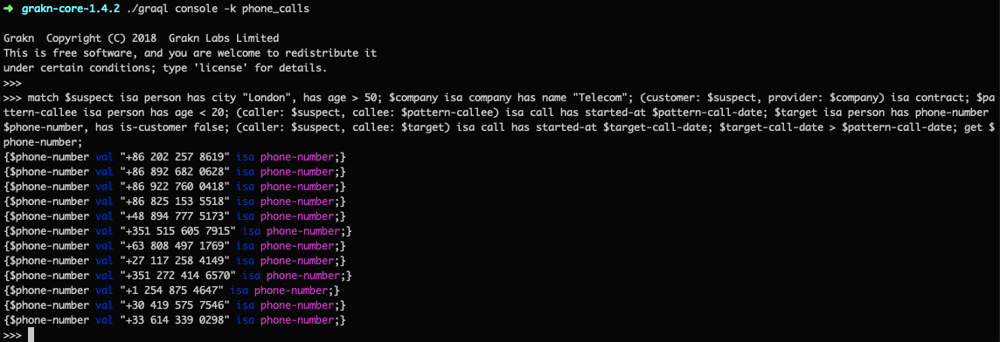
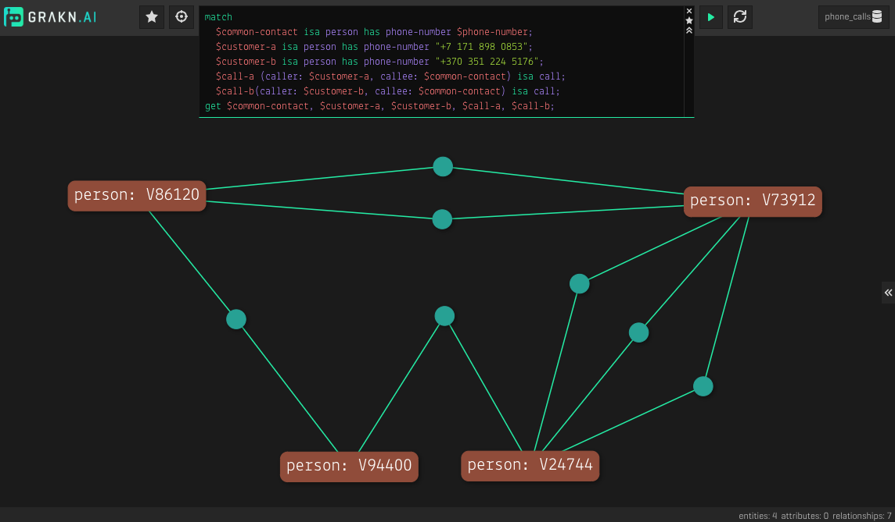
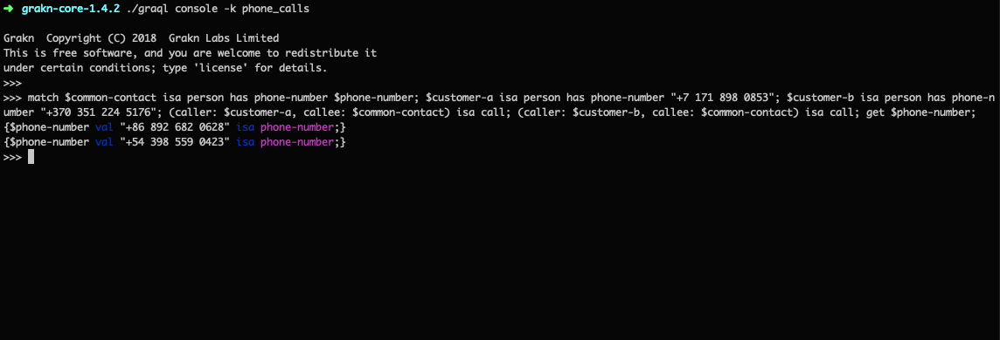
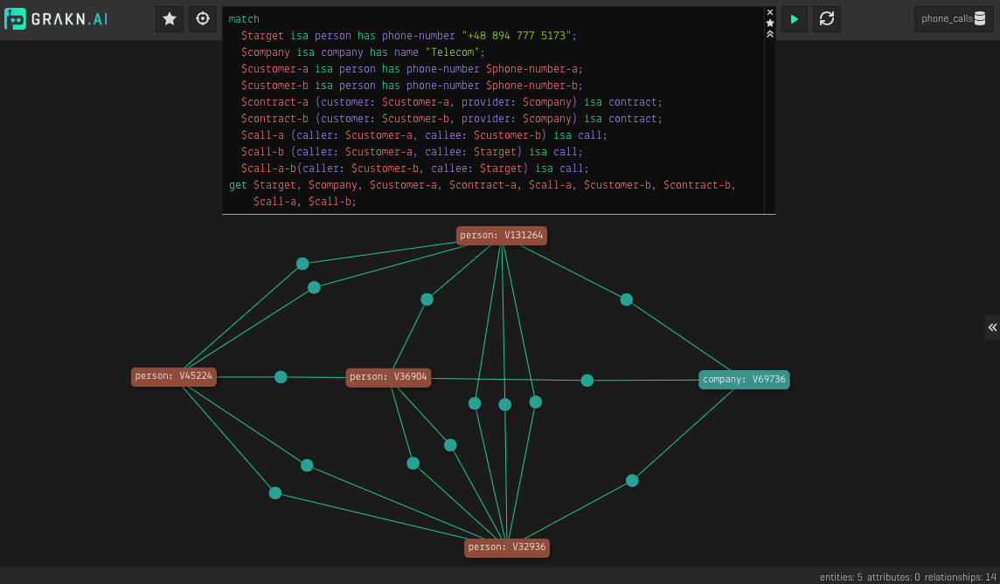
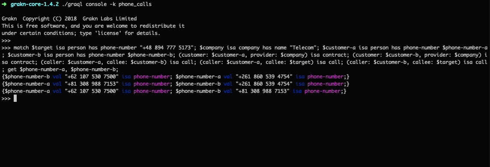
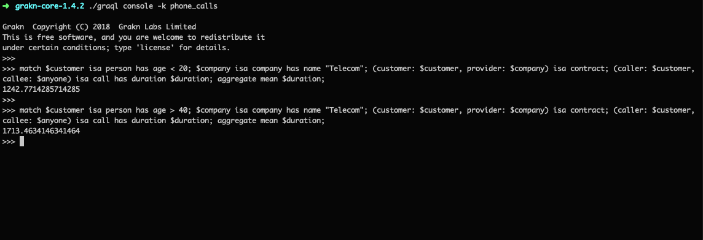

## Goal

When we [modelled and loaded the schema into TypeDB](../defining-the-schema), we had some insights in mind that we wanted to obtain from `phone_calls`; the knowledge graph.

Let’s revise:

- [Since September 14th, which customers called person X?](#since-september-14th-which-customers-called-person-x)
- [Who are the people who have received a call from a London customer aged over 50 who has previously called someone aged under 20?](#who-are-the-people-who-have-received-a-call-from-a-london-customer-aged-over-50-who-has-previously-called-someone-aged-under-20)
- [Who are the common contacts of customers X and Y?](#who-are-the-common-contacts-of-customers-x-and-y)
- [Who are the customers who 1) have all called each other and 2) have all called person X at least once?](#who-are-the-customers-who-1-have-all-called-each-other-and-2-have-all-called-person-x-at-least-once)
- [How does the average call duration among customers aged under 20 compare those aged over 40?](#how-does-the-average-call-duration-among-customers-aged-under-20-compare-with-those-aged-over-40)

For the rest of this post, we go through each of these questions to:

- understand their business value,
- write them as a statement,
- write them in [TypeQL](https://docs.vaticle.com/docs/query/overview), and
- assess their result.

Make sure you have [TypeDB Workbase](../07-workbase/00-overview.md) installed, [connected](../07-workbase/01-connection.md#configure-connection) to the running [TypeDB Server](../01-running-typedb/01-install-and-run.md#start-the-typedb-server) and `phone_calls` is the [selected database](../07-workbase/01-connection.md#select-a-database).

Let’s begin.

### Since September 14th, which customers called person X?

#### The business value:

> The person with phone number +86 921 547 9004 has been identified as a lead. We (company "Telecom") would like to know which of our customers have been in contact with this person since September 14th. This helps us in converting this lead into a customer.

#### As a statement:

> Get me the customers of company “Telecom” who called the target person with phone number +86 921 547 9004 from September 14th onwards.

#### In TypeQL:
```typeql
match
  $customer isa person, has phone-number $phone-number;
  $company isa company, has name "Telecom";
  (customer: $customer, provider: $company) isa contract;
  $target isa person, has phone-number "+86 921 547 9004";
  (caller: $customer, callee: $target) isa call, has started-at $started-at;
  $min-date 2018-09-14T17:18:49; $started-at > $min-date;
get $phone-number;
```

#### The result:

```javascript
[ '+62 107 530 7500', '+370 351 224 5176', '+54 398 559 0423',
  '+7 690 597 4443',  '+263 498 495 0617', '+63 815 962 6097',
  '+81 308 988 7153', '+81 746 154 2598']
```

#### Try it yourself


[caption:Using [Workbase](../07-workbase/00-overview.md)]


[caption:Using [TypeDB Console](../02-console/01-console.md)]

<div class="tabs dark">

[tab:Java]
<!-- test-example PhoneCallsFirstQuery.java -->
```java
package com.vaticle.doc.example.phoneCalls;


import com.vaticle.typedb.client.api.connection.TypeDBClient;
import com.vaticle.typedb.client.api.connection.TypeDBSession;
import com.vaticle.typedb.client.api.connection.TypeDBTransaction;
import com.vaticle.typedb.client.TypeDB;
import com.vaticle.typedb.client.api.answer.ConceptMap;
import com.vaticle.typeql.lang.query.TypeQLMatch;
import static com.vaticle.typeql.lang.TypeQL.*;

import java.util.*;
import java.util.stream.Collectors;

public class PhoneCallsFirstQuery {
    public static void main(String[] args) {
        TypeDBClient client = TypeDB.coreClient("localhost:1729");
        TypeDBSession session = client.session("phone_calls", TypeDBSession.Type.DATA);
        TypeDBTransaction transaction = session.transaction(TypeDBTransaction.Type.WRITE);

        List&lt;String&gt; queryAsList = Arrays.asList(
                "match",
                "  $customer isa person, has phone-number $phone-number;",
                "  $company isa company, has name \"Telecom\";",
                "  (customer: $customer, provider: $company) isa contract;",
                "  $target isa person, has phone-number \"+86 921 547 9004\";",
                "  (caller: $customer, callee: $target) isa call, has started-at $started-at;",
                "  $min-date 2018-09-14T17:18:49; $started-at > $min-date;",
                "get $phone-number;"
        );

        System.out.println("\nQuery:\n" + String.join("\n", queryAsList));
        String query = String.join("", queryAsList);

        List&lt;String&gt; result = new ArrayList<>();

        List&lt;ConceptMap&gt; answers = transaction.query().match(parseQuery(query).asMatch()).collect(Collectors.toList());
        for (ConceptMap answer : answers) {
            result.add(
                    answer.get("phone-number").asThing().asAttribute().getValue().toString()
            );
        }

        System.out.println("\nResult:\n" + String.join(", ", result));

        transaction.close();
        session.close();
        client.close();
    }
}
```
[tab:end]

[tab:Node.js]
<!-- test-example phoneCallsFirstQuery.js -->
```javascript
const { TypeDB } = require("typedb-client/TypeDB");
const { SessionType } = require("typedb-client/api/connection/TypeDBSession");
const { TransactionType } = require("typedb-client/api/connection/TypeDBTransaction");

async function ExecuteMatchQuery() {
    const client = TypeDB.coreClient("localhost:1729");
    const session = await client.session("phone_calls", SessionType.DATA);
	const transaction = await session.transaction(TransactionType.READ);

  	let query = [
    	"match",
    	"  $customer isa person, has phone-number $phone-number;",
    	'  $company isa company, has name "Telecom";',
    	"  (customer: $customer, provider: $company) isa contract;",
    	'  $target isa person, has phone-number "+86 921 547 9004";',
    	"  (caller: $customer, callee: $target) isa call, has started-at $started-at;",
    	"  $min-date 2018-09-14T17:18:49; $started-at > $min-date;",
    	"get $phone-number;"
  	];

  	console.log("\nQuery:\n", query.join("\n"));
  	query = query.join("");

  	const iterator = await transaction.query().match(query);
	const answers = await iterator.collect();
	const result = await Promise.all(
		answers.map(answer =>
			answer.map()
				  .get("phone-number")
				  .value()
		)
	);

  	console.log("\nResult:\n", result);

  	await transaction.close();
  	await session.close();
  	client.close();
}

ExecuteMatchQuery();
```
[tab:end]

[tab:Python]
<!-- test-example phone_calls_first_query.py -->
```python
from typedb.client import TypeDB, TypeDBClient, SessionType, TransactionType

with TypeDB.core_client('localhost:1729') as client:
    with client.session("phone_calls", SessionType.DATA) as session:
        with session.transaction(TransactionType.READ) as transaction:
            query = [
                'match',
                '  $customer isa person, has phone-number $phone-number;',
                '  $company isa company, has name "Telecom";',
                '  (customer: $customer, provider: $company) isa contract;',
                '  $target isa person, has phone-number "+86 921 547 9004";',
                '  (caller: $customer, callee: $target) isa call, has started-at $started-at;',
                '  $min-date 2018-09-14T17:18:49; $started-at > $min-date;',
                'get $phone-number;'
            ]

            print("\nQuery:\n", "\n".join(query))
            query = "".join(query)

            iterator = transaction.query().match(query)
            answers = [ans.get("phone-number") for ans in iterator]
            result = [ answer.value() for answer in answers ]

            print("\nResult:\n", result)
```
[tab:end]

</div>


### Who are the people who have received a call from a London customer aged over 50 who has previously called someone aged under 20?

#### The business value:

> We (company "Telecom") have received a number of harassment reports, which we suspect is caused by one individual. The only thing we know about the harasser is that he/she is aged roughly over 50 and lives in London. The reports have been made by young adults all aged under 20. We wonder if there is a pattern and so would like to speak to anyone who has received a call from a suspect since he/she potentially started harassing.

#### As a statement:

> Get me the phone number of people who have received a call from a customer aged over 50 after this customer (suspect) made a call to another customer aged under 20.

#### In TypeQL:
```typeql
match
  $suspect isa person, has city "London", has age > 50;
  $company isa company, has name "Telecom";
  (customer: $suspect, provider: $company) isa contract;
  $pattern-callee isa person, has age < 20;
  (caller: $suspect, callee: $pattern-callee) isa call, has started-at $pattern-call-date;
  $target isa person, has phone-number $phone-number, has is-customer false;
  (caller: $suspect, callee: $target) isa call, has started-at $target-call-date;
  $target-call-date > $pattern-call-date;
get $phone-number;
```

#### The result:

```javascript
[ '+30 419 575 7546',  '+86 892 682 0628', '+1 254 875 4647',
  '+351 272 414 6570', '+33 614 339 0298', '+86 922 760 0418',
  '+86 825 153 5518',  '+48 894 777 5173', '+351 515 605 7915',
  '+63 808 497 1769',  '+27 117 258 4149', '+86 202 257 8619' ]
```

#### Try it yourself


[caption:Using [Workbase](../07-workbase/00-overview.md)]


[caption:Using [TypeDB Console](../02-console/01-console.md)]

<div class="tabs dark">
[tab:Java]

<!-- test-example PhoneCallsSecondQuery.java -->
```java
package com.vaticle.doc.example.phoneCalls;


import com.vaticle.typedb.client.api.connection.TypeDBClient;
import com.vaticle.typedb.client.api.connection.TypeDBSession;
import com.vaticle.typedb.client.api.connection.TypeDBTransaction;
import com.vaticle.typedb.client.TypeDB;
import com.vaticle.typedb.client.api.answer.ConceptMap;
import com.vaticle.typeql.lang.query.TypeQLMatch;
import static com.vaticle.typeql.lang.TypeQL.*;

import java.util.*;
import java.util.stream.Collectors;

public class PhoneCallsSecondQuery {
    public static void main(String[] args) {
        TypeDBClient client = TypeDB.coreClient("localhost:1729");
        TypeDBSession session = client.session("phone_calls", TypeDBSession.Type.DATA);
        TypeDBTransaction transaction = session.transaction(TypeDBTransaction.Type.WRITE);

        List&lt;String&gt; queryAsList = Arrays.asList(
                "match ",
                "  $suspect isa person, has city \"London\", has age > 50;",
                "  $company isa company, has name \"Telecom\";",
                "  (customer: $suspect, provider: $company) isa contract;",
                "  $pattern-callee isa person, has age < 20;",
                "  (caller: $suspect, callee: $pattern-callee) isa call, has started-at $pattern-call-date;",
                "  $target isa person, has phone-number $phone-number, has is-customer false;",
                "  (caller: $suspect, callee: $target) isa call, has started-at $target-call-date;",
                "  $target-call-date > $pattern-call-date;",
                "get $phone-number;"
        );

        System.out.println("\nQuery:\n" + String.join("\n", queryAsList));
        String query = String.join("", queryAsList);

        List&lt;String&gt; result = new ArrayList<>();

        List&lt;ConceptMap&gt; answers = transaction.query().match(parseQuery(query).asMatch()).collect(Collectors.toList());
        for (ConceptMap answer : answers) {
            result.add(
                    answer.get("phone-number").asThing().asAttribute().getValue().toString()
            );
        }

        System.out.println("\nResult:\n" + String.join(", ", result));

        transaction.close();
        session.close();
        client.close();
    }
}
```
[tab:end]

[tab:Node.js]
<!-- test-example phoneCallsSecondQuery.js -->
```javascript
const { TypeDB } = require("typedb-client/TypeDB");
const { SessionType } = require("typedb-client/api/connection/TypeDBSession");
const { TransactionType } = require("typedb-client/api/connection/TypeDBTransaction");

async function ExecuteMatchQuery() {
    const client = TypeDB.coreClient("localhost:1729");
    const session = await client.session("phone_calls", SessionType.DATA);
	const transaction = await session.transaction(TransactionType.READ);

  	let query = [
		"match ",
		'  $suspect isa person, has city "London", has age > 50;',
		'  $company isa company, has name "Telecom";',
		"  (customer: $suspect, provider: $company) isa contract;",
		"  $pattern-callee isa person, has age < 20;",
		"  (caller: $suspect, callee: $pattern-callee) isa call, has started-at $pattern-call-date;",
		"  $target isa person, has phone-number $phone-number, has is-customer false;",
		"  (caller: $suspect, callee: $target) isa call, has started-at $target-call-date;",
		"  $target-call-date > $pattern-call-date;",
		"get $phone-number;"
  	];

  	console.log("\nQuery:\n", query.join("\n"));
  	query = query.join("");

  	const iterator = await transaction.query().match(query);
	const answers = await iterator.collect();
	const result = await Promise.all(
		answers.map(answer =>
			answer.map()
				  .get("phone-number")
				  .value()
		)
	);

  	console.log("\nResult:\n", result);

  	await transaction.close();
  	await session.close();
  	client.close();
}

ExecuteMatchQuery();
```
[tab:end]

[tab:Python]
<!-- test-example phone_calls_second_query.py -->
```python
from typedb.client import TypeDB, TypeDBClient, SessionType, TransactionType

with TypeDB.core_client('localhost:1729') as client:
    with client.session("phone_calls", SessionType.DATA) as session:
      with session.transaction(TransactionType.READ) as transaction:
        query = [
          'match ',
          '  $suspect isa person, has city "London", has age > 50;',
          '  $company isa company, has name "Telecom";',
          '  (customer: $suspect, provider: $company) isa contract;',
          '  $pattern-callee isa person, has age < 20;',
          '  (caller: $suspect, callee: $pattern-callee) isa call, has started-at $pattern-call-date;',
          '  $target isa person, has phone-number $phone-number, has is-customer false;',
          '  (caller: $suspect, callee: $target) isa call, has started-at $target-call-date;',
          '  $target-call-date > $pattern-call-date;',
          'get $phone-number;'
        ]

        print("\nQuery:\n", "\n".join(query))
        query = "".join(query)

        iterator = transaction.query().match(query)
        answers = [ans.get("phone-number") for ans in iterator]
        result = [ answer.value() for answer in answers ]

        print("\nResult:\n", result)
```
[tab:end]

</div>


### Who are the common contacts of customers X and Y?

#### The business value:

> The customer with phone number +7 171 898 0853 and +370 351 224 5176 have been identified as friends. We (company "Telecom") like to know who their common contacts are in order to offer them a group promotion.

#### As a statement:

> Get me the phone number of people who have received calls from both customers with phone number +7 171 898 0853 and customer with phone number +370 351 224 5176.

#### In TypeQL:
```typeql
match
  $common-contact isa person, has phone-number $phone-number;
  $customer-a isa person, has phone-number "+7 171 898 0853";
  $customer-b isa person, has phone-number "+370 351 224 5176";
  (caller: $customer-a, callee: $common-contact) isa call;
  (caller: $customer-b, callee: $common-contact) isa call;
get $phone-number;
```

#### The result:

```javascript
['+86 892 682 0628', '+54 398 559 0423']
```

#### Try it yourself


[caption:Using [Workbase](../07-workbase/00-overview.md)]


[caption:Using [TypeDB Console](../02-console/01-console.md)]

<div class="tabs dark">
[tab:Java]

<!-- test-example PhoneCallsThirdQuery.java -->
```java
package com.vaticle.doc.example.phoneCalls;


import com.vaticle.typedb.client.api.connection.TypeDBClient;
import com.vaticle.typedb.client.api.connection.TypeDBSession;
import com.vaticle.typedb.client.api.connection.TypeDBTransaction;
import com.vaticle.typedb.client.TypeDB;
import com.vaticle.typedb.client.api.answer.ConceptMap;
import com.vaticle.typeql.lang.query.TypeQLMatch;
import static com.vaticle.typeql.lang.TypeQL.*;

import java.util.*;
import java.util.stream.Collectors;

public class PhoneCallsThirdQuery {
    public static void main(String[] args) {
        TypeDBClient client = TypeDB.coreClient("localhost:1729");
        TypeDBSession session = client.session("phone_calls", TypeDBSession.Type.DATA);
        TypeDBTransaction transaction = session.transaction(TypeDBTransaction.Type.WRITE);

        List&lt;String&gt; queryAsList = Arrays.asList(
                "match ",
                "  $common-contact isa person, has phone-number $phone-number;",
                "  $customer-a isa person, has phone-number \"+7 171 898 0853\";",
                "  $customer-b isa person, has phone-number \"+370 351 224 5176\";",
                "  (caller: $customer-a, callee: $common-contact) isa call;",
                "  (caller: $customer-b, callee: $common-contact) isa call;",
                "get $phone-number;"
        );

        System.out.println("\nQuery:\n" + String.join("\n", queryAsList));
        String query = String.join("", queryAsList);

        List&lt;String&gt; result = new ArrayList<>();

        List&lt;ConceptMap&gt; answers = transaction.query().match(parseQuery(query).asMatch()).collect(Collectors.toList());
        for (ConceptMap answer : answers) {
            result.add(
                    answer.get("phone-number").asThing().asAttribute().getValue().toString()
            );
        }

        System.out.println("\nResult:\n" + String.join(", ", result));

        transaction.close();
        session.close();
        client.close();
    }
}
```
[tab:end]

[tab:Node.js]
<!-- test-example phoneCallsThirdQuery.js -->
```javascript
const { TypeDB } = require("typedb-client/TypeDB");
const { SessionType } = require("typedb-client/api/connection/TypeDBSession");
const { TransactionType } = require("typedb-client/api/connection/TypeDBTransaction");

async function ExecuteMatchQuery() {
    const client = TypeDB.coreClient("localhost:1729");
    const session = await client.session("phone_calls", SessionType.DATA);
	const transaction = await session.transaction(TransactionType.READ);

	let query = [
		"match ",
		"  $common-contact isa person, has phone-number $phone-number;",
		'  $customer-a isa person, has phone-number "+7 171 898 0853";',
		'  $customer-b isa person, has phone-number "+370 351 224 5176";',
		"  (caller: $customer-a, callee: $common-contact) isa call;",
		"  (caller: $customer-b, callee: $common-contact) isa call;",
		"get $phone-number;"
	];

  	console.log("\nQuery:\n", query.join("\n"));
  	query = query.join("");

	const iterator = await transaction.query().match(query);
	const answers = await iterator.collect();
	const result = await Promise.all(
		answers.map(answer =>
			answer.map()
				  .get("phone-number")
				  .value()
		)
	);

  	console.log("\nResult:\n", result);

	transaction.close();
  	await session.close();
  	client.close();
}

ExecuteMatchQuery();
```
[tab:end]

[tab:Python]
<!-- test-example phone_calls_third_query.py -->
```python
from typedb.client import TypeDB, TypeDBClient, SessionType, TransactionType

with TypeDB.core_client('localhost:1729') as client:
    with client.session("phone_calls", SessionType.DATA) as session:
        with session.transaction(TransactionType.READ) as transaction:
            query = [
                'match ',
                '  $common-contact isa person, has phone-number $phone-number;',
                '  $customer-a isa person, has phone-number "+7 171 898 0853";',
                '  $customer-b isa person, has phone-number "+370 351 224 5176";',
                '  (caller: $customer-a, callee: $common-contact) isa call;',
                '  (caller: $customer-b, callee: $common-contact) isa call;',
                'get $phone-number;'
            ]

            print("\nQuery:\n", "\n".join(query))
            query = "".join(query)

            iterator = transaction.query().match(query)
            answers = [ans.get("phone-number") for ans in iterator]
            result = [ answer.value() for answer in answers ]

            print("\nResult:\n", result)
```
[tab:end]

</div>

### Who are the customers who 1) have all called each other and 2) have all called person X at least once?

#### The business value:

```
The person with phone number +48 894 777 5173 has been identified as a lead. We (company "Telecom") would like to know who his circle of  (customer) contacts are, so that we can encourage them in converting this lead to a customer.
```

#### As a statement:

```
Get me the phone number of all customers who have called each other as well as the person with phone number +48 894 777 5173.
```

#### In TypeQL:
```typeql
match
  $target isa person, has phone-number "+48 894 777 5173";
  $company isa company, has name "Telecom";
  $customer-a isa person, has phone-number $phone-number-a;
  $customer-b isa person, has phone-number $phone-number-b;
  (customer: $customer-a, provider: $company) isa contract;
  (customer: $customer-b, provider: $company) isa contract;
  (caller: $customer-a, callee: $customer-b) isa call;
  (caller: $customer-a, callee: $target) isa call;
  (caller: $customer-b, callee: $target) isa call;
get $phone-number-a, $phone-number-b;
```

#### The result:

```javascript
[ '+62 107 530 7500', '+261 860 539 4754', '+81 308 988 7153' ]
```

#### Try it yourself


[caption:Using [Workbase](../07-workbase/00-overview.md)]


[caption:Using [TypeDB Console](../02-console/01-console.md)]

<div class="tabs dark">
[tab:Java]

<!-- test-example PhoneCallsForthQuery.java -->
```java
package com.vaticle.doc.example.phoneCalls;


import com.vaticle.typedb.client.api.connection.TypeDBClient;
import com.vaticle.typedb.client.api.connection.TypeDBSession;
import com.vaticle.typedb.client.api.connection.TypeDBTransaction;
import com.vaticle.typedb.client.TypeDB;
import com.vaticle.typedb.client.api.answer.ConceptMap;
import com.vaticle.typeql.lang.query.TypeQLMatch;
import static com.vaticle.typeql.lang.TypeQL.*;

import java.util.*;
import java.util.stream.Collectors;

public class PhoneCallsForthQuery {
    public static void main(String[] args) {
        TypeDBClient client = TypeDB.coreClient("localhost:1729");
        TypeDBSession session = client.session("phone_calls", TypeDBSession.Type.DATA);
        TypeDBTransaction transaction = session.transaction(TypeDBTransaction.Type.WRITE);

        List&lt;String&gt; queryAsList = Arrays.asList(
                "match ",
                "  $target isa person, has phone-number \"+48 894 777 5173\";",
                "  $company isa company, has name \"Telecom\";",
                "  $customer-a isa person, has phone-number $phone-number-a;",
                "  (customer: $customer-a, provider: $company) isa contract;",
                "  (caller: $customer-a, callee: $target) isa call;",
                "  $customer-b isa person, has phone-number $phone-number-b;",
                "  (customer: $customer-b, provider: $company) isa contract;",
                "  (caller: $customer-b, callee: $target) isa call;",
                "  (caller: $customer-a, callee: $customer-b) isa call;",
                "get $phone-number-a, $phone-number-b;"
        );

        System.out.println("\nQuery:\n" + String.join("\n", queryAsList));
        String query = String.join("", queryAsList);

        Set&lt;String&gt; result = new HashSet<>();

        List&lt;ConceptMap&gt; answers = transaction.query().match(parseQuery(query).asMatch()).collect(Collectors.toList());
        for (ConceptMap answer : answers) {
            result.add(answer.get("phone-number-a").asThing().asAttribute().getValue().toString());
            result.add(answer.get("phone-number-b").asThing().asAttribute().getValue().toString());
        }

        System.out.println("\nResult:\n" + String.join(", ", result));

        transaction.close();
        session.close();
        client.close();
    }
}
```
[tab:end]

[tab:Node.js]
<!-- test-example phoneCallsForthQuery.js -->
```javascript
const { TypeDB } = require("typedb-client/TypeDB");
const { SessionType } = require("typedb-client/api/connection/TypeDBSession");
const { TransactionType } = require("typedb-client/api/connection/TypeDBTransaction");

async function ExecuteMatchQuery() {
    const client = TypeDB.coreClient("localhost:1729");
    const session = await client.session("phone_calls", SessionType.DATA);
	const transaction = await session.transaction(TransactionType.READ);

  	let query = [
    	"match ",
    	'  $target isa person, has phone-number "+48 894 777 5173";',
    	'  $company isa company, has name "Telecom";',
    	"  $customer-a isa person, has phone-number $phone-number-a;",
    	"  (customer: $customer-a, provider: $company) isa contract;",
    	"  (caller: $customer-a, callee: $target) isa call;",
    	"  $customer-b isa person, has phone-number $phone-number-b;",
    	"  (customer: $customer-b, provider: $company) isa contract;",
    	"  (caller: $customer-b, callee: $target) isa call;",
    	"  (caller: $customer-a, callee: $customer-b) isa call;",
    	"get $phone-number-a, $phone-number-b;"
  	];

  	console.log("\nQuery:\n", query.join("\n"));
  	query = query.join("");

  	const iterator = await transaction.query().match(query);
	const answers = await iterator.collect();
	const result = await Promise.all(
		answers.map(answer =>
			answer.map()
				  .get("phone-number-a")
			      .value()
		)
	);

	console.log("\nResult:\n", result);

	await transaction.close();
  	await session.close();
  	client.close();
}

ExecuteMatchQuery();
```
[tab:end]

[tab:Python]
<!-- test-example phone_calls_forth_query.py -->
```python
from typedb.client import TypeDB, TypeDBClient, SessionType, TransactionType

with TypeDB.core_client('localhost:1729') as client:
    with client.session("phone_calls", SessionType.DATA) as session:
        with session.transaction(TransactionType.READ) as transaction:
            query = [
                'match ',
                '  $target isa person, has phone-number "+48 894 777 5173";',
                '  $company isa company, has name "Telecom";',
                '  $customer-a isa person, has phone-number $phone-number-a;',
                '  (customer: $customer-a, provider: $company) isa contract;',
                '  (caller: $customer-a, callee: $target) isa call;',
                '  $customer-b isa person, has phone-number $phone-number-b;',
                '  (customer: $customer-b, provider: $company) isa contract;',
                '  (caller: $customer-b, callee: $target) isa call;',
                '  (caller: $customer-a, callee: $customer-b) isa call;',
                'get $phone-number-a, $phone-number-b;'
            ]

            print("\nQuery:\n", "\n".join(query))
            query = "".join(query)

            iterator = transaction.query().match(query)
            answers = []
            for answer in iterator:
                answers.extend(answer.map().values())
            result = [ answer.value() for answer in answers ]
            print("\nResult:\n", result)
```
[tab:end]

</div>

### How does the average call duration among customers aged under 20 compare with those aged over 40?

#### The business value:

> In order to better understand our customers' behaviour, we (company "Telecom") like to know how the average phone call duration among those aged under 20 compares to those aged over 40.

Two queries need to be executed to provide this insight.

### Query 1: aged under 20

#### As a statement:

> Get me the average call duration among customers who have a contract with company "Telecom" and are aged under 20.

#### In TypeQL:
```typeql
match
  $customer isa person, has age < 20;
  $company isa company, has name "Telecom";
  (customer: $customer, provider: $company) isa contract;
  (caller: $customer, callee: $anyone) isa call, has duration $duration;
get $duration; mean $duration;
```

#### The result:

```
1242 seconds
```

### Query 2: aged over 40

#### As a statement:

> Get me the average call duration among customers who have a contract with company "Telecom" and are aged over 40.

#### In TypeQL:
```typeql
match
  $customer isa person, has age > 40;
  $company isa company, has name "Telecom";
  (customer: $customer, provider: $company) isa contract;
  (caller: $customer, callee: $anyone) isa call, has duration $duration;
get $duration; mean $duration;
```

#### The result:

```
1713 seconds
```

#### Try it yourself


[caption:Using [TypeDB Console](../02-console/01-console.md)]

<div class="tabs dark">
[tab:Java]

<!-- test-example PhoneCallsFifthQuery.java -->
```java
package com.vaticle.doc.example.phoneCalls;


import com.vaticle.typedb.client.api.connection.TypeDBClient;
import com.vaticle.typedb.client.api.connection.TypeDBSession;
import com.vaticle.typedb.client.api.connection.TypeDBTransaction;
import com.vaticle.typedb.client.TypeDB;
import com.vaticle.typedb.client.api.answer.ConceptMap;
import com.vaticle.typedb.client.api.answer.ConceptMapGroup;
import com.vaticle.typedb.client.api.answer.Numeric;
import com.vaticle.typeql.lang.query.TypeQLMatch;
import static com.vaticle.typeql.lang.TypeQL.*;

import java.util.*;
import java.util.stream.Collectors;

public class PhoneCallsFifthQuery {
    public static void main(String[] args) {
        TypeDBClient client = TypeDB.coreClient("localhost:1729");
        TypeDBSession session = client.session("phone_calls", TypeDBSession.Type.DATA);
        TypeDBTransaction transaction = session.transaction(TypeDBTransaction.Type.WRITE);

        List&lt;String&gt; firstQueryAsList = Arrays.asList(
                "match",
                "  $customer isa person, has age < 20;",
                "  $company isa company, has name \"Telecom\";",
                "  (customer: $customer, provider: $company) isa contract;",
                "  (caller: $customer, callee: $anyone) isa call, has duration $duration;",
                "get $duration; mean $duration;"
        );

        System.out.println("\nFirst Query:\n" + String.join("\n", firstQueryAsList));

        String firstQuery = String.join("", firstQueryAsList);

        Numeric firstAnswer = transaction.query().match(parseQuery(firstQuery).asMatchAggregate()).get();
        String firstResult = !firstAnswer.isNaN() ? firstAnswer.asNumber().toString() : "NaN";

        String result = "Customers aged under 20 have made calls with average duration of " + firstResult + " seconds.\n";

        List&lt;String&gt; secondQueryAsList = Arrays.asList(
                "match",
                "  $customer isa person, has age > 40;",
                "  $company isa company, has name \"Telecom\";",
                "  (customer: $customer, provider: $company) isa contract;",
                "  (caller: $customer, callee: $anyone) isa call, has duration $duration;",
                "get $duration; mean $duration;"
        );

        System.out.println("\nSecond Query:\n" +
                String.join("\n", secondQueryAsList));

        String secondQuery = String.join("", secondQueryAsList);

        Numeric secondAnswer = transaction.query().match(parseQuery(secondQuery).asMatchAggregate()).get();
        String secondResult = !secondAnswer.isNaN() ? secondAnswer.asNumber().toString() : "NaN";

        result += "Customers aged over 40 have made calls with average duration of " + secondResult + " seconds.\n";

        System.out.println("\nResult:\n" + String.join(", ", result));

        transaction.close();
        session.close();
        client.close();
    }
}
```
[tab:end]

[tab:Node.js]
<!-- test-example phoneCallsFifthQuery.js -->
```javascript
const { TypeDB } = require("typedb-client/TypeDB");
const { SessionType } = require("typedb-client/api/connection/TypeDBSession");
const { TransactionType } = require("typedb-client/api/connection/TypeDBTransaction");

async function ExecuteMatchQuery() {
	const client = TypeDB.coreClient("localhost:1729");
    const session = await client.session("phone_calls", SessionType.DATA);
    const transaction = await session.transaction(TransactionType.READ);

  	let firstQuery = [
		'match',
		'  $customer isa person, has age < 20;',
		'  $company isa company, has name "Telecom";',
		'  (customer: $customer, provider: $company) isa contract;',
		'  (caller: $customer, callee: $anyone) isa call, has duration $duration;',
		'get $duration; mean $duration;'
	];

	console.log("\nQuery:\n", firstQuery.join("\n"));

	firstQuery = firstQuery.join("");
	const firstAnswer = await transaction.query().matchAggregate(firstQuery);
	let firstResult = 0;
	if(firstAnswer.isNumber()) {
		firstResult = firstAnswer.asNumber();
	}


  	let result =
		"Customers aged under 20 have made calls with average duration of " +
		Math.round(firstResult) +
		" seconds.\n";

	secondQuery = [
		'match ' +
		'  $customer isa person, has age > 40;',
		'  $company isa company, has name "Telecom";',
		'  (customer: $customer, provider: $company) isa contract;',
		'  (caller: $customer, callee: $anyone) isa call, has duration $duration;',
		'get $duration; mean $duration;'
	];

	console.log("\nQuery:\n", secondQuery.join("\n"));
	secondQuery = secondQuery.join("");

	const secondAnswer = await transaction.query().matchAggregate(secondQuery);
	let secondResult = 0;
	if(secondAnswer.isNumber()) {
		secondResult = secondAnswer.asNumber();
	}

	result +=
		"Customers aged over 40 have made calls with average duration of " +
		Math.round(secondResult) +
		" seconds.\n";
	
	console.log(result);

	await transaction.close();
  	await session.close();
  	client.close();
}

ExecuteMatchQuery();
```
[tab:end]

[tab:Python]
<!-- test-example phone_calls_fifth_query.py -->
```python
from typedb.client import TypeDB, TypeDBClient, SessionType, TransactionType

with TypeDB.core_client('localhost:1729') as client:
    with client.session("phone_calls", SessionType.DATA) as session:
        with session.transaction(TransactionType.READ) as transaction:
            first_query = [
                'match',
                '  $customer isa person, has age < 20;',
                '  $company isa company, has name "Telecom";',
                '  (customer: $customer, provider: $company) isa contract;',
                '  (caller: $customer, callee: $anyone) isa call, has duration $duration;',
                'get $duration; mean $duration;'
            ]

            print("\nQuery:\n", "\n".join(first_query))
            first_query = "".join(first_query)

            first_answer = transaction.query().match_aggregate(first_query).get()
            first_result = 'NaN'
            if first_answer.is_int():
                first_result = first_answer.as_int()
            elif first_answer.is_float():
                first_result = first_answer.as_float()

            result = ("Customers aged under 20 have made calls with average duration of "
                      + first_result + " seconds.\n")

            second_query = [
                'match ',
                '  $customer isa person, has age > 40;',
                '  $company isa company, has name "Telecom";',
                '  (customer: $customer, provider: $company) isa contract;',
                '  (caller: $customer, callee: $anyone) isa call, has duration $duration;',
                'get $duration; mean $duration;'
            ]
            print("\nQuery:\n", "\n".join(second_query))
            second_query = "".join(second_query)

            second_answer = transaction.query().match_aggregate(second_query).get()
            second_result = 'NaN'
            if second_answer.is_int():
                second_result = second_answer.as_int()
            elif second_answer.is_float():
                second_result = second_answer.as_float()

            result += ("Customers aged above 40 have made calls with average duration of "
                       + second_result + " seconds.\n")

            print("\nResult:\n", result)
```
[tab:end]

</div>

## 👏 You’ve done it!

Five TypeQL queries, each written in a few lines, answered all of our questions.
Our imaginary client, Telecom, can now take these insights back to their team and, hopefully, use them responsibly to serve their customers.
And you ... are the one who made it happen!
