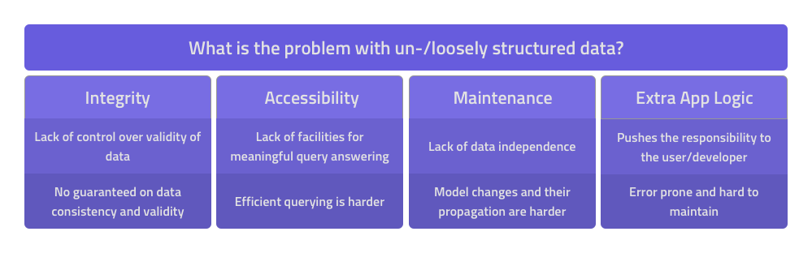

## Why Use a Schema?

Schema is a means to address the problems of managing and handling unstructured or loosely structured data.



The common problems we encounter when dealing with unstructured or loosely structured data are:

- **Integrity** - when data is weakly tied to any particular structure it is hard or even impossible to control the state and validity of the data. As a result, we have no guarantees on data consistency and validity.

- **Accessibility and retrieval** - with the lack of any high-level structure comes the lack of possibility to query the data meaningfully. This is either because our data structure is too low level to express complex queries or that handling the complexity of such queries becomes a problem. Consequently, we might be forced to ask simple questions only.

- **Maintenance** - the problem is directly coupled with the integrity problem. When we have little control over the structure of our data it is hard to alter that structure over time as requirements change. As a consequence, data changes need to be carried out with surgical precision or risk data pollution.

- **Deferring Responsibility** - starting with loose or no schema only defers the responsibility of schema definition and enforcement in time. In production systems, we cannot afford to lose control over data. If the database doesn't take responsibility for schema definition and enforcement, that means that the schema logic needs to be incorporated at the app level.

A TypeDB schema is the blueprint of a TypeDB knowledge graph. Using a highly flexible language, we define a schema to model a domain true to nature.
Highly interconnected data cannot be stored at scale without an underlying structure - one that is capable of expressing the complexity of the dataset is easy to understand and can be extended programmatically, at runtime.

The schema defines a specific, explicit, high-level structure of data that is enforced across the dataset. This allows the database to provide logical integrity guarantees and consistency guarantees for our data. Any attempt to add data not conforming to the defined schema is a schema violation and is not allowed.

A well-constructed schema enables writing intuitive queries. Given such schema, we often find ourselves writing queries that map seamlessly with how we form them as questions in our mind.

Last and certainly not least, the schema sets the basis for performing automated reasoning over the represented data. It enables the extraction of implicit information from explicitly stored data - a powerful feature of TypeDB that facilitates knowledge discovery and the implementation of business logic inside the database.

## What is a TypeDB schema
TypeDB schema is an inherent part of the knowledge graph that describes how the data is and can be structured.

As you may already know, in the domain of schema-first database knowledge systems, database design involves three schemas:

  1. _A high-level conceptual schema_, that models our problem and usually involves some variation of the entity-relation model
  2. _A mid-level logical schema_, that depends on the database type we are using. For example if we are going relational, this would involve turning the conceptual model into tables and going over a series of normalisation steps of the schema.
  3. _A low-level physical schema_, that requires us to optimise our schema according to how our physical resources are distributed

With TypeDB, thanks to our high-level knowledge model, the schema closely resembles the conceptual schema, essentially avoiding the hassle of going through the other two modelling steps. The TypeDB system takes care of this.
This greatly simplifies the design process, providing us with, what can be considered, a highly normalised distributed schema without the need of going through logical and physical modelling. 

Let's have a look at the main components of a TypeDB knowledge graph and schema.

## TypeDB Data Model

Everything that describes a domain in a TypeDB Knowledge Graph is a concept or a logical structure.
Concepts consist of the schema concepts (namely types and roles) and data concepts, the actual data instances, which we refer to as _thing_ concepts.
Logical structures consist of rules.

### Types
Types constitute the core of the schema. They provide the necessary vocabulary to talk about our domain. They come in three flavours: [Entities](../09-schema/01-concepts.md#entity), [Relations](../09-schema/01-concepts.md#relation), and [Attributes](../09-schema/01-concepts.md#attribute):

**Entities** are the main actors in our domain. These are usually the type of things we want to know about. Entity types provide means of classifying the objects in our domain.

**Relations** connect concepts together. Each relation can connect a number of things. A thing's participation in a relation is characterised by a **role** that can be played in that relation.
Each relation is required to have at least one role.

**Attributes** are used to characterise concepts with small pieces of data (think of numbers, strings, dates etc.). Consequently, by defining attributes we can attach values of a specified value type to our instances.

Apart from serving as a mean of classification, types also define behaviours of their instances. Consequently, types can define the following behaviours:

**owns [attribute type]** - the ability to have an attribute of a specified type attached to an instance.

**plays [role]** - the ability to participate in relations that allow for that role to be played.

**relates [role]** (only relation) - the ability for other instances to play the given role in instances of the defined relation type.

### Type Hierarchies
Besides the modularity that the concept types provide, we are free to form subtype relationships between concept types. For a given child concept type that subtypes a parent concept type, the child concept type inherits the attributes owned and roles played by the parent type. The mechanism is analogous to subclassing in Object Oriented Programming. Each concept type can have only a single parent type - multiple inheritance is not supported.
Subtyping not only allows us to mirror nature of a dataset as perceived in the real world but also enables automated reasoning.

### Roles
_Roles_ are capabilities belonging to relations, that specify the nature of the connection between instances. They are not types themselves. That means, we cannot have a thing which is an instance of a role, but we can have things playing a role in a specific relation. However, roles can also be subtyped (with `as`) and queried similarly to regular schema types. 
In the schema, we need to specify what role relates to each relation type and who can play this role. Thanks to roles, we are able to guarantee the logical integrity of our data, disallowing a `marriage` between a `person` and a `building`, for example. Unless we specifically allow such a relationship in the schema.

### Rules
Lastly, the TypeDB schema is completed with [**TypeQL Rules**](../09-schema/03-rules.md). Rules are used for query-time capture of patterns in the data and performing deduction. Rules are the building blocks of automated reasoning in TypeDB.

In the sections that follow, by looking at various real-world examples, we learn how these concepts can be defined in a schema to represent a dataset of any complexity.

## (un)Define the schema programmatically
In the following sections, we learn how to define a schema using TypeQL code in a `schema.tql` file. However, defining a schema can also be done programmatically (at runtime) using one of the TypeDB Clients - [Java](../02-clients/java/01-java-overview.md), [Python](../02-clients/python/01-python-overview.md) and [Node.js](../02-clients/node-js/01-node-js-overview.md).

## Load the schema
Once we have defined the schema, the next immediate step is to load it into TypeDB. We can do this using the TypeDB Console that comes in the TypeDB distribution: 

```
$ typedb console --command="transaction <database-name> schema write" --command="source <path-to-schema.tql>" --command="commit"
```


## Migrate Data
To learn about migrating a pre-existing dataset in CSV, JSON or XML formats to a TypeDB knowledge graph, check out the [migration tutorials](../08-examples/00-overview.md) in the language of your choice.

## Query the schema
In the next section we learn how to [insert](../11-query/03-insert-query.md), [get](../11-query/02-get-query.md), [delete](../11-query/04-delete-query.md), [update](../11-query/05-update-query.md), and [aggregate](../11-query/06-aggregate-query.md) data represented by a schema.

## Reserved Keywords
The following keywords are reserved and meant to only be used by TypeQL.
<!-- test-ignore -->
```typeql
## Native types
thing, entity, attribute, relation, role

## Data types
long, double, string, boolean, datetime

## Query commands
define, undefine, match, get, insert, delete;

## Delete and get query modifiers
offset, limit, group, sort, asc, desc

## Statement properties
abstract, as, iid, type, isa, isa!, sub, sub!, owns, has, plays, relates, value, regex, rule, when, then

## Operators
or, not, like, is

## Literal values
true, false
```

## Summary
The TypeDB schema sets the foundation for a TypeDB knowledge graph. When modelled thoroughly, the schema provides us with a knowledge graph that benefits from logical integrity, is flexible towards change, capable of automated reasoning, and enables writing intuitive queries.

In the next section, we learn about the members of a schema - [Concept Types](../09-schema/01-concepts.md) and [Rules](../09-schema/03-rules.md).
