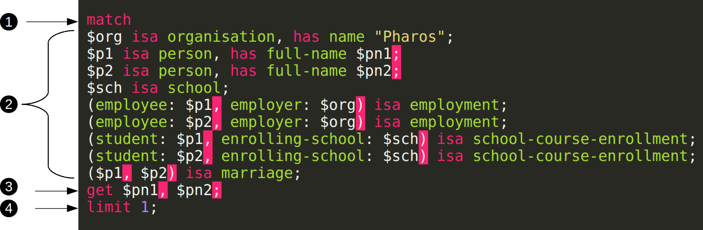

## Graql Query Language

Graql is the query language for the Grakn knowledge graph. Whether it's through the [Grakn Console](../02-running-grakn/02-console.md) or one of the [Grakn Clients](../03-client-api/00-overview.md), Grakn accepts instructions and provides answers only in its own language - Graql.

**Graql is declarative**.

When writing Graql queries, you simply describe **what** information you would like to retrieve, rather than **how** should it be obtained. Once we specify the target information to retrieve, the Graql query processor will take care of finding an optimal way to retrieve it.

**Graql is intuitive**.

Graql was designed to provide a high-level query language interface with a clear and human-readable syntax. By defining high-level application-specific [schema](../09-schema/00-overview.md),
we effectively define our own vocabulary to talk about the domain of interest. By introduction of an explicit data model tightly reflected in the structure of the query language,
formulating queries comes naturally as it is reminiscent of building ordinary sentences about our domain. The more tightly the schema represents our domain of interest,
the more intuitive writing and reading Graql queries become.

**Graql serves as both the Data Manipulation Language (DML) as well as the Data Definition Language (DDL)**

Graql is a language that provides you with a complete set of tools to perform all data-oriented tasks.
This includes defining the schema, retrieving information as well as creating and manipulating data. 


## The structure of a Graql query

Let's look at the anatomy of a typical Match-Get query:



The important parts were marked with numbers, as a result we have:

  1. A **query keyword** specifying the query type and subsequently the nature of the operation we want the query to carry out.
  In that way we can differentiate between data manipulation and update operations(`match`, `compute`), as well as data definition operations (`define`, `insert`).
  The `match` keyword indicates that the we intend to match the following pattern within the knowledge graph.
  The `match` keyword and the preceding pattern, commonly known as the _match clause_, is always accompanied by a _query action keyword_.
  In the example above, that query action keyword happens to be `get`. `match` may also be accompanied with, `insert` and `delete`.
  
  1. A **query pattern** part. The pattern describes the part of the knowledge graph we are interested in.
  Notice that differently from what normally happens with query languages, **the order of patterns in a Graql query does not matter**.
  The system will take care of putting it in the correct order and execute the query in the most efficient way it can.

  1. A mandatory **query action keyword** that actually specifies what the query does. In the case of `get` and `delete` queries,
  the keyword can be optionally followed by variables of interest defined in the match clause. In the case of `insert` queries,
  what follows is one or more statements that describes the pattern to be inserted.
  
  1. One or more optional **modifiers**. This specify any modification operation to be carried out on our results. Here we can control the order in which they should be displayed, the number of results you want or a specific offset.

In the following sections, we learn how to create Graql queries of different types in order to:
- retrieve data
    * [Match](../10-query/01-match-clause.md) specific patterns in the data and schema   
    * [Get](../10-query/02-get-query.md) back desired data/knowledge
    * [Aggregate](../10-query/06-aggregate-query.md) values over a set of data
    * [Compute](../10-query/07-compute-query) distributed analytics over a large set of data

- define and undefine schema
    * [Define/Undefine](/docs/query/schema/concepts) new instances of concept types into the knowledge graph

- insert and remove data
    * [Insert](../10-query/03-insert-query.md) new instances of concept types into the knowledge graph
    * [Delete](../10-query/04-delete-query.md) instances of concept types from the knowledge graph

- manipulate data
    * [Update](/docs/query/update-query) instances of concept types

## Graql Answers

Some Graql queries such as `get`, `aggregate` and `compute` are expected to return an answer. Depending on the type of query, the structure of the answer may be different (more on Answer types in the [Client API](../03-client-api/00-overview.md#investigating-answers) section). As a part of the [Concept API](../04-concept-api/00-overview.md), we can call various methods on the concepts contained in an answer to retrieve more explicit and implicit knowledge about them and their surroundings.

## Reserved Keywords

The following keywords are reserved and meant to only be used by Graql in the queries.
<!-- test-ignore -->
```graql
asc
by
compute, contains, count
delete, desc
from
get, group
id, in, insert
label, limit
match, max, mean, median, min
offset, order
regex
std, sum
to
val
```