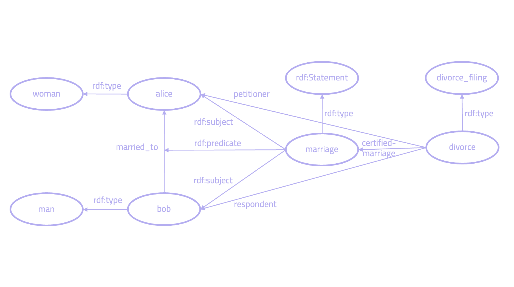

## Comparing Grakn to Semantic Web Standards

This article explores how Grakn compares to Semantic Web Standards, focusing specifically on RDF, XML, RDFS, OWL, SPARQL and SHACL. There are some key similarities between these two sets of technologies — primarily as they are both rooted in the field of symbolic AI, knowledge representation and automated reasoning. These similarities include:

1. Both allow developers to represent and query complex and heterogeneous data sets.
2. Both give the ability to add semantics to complex sets of data.
3. Both enable the user to perform automated deductive reasoning over large bodies of data.

However, there are core differences between these technologies, as they were designed for different types of applications. Specifically, the *Semantic Web* is built for the Web, with incomplete data coming from many sources, where anyone can contribute to the definition and mapping between information sources. Grakn, in contrast, wasn't built to share data over the web, but instead to work as a transactional database for closed world organisations. Because of this, comparing the two technologies sometimes feels like comparing apples to oranges. 

These differences can be summarised: 

1. Compared to the Semantic Web, **Grakn reduces the complexity while maintaining a high degree of expressivity.** With Grakn, we avoid having to learn different Semantic Web Standards, each with high levels of complexity. This reduces the barrier to entry. 
2. **Grakn provides a higher-level abstraction for working with complex data** than Semantic Web Standards. With RDF we model the world in triples, which is a lower level data model than Grakn's entity-relation concept level schema. Modelling and querying for higher order relationships and complex data is native in Grakn. 
3. **Semantic Web Standards are built for the Web, Grakn works for closed world systems with private data.** The former was designed to work for linked data on an open web with incomplete data, while Grakn works like a traditional database management system in a closed world environment.

This documentation shows there are strong overlaps in how both technologies offer tools for knowledge representation and automated reasoning, and covers the most important concepts at a high level without going into too much detail. The goal is to help users from an RDF/OWL background to familiarise themselves with Grakn.

### The Semantic Web Stack

The Semantic Web started at the end of the 1990s to extend the web's existing architecture with a layer of formal semantics. It consists of a number of Standards that together make the Semantic Web Stack. The technologies covered in this article include: XML, RDF, RDFS, OWL, SPARQL and SHACL. 

- RDF is a standard to exchange data over the web and XML as its serialisation.
- RDFS provides a schema and some basic ontological constructs.
- OWL enhances this further with constructs from Descriptive Logic. SPARQL is the language to query and insert RDF data.
- SHACL provides a set of verification constraints to logically validate data.

In addition to the standards, there are different libraries and implementations a user has to choose from to actually use the standards in practice. For example, several libraries exist that allow the user to use RDF or SHACL (for Java alone you can choose between these two: [TopBraid](https://github.com/TopQuadrant/shacl) and [Apache Jena](https://jena.apache.org/documentation/shacl/)), but they all vary slightly from the standards and have individual nuances. 

However, despite a lot of educational material available, the Semantic Web has not achieved mass adoption outside academia. Because of the large number of technologies a user needs to learn, coupled with their inherent complexity, a user spends a long time educating themselves on the Semantic Web before getting started. The barrier to entry is high. This makes it hard for most developers to get started.

Instead, Grakn provides the user with just one technology that can replace many of the standards in the Semantic Web (in this article we cover RDF, RDFS, OWL, SPARQL and SHACL). This means, for example, a user building an application doesn't need to educate themselves on what type of reasoner, which verification system or what query language to use. With Graql, all of this happens within the same technology the user only needs to learn once. 

*Grakn works at a higher level and is easier to learn, reducing the barrier to entry, enabling millions of developers to have access to semantic technologies which previously were inaccessible. In Grakn, ease of use is a first principle.*


*Instead of RDF, SPARQL, RDFS, OWL and SHACL, we use Grakn and Graql.*

In short, Grakn is a distributed logical database in the form of a knowledge graph that implements a concept-level schema. This knowledge representation system is then interpreted by an automated reasoning engine that performs automated deductive reasoning during query runtime. The querying, schema and reasoning all happen through Grakn's query language — Graql. 

The formal foundations of Grakn's concept level schema are provided by the *hypergraph*, which plays the same role as the relational model for relational databases, directed graphs in the Semantic Web and property graphs for graph databases. Hypergraphs generalise the common notion of what an edge is. In RDF and property graphs, an edge is just a *pair* of vertices. Instead, a *hypergraph* is a *set* of vertices, which can be further structured. The benefits over a directed graph model include:

1. The **natural mechanism of grouping relevant pieces of information** in a relational style, which is to a large extent lost in directed graphs.
2. **Uniform handling of all n-ary relationships**, as opposed to directed graphs where relations with more than two role players require a radical change in the modelling approach (n-ary).
3. A **natural way of expressing higher-order information** (relations between relations, nesting of information), which in directed graphs require dedicated modelling techniques (i.e. reification).

## RDF

### RDF Triples

RDF is a system to model data and distribute it over the web. It's made out of a labelled, directed multigraph with vertices and labelled edges. These consists out of URIs (things), literals (data values) and blank nodes (dummy nodes). 

RDF stores triples in subject-predicate-object form, atomic statements declared one by one. Below is an example of a person "Peter Parker", who knows another person "Aunt May" in XML notation. 

```xml
<rdf:RDF xmlns:rdf="http://www.w3.org/1999/02/22-rdf-syntax-ns#"
         xmlns:foaf="http://xmlns.com/foaf/0.1/"
         xmlns:rdfs="http://www.w3.org/2000/01/rdf-schema#">
 <foaf:Person>
   <foaf:name>Peter Parker</foaf:name>  
   <foaf:knows>
       <foaf:Person>
         <foaf:name>Aunt May</foaf:name>
       </foaf:Person>   
   </foaf:knows>
 </foaf:Person>
</rdf:RDF>
```

As we can see, RDF gives up in compactness what it gains in flexibility. This means that it can be expressive, while being extremely granular. Every single relationship between a data point is explicitly declared — a relationship either exists or not. This makes it easy to merge data from different sources compared to traditional relational databases. The above triples make up this graph:


*Graphical representation of RDF triples.*

Grakn doesn't work with triples. Instead, it exposes a **concept level entity-relationship model**. So, instead of modelling in subject-predicate-object form, Grakn represents our data at a higher level, with entities, relations, roles and attributes. For the example above, we would say there are two `person` entities, which have `name` attributes and are related through a `knows` relation. 

<!-- test-ignore -->
```graql
$p isa person, has name "Peter Parker";
$p2 isa person, has name "Aunt May"; 
($p, $p2) isa knows; 
```


*Grakn model with two entities ("Peter Parker" and "Aunt May") and one relation ("knows").*

### Hyper-Relations

As mentioned, Grakn's data model is based on hyper-graphs. While in RDF an edge is just a *pair* of vertices, a *hyperedge* is a *set* of vertices. Grakn's data model's formal foundation is based on three premises: 

1. A hypergraph consists of a non-empty set of vertices and a set of hyperedges 
2. A hyperedge is a finite set of vertices (distinguishable by specific roles they play in that hyperedge)
3. A hyperedge is also a vertex itself and can be connected by other hyperedges

*Note:* although Grakn leverages hyperedges, Grakn doesn't actually expose *edges* or *hyperedges*. Instead, it works with *relations*, or *hyper-relations*. Below is a figure that depicts how this works. The example shows two *hyper-relations*:

- *marriage*, describing a binary *marriage* relation between *Bob* and *Alice* playing the roles of *husband* and *wife*, respectively
- *divorce-filing* describing a ternary *divorce-filing* relation involving three role-players in the roles of *certified marriage, petitioner* and *respondent*


*Example of a hyper-relation in Grakn.*

A hyper-relation can simply be seen as a collection of a role & role-player pairs of arbitrary cardinality. As hyper-relations cannot be represented natively in a labelled directed graph, the above example in RDF can end up looking like this: 


*Representation of hyper-relations in RDF.*

As is shown, each *hyper-relation* in Grakn can be mapped to the corresponding directed graph in the RDF model. For instance, in this model, entity and relation types are also explicitly encoded as RDF resources in the RDF style. As such, hyper-relations can be implemented over an RDF triple store. Therefore, in terms of modelling, hyper-relations offer a very natural and straightforward data representation formalism, enabling modeling at a conceptual level using entity-relationship diagrams.

The difference, however, is that in Grakn hyper-relations become first-class modelling constructs. This is important because in a real-life scenario, when the complete conceptual model is not fully foreseen at the outset, the actual modelling outcome may create a lot of unnecessary complexity. Furthermore, modelling hyper-relations natively, as compared to binary directed edges, leads to improvements to query planning and query optimisation, as the data grouped together in the same structure "containers" is also often retrieved in similar groupings by users and applications. And by acknowledging the structure of these in advance of querying, the retrieval process can be more optimally planned and executed. 

### Namespaces

Due to the public nature of the Web, RDF uses namespaces to interpret and identify different ontologies, which are usually given at the beginning of a document to make it more readable. Every resource in RDF has a unique identifier. The `rdf:RDF` tag tells it that it's an RDF document: 

```xml
rdf:RDF xmlns:rdf="http://www.w3.org/1999/02/22-rdf-syntax-ns#
```

As Grakn doesn't operate on the web, there isn't a need for URIs. A related concept is that of `databases`, which are logically separate databases within a Grakn instance. Unlike an RDF `namespace` these cannot talk to each other. 

### Serialisation

There are many ways to express RDF in textual form. One common way is to represent triples in XML format (as recommended by W3C):

```xml
<http://example.org/#spiderman>
  <http://www.perceive.net/schemas/relationship/enemyOf>
    <http://example.org/#green-goblin> .
<http://example.org/#green-goblin>
  <http://www.perceive.net/schemas/relationship/enemyOf>
    <http://example.org/#spiderman> .
```

However, as XML can become difficult to read, *[Turtle](https://www.w3.org/TR/turtle/)* can also be used as a more compact serialisation (other popular serialisation formats include JSON-LD and N-triples). With *Turtle*, we use qnames instead of local URIs. The example below represents two `Person`s from the `foaf` namespace: "Green Goblin" and "Spiderman". They are connected through a relationship called `enemyOf` from the `rel` namespace. 

```xml
@base <http://example.org/> .
@prefix rdf: <http://www.w3.org/1999/02/22-rdf-syntax-ns#> .
@prefix rdfs: <http://www.w3.org/2000/01/rdf-schema#> .
@prefix foaf: <http://xmlns.com/foaf/0.1/> .
@prefix rel: <http://www.perceive.net/schemas/relationship/> .

<#green-goblin>
    rel:enemyOf <#spiderman> ;
    a foaf:Person ;
    foaf:name "Green Goblin" .

<#spiderman>
    rel:enemyOf <#green-goblin> ;
    a foaf:Person ;
    foaf:name "Spiderman" .
```

In Grakn, we avoid the need to choose between multiple serialisations and use Graql. The example can be represented like this:

<!-- test-ignore -->
```graql
$g isa person, has name "Green Goblin"; 
$s isa person, has name "Spiderman"; 
(enemy: $g, enemy: $s) isa enemyship; 
```

Here, we have two `person` entities, with attribute `name` "Green Goblin" and "Spiderman". They are connected through a relation of type `enemyship`, where both play the role of `enemy`. 

### Higher Order Relationships

Given the subject/predicate/object form of a triple, modelling in RDF can become limited when representing higher order relationship. For example, let's take this triple: 

```xml
lit:HarryPotter bio:author lit:JKRowling . 
```

This states that *JK Rowling wrote Harry Potter*. However, we may want to qualify this statement by saying that *JK Rowling wrote Harry Potter in 2000*. In RDF, to do this we would go through a process called reification, creating one triple per statement, where the subject of the triple would be the same node:

```xml
bio:n1 bio:author lit:JKRowling .
bio:n1 bio:title "Harry Potter" .
bio:n1 bio:publicationDate 2000 .			
```

In Grakn, given its concept level schema, the need for reification doesn't exist and we can represent higher order relationships natively. *JK Rowling wrote Harry Potter* would be expressed like this: 

<!-- test-ignore -->
```graql
$a isa person, has name "JK Rowling"; 
$b isa book, has name "Harry Potter"; 
(author: $a, publication: $b) isa authorship; 
```

Then, if we want to qualify this and say *JK Rowling wrote Harry Potter in 2000*, we would simply add an attribute to the relation: 

<!-- test-ignore -->
```graql
$a isa person, has name "JK Rowling"; 
$b isa book, has name "Harry Potter"; 
(author: $a, publication: $b) isa authorship, has date 2000; 
```

### Blank Nodes

Sometimes in RDF we don't want to give a URI or a literal. In such cases we are dealing with blank nodes, which are anonymous resources without a Web identify. An example is the statement that *Harry Potter was inspired by a man who lives in England:* 

```xml
lit: HarryPotter bio:name lit:"Harry Potter" .
lit:HarryPotter lit:hasInspiration [a :Man; 
							bio:livesIn geo:England] .
```

As Grakn doesn't live on the web, the idea of a blank node doesn't directly translate to Grakn. While in RDF we use a blank node to indicate the existing of a *thing* for which we don't have a URI, there are multiple ways how this could be done in Grakn. If, as in the example above, we're using a blank node to indicate that we don't know anything else about that man, other than that he lives in England, we represent this as follows:

<!-- test-ignore -->
```graql
$b isa book, has name "Harry Potter"; 
$m isa man; ($b, $m) isa inspiration; 
$l isa location, has name "England";
($m, $l) isa lives-in; 
```

What we can see is that the variable `$m` is assigned to the entity type `man`, for which no further information is given, other than that he is connected to the entity type `location` with `name` "England", through a `lives-in` relation type.

## SPARQL

### What is SPARQL

SPARQL is a W3C-standardised language to query for information from databases that can be mapped to RDF. Similar to SQL, SPARQL allows to insert and query for data. Unlike SQL, queries aren't constrained to just one database and can be federated across multiple HTTP endpoints. 

As Grakn's query language, Graql is the equivalent query language. As in SPARQL, Graql allows to insert and query for data. However, given that Graql is not built as an open Web language, it doesn't allow querying across multiple endpoints natively (this can be done with one of Grakn's client drivers). As such, Graql is more similar to SQL and other traditional database management systems. 

### Inserting data with SPARQL

To add data into the default graph store, this snippet describes how two RDF triples are inserted with SPARQL: 

```sparql
PREFIX dc: <http://purl.org/dc/elements/1.1/>
INSERT DATA
{ 
  <http://example/book1> dc:title "A new book" ;
                         dc:creator "A.N.Other" .
}
```

In Graql, we begin with the `insert` statement to declare that data is to be inserted. The variable `$b` is assigned to the entity type `book`, which has a `title` with value "A new book" and a `creator` "A.N.Other". 

<!-- test-ignore -->
```graql
insert
$b isa book, has title "A new book", has creator "A.N.Other"; 
```

### Querying with SPARQL

In SPARQL, we first declare the endpoints we want to retrieve our data from and we may attach those to a certain PREFIX. The actual query starts with `SELECT` before stating the data we want to be returned. Then, in the `WHERE` clause, we state the graph pattern for which SPARQL will then find the data that matches. In this query, we look for all the persons that "Adam Smith" knows using the namespaces `foaf` and `vCard`: 

```sparql
PREFIX foaf: <http://xmlns.com/foaf/0.1/>
PREFIX vCard: <http://www.w3.org/2001/vcard-rdf/3.0#>

SELECT ?whom
WHERE {
	 ?person rdf:type  foaf:Person .
	 ?person vcard:family-name "Smith" .
    	 ?person vcard:given-name  "Adam" .
	 ?person foaf:knows ?whom .
 }
```

In Graql, we begin with the `match` statement to declare that we want to retrieve data. We match for an entity of type `person` who has a `family-name` "Smith" and a `given-name` "Adam". Then, we connect it through a `knows` relation type to `$p2`. As we want to know who "Adam Smith" knows, we want to be returned `$p2` which is declared in the `get` statement:

<!-- test-ignore -->
```graql
match $p isa person, has family-name "Smith", has given-name "Adam"; 
($p, $p2) isa knows; 
get $p2; 
```

Let's look at a different query: *Give me the director and movies that James Dean played in, where also a woman played a role, and that woman played in a movie directed by John Ford.* Below is the SPARQL code and the visual representation of this traversal type query. 

```sparql
PREFIX  movie: <http://example.com/moviedb/0.1/>
PREFIX  rdf:  <http://www.w3.org/1999/02/22-rdf-syntax-ns#>
PREFIX  foaf: <http://xmlns.com/foaf/0.1/>
 
SELECT  ?director ?movie
WHERE{	
?actor    	 rdf:type             foaf:Man ;
          	 movie:name          "James Dean" ;
          	 movie:playedIn       ?movie .
?actress  	 movie:playedIn       ?movie ;
          	 rdf:type             foaf:Woman ;
          	 movie:playedIn       ?anotherMovie .
?JohnFord 	 rdf:type             foaf:Man ;
          	 movie:name           "John Ford" .
?anotherMovie	 movie:directedBy  ?JohnFord .
}
```


*Visual representation of the Sparql traversal query.*

In Grakn, we can ask the same like this: 

<!-- test-ignore -->
```graql
match 
$p isa man, has name "James Dean"; 
$w isa woman; 
(actor: $p, actress: $w, casted-movie: $m) isa casting; 
(actress: $w, casted-movie: $m2) isa casting; 
$d isa man, has name "John Ford"; 
($m2, $d) isa directorship; get $d, $m;
```

Here, we assign the entity type `man` with attribute `name` and value "James Dean" to the variable `$p`. We then say that `$w` is of entity type `woman`. These two are connected with `movie` in a three-way relation called `casting`. The `woman` also plays a role in another `casting` relation, where the `movie` entity is connected to "John Ford" who relates to this `movie` through a `directorship` relation. 

In the example above, the hyper-relation `casting` in Grakn is representing the two `playedIn` properties in SPARQL. However, in SPARQL we can only have two edges connecting `woman` and "James Dean" with `movie`, but not between themselves. This shows **how fundamentally different modelling in Grakn is to RDF given its ability to model hypergraphs.** Grakn enables to natively represent N number of role players in one relation without having to reify the model. 

Schematically, this is how the query above is represented visually (note the ternary relation `casting`):


*Visual representation of the query in Grakn.*

### Negation

In SPARQL, we can also specify in our query that certain data isn't there using the keyword `NOT EXISTS`. This finds a graph pattern that only matches if that subgraph doesn't match. In the example below, we look for actors who played in the movie Giant, but aren't yet passed away:

```sparql
PREFIX movie: <http://example.com/moviedb/0.1/>

SELECT ?actor
WHERE {
	  ?actor movie:playedIn movie:Giant .
	  NOT EXISTS {?actor movie:diedOn ?deathdate .
}
```

Using closed world assumptions, Grakn supports negation. This is done using the keyword `not` followed by the pattern to be negated. The example above is represented like this: 

<!-- test-ignore -->
```graql
match 
$m isa movie, has name "Giant"; ($a, $m) isa played-in; 
not {$a has death-date $dd;}; get $a; 
```

Here, we're looking for an entity type `movie` with name "Giant", which is connected to `$a`, an `actor`, through a relation of type `played-in`. In the `not` sub-query, we specify that `$a` must not have an attribute of type `death-date` with any value. We then `get` the actor `$a`. 

## RDF Schema

As RDF is just a data exchange model, on its own it's "schemaless". That's why RDF Schema (RDFS) was introduced to extend RDF with basic ontological semantics. These allow, for example, for simple type hierarchies over RDF data. In Grakn, Graql is used as its schema language. 

### RDFS Classes

RDFS extends the RDF vocabulary and allows to describe taxonomies of classes and properties. An RDFS class declares an RDFS resource as a class for other resources. We can abbreviate this using `rdfs:Class`. Using XML, creating a class `animal` with a sub-class `horse` would look like this: 

```xml
<?xml version="1.0"?>

<rdf:RDF
xmlns:rdf="http://www.w3.org/1999/02/22-rdf-syntax-ns#"
xmlns:rdfs="http://www.w3.org/2000/01/rdf-schema#"
xml:base="http://www.animals.fake/animals#">

<rdfs:Class rdf:ID="animal" />
<rdfs:Class rdf:ID="horse">
  <rdfs:subClassOf rdf:resource="#animal"/>
</rdfs:Class>
</rdf:RDF>
```

To do the same in Grakn, we would write this:

<!-- test-ignore -->
```graql
define 
animal sub entity; 
horse sub animal;
```

RDFS also allows for sub-typing of `Properties`: 

```xml
<?xml version="1.0"?>

<rdf:RDF
xmlns:rdf="http://www.w3.org/1999/02/22-rdf-syntax-ns#"
xmlns:rdfs="http://www.w3.org/2000/01/rdf-schema#"
xml:base="http://www.animals.fake/animals#">

<rdfs:Class rdf:ID="mammal" />

<rdfs:Class rdf:ID="human">
  <rdfs:subClassOf rdf:resource="#mammal"/>
</rdfs:Class>

<rdfs:Property rdf:ID="employment" />

<rdfs:Property rdf:ID="part-time-employment">
  <rdfs:subPropertyOf rdf:resource="#employment"/>
</rdfs:Property>

</rdf:RDF>
```

Which in Grakn would look like this: 

<!-- test-ignore -->
```graql
define
mammal sub entity; 
human sub mammal;
employment sub relation;
part-time-employment sub employment;
```

As the examples show, RDFS mainly describes constructs for types of objects (`Classes`), inheriting from one another (`subClasses`), properties that describe objects (`Properties`), and inheriting from one another (`subProperty`) as well. This sub-typing behaviour can be obtained with Graql's `sub` keyword, which can be used to create type hierarchies of any `thing` (`entities`, `relations`, and `attributes`) in Grakn.

However, to create a one-to-one mapping between a `class` to an `entity` in Grakn or a `property` to a `relation` in Grakn, despite their seeming similarities, should not always be made. This is because the model in RDF is built using a lower level data model, working in triples, while Grakn enables to model at a higher level.

### Multiple Inheritance

One important modelling difference between Grakn and the Semantic Web is with regards to multiple inheritance. In RDFS, a class can have as many superclasses as are named or logically inferred. Let's take this example: 

```xml
company      rdf:type  rdfs:Class
government   rdf:type  rdfs:Class

employer     rdf:type         rdfs:Class
employer     rdfs:subClassOf  company
employer     rdfs:subClassOf  government
```

This models an `employer` as both of class `company` and `government`. However, although this may look correct, the problem is that often multiple inheritance, as a modelling concept, is not used in the right way. Multiple inheritance should group things, and not subclass "types", where each type is a definition of something else. In other words, we don't want to represent instances of data. This is a common mistake. 

Instead of multiple inheritance, Grakn supports single type inheritance, where we we should assign `role`s instead of multiple classes. A `role` defines the behaviour and aspect of a `thing` in the context of a `relation`, and we can assign multiple `role`s to a `thing` (note that roles are inherited when types subclass another).

For example, a `government` can employ a `person`, and a `company` can employ a `person`. One might suggest to then create a class that inherits both `government` and `company` which can employ a `person`, and end up with an `employer` class that subclasses both (as shown in the example above).

However, this is an abuse of inheritance. In this case, we should create a role `employer`, which relates to an `employment` relation and contextualises how a `company` or `government` is involved in that relation (by playing the role of `employer`). 

<!-- test-ignore -->
```graql
company sub entity,
    plays employment:employer;

government sub entity,
    plays employment:employer;

employment sub relation,
    relates employer;
```

### rdfs:domain and rdfs:range

Two commonly used instances of `rdf:property` include `domain` and `range`. These are used to state that respectively the members or the values of a property are instances of one or more classes. Below is an example of `rdfs:domain`: 

```xml
:publishedOn rdfs:domain :PublishedBook
```

Here, `rdfs:domain` assigns the class `Person` to the subject of the `hasBrother` property. 

This is an example of `rdfs:range`: 

```xml
:hasBrother rdfs:range :Male
```

Here, `rdfs:range` assigns the class `Male` to the object of the `hasBrother` property. 

In Grakn, there is no direct implementation of `range` and `domain`. The basic inferences drawn from them would be either already natively be represented in the Grakn data model through the use of `role`s, or we can create `rule`s to represent the logic we want to infer. 

However, bear in mind that using rules in Grakn gives more expressivity in allowing us to represent the type of inferences we want to make. In short, translating `range` and `domain` to Grakn should be done on a case by case basis. 

In the example above, `rdfs:domain` can be translated to Grakn by saying that when an entity has an attribute type `published-date`, it plays the role of `published-book` in a `publishing` relation type. This is represented in a Grakn rule: 

<!-- test-ignore -->
```graql
rule publishing-rule:
when {
	$b has published-date $pd; 
} then {
	(published-book: $b) is publishing; 
}; 
```

The example of `rdfs:range` can be created with the following Grakn rule, which adds the attribute type `gender` with value of "male", only if a `person` plays the role `brother` in any `siblingship` relation, where the number of other siblings is N.

<!-- test-ignore -->
```graql
rule gender-male:
when {
	$r (brother: $p) isa siblingship; 
} then {
	$p has gender "male";  
}; 
```

Let's also look at another example. In a maritime setting, if we have a vessel of class `DepartingVessel`, which has the Property `nextDeparture` specified, we could state: 

```xml
ship:Vessel rdf:type rdfs:Class .
ship:DepartingVessel rdf:type rdfs:Class .
ship:nextDeparture rdf:type rdf:Property .
ship:QEII a ship:Vessel .
ship:QEII ship:nextDeparture "Mar 4, 2010" .
```

With the following `rdfs:Domain`, any vessel for which `nextDeparture` is specified, will be inferred to be a member of the `DepartingVessel` class. In this example, this means QEII is assigned the `DepartingVessel` class.

```xml
ship:nextDeparture rdfs:domain ship:DepartingVessel .
```

To do the same in Grakn, we can write a rule that finds all entities with an attribute `next-departure` and assign them to a relation `departure` playing the role of `departing-vessel`. 

<!-- test-ignore -->
```graql
rule departure-next:
when {
	$s has next-departure $nd; 
} then {
	(departing-vessel: $s) isa departure; 
}; 
```

Then, if this data is ingested: 

<!-- test-ignore -->
```graql
$s isa vessel, has name "QEII", has next-departure "Mar 4, 2010"; 
```

Grakn infers that the vessel QEII plays the role of `departing-vessel` in a `departure` relation, the equivalent in this case of the `nextDeparture` class. 

The use of `rdfs:domain` and `rdfs:range` are useful in the context of the web, where federated data can often be found to be incomplete. As Grakn doesn't live on the web, the need for these concepts is reduced. Further, most of this inferred data is already natively represented in Grakn's conceptual model. A lot of this is due to its higher level model and the usage of rules. Therefore, directly mapping `rdfs:range` and `rdfs:domain` to a concept in Grakn is usually naive and leads to redundancies. Instead, translating these concepts into Grakn should be done on a case by case basis using rules and roles. 

## OWL

### OWL and Grakn

OWL is a family of Descriptive Logic (DL) based ontology language which adds ontological constructs on top of RDFS to express conditions and derive new facts. To make meaningful use of these, OWL provides different flavours: OWL QL, OWL RL, OWL DL, with the user needing to decide which fits their use case best.

Grakn, on the other hand, comes with its own built-in native inference capabilities. This is an important distinction, because OWL assumes a good understanding of the field of logic by the user, while using Grakn doesn't require the user to have studied this field extensively. 

The result is that OWL struggles to maintain a satisfactory balance between expressiveness and complexity. Just to reason over two simple constraints: *Every parent has a child* and *Every child is a person* requires the use a fully-fledged OWL DL reasoner. Furthermore, OWL is not suited to reasoning with complex relations. Its formal foundations, based on a tree-model property, make it a better fit for tree-shaped data, but scale poorly with more complex data.

OWL adopts open world assumptions, instead of Grakn's closed world assumptions. This means that in an example where OWL has the constraint: *Every parent must have at least one child*, if we have a person with no children, this is still consistent with the constraint, as we may not yet know about John's children. However, with Grakn's closed world assumption, if there are no actual mentions of John's children, this means he really doesn't have any children and isn't a parent. 

Open world assumptions lend themselves well for the open-ended web, which includes incomplete information from multiple sources, which is why OWL provides many concepts to manage and deal with this incompleteness. However, because of this open world assumption, OWL makes it hard to validate consistency of data. That's why relational databases maintain schema constraints to guarantee the quality of data. Grakn combines both styles of reasoning: ontological style open world inference, and schema like closed world constraint checking. 

Everything put together, OWL has a very high entry threshold for non-logicians. As it's based on description logic, developers avoid using OWL as it's non-trivial to understand the language and its intended behaviour. Because of this, Grakn's knowledge representation formalisms remain lightweight, providing semantic capabilities to a much larger audience than that of OWL. **In other words, Grakn is simpler to use than OWL.** 

Here we look at some common axioms in OWL and comapre them to Grakn. This is not an exhaustive list, and is provided to help the user understand how to think of migrating to Grakn.

### Restrictions

A key functionality of OWL is to define restriction classes (`owl:Restriction`). These unnamed classes are defined based on restrictions of the values for certain properties of the class. OWL allows to model situations where certain members of a class need to have certain properties. Restrictions allow to differentiate between something that applies to all members of a class. A restriction is defined by giving a description that limits the kinds of things that can be said about a member of that class. 

One example is the restriction `AllValuesFrom`, which states that in the context of a specific class, the range of a property should always be a specific class. For instance, if `AllValuesFrom` has been applied for Class `Person`, and this is applied to the range of `hasParent` with `Person`, then they can only have `Person`-parents, while an `Animal` cannot have a `Person`-parent. The example below also shows that only `Animal`s can have `Animal`-parents. 

```xml
:Person
  a owl:Class ;
  rdfs:subClassOf
    [ a owl:Restriction ;
      owl:onProperty :hasParent ;
      owl:allValuesFrom :Person
   ] .

:Animal
  a owl:Class ;
  rdfs:subClassOf
    [ a owl:Restriction ;
      owl:onProperty :hasParent ;
      owl:allValuesFrom :Animal
   ] .
```

To do this in Grakn, the restriction is represented in the schema definition. `person` and `animal` entity types are created and two relations with restrictions: `person-parentship` and `animal-parenthship`. The former only relates to `person` while the latter relates to `animal`.  

<!-- test-ignore -->
```graql
define
person sub entity, 
plays person-parentship:child,
plays person-parentship:parent; 

animal sub entity,
plays animal-parentship:child,
plays animal-parentship:parent; 

parentship sub relation, abstract;

person-parentship sub parentship,
relates child,
relates parent; 

animal-parentship sub parentship,
relates child,
relates parent; 
```

### Transitive Properties

A common inference in OWL is transitivity. This states that relation R is said to be *transitive*, if A is connected to B with R(a,b), and B is connected to C with R(b, c), this implies that A is connected to C with R(a, c). The construct `owl:TransitiveProperty` is used for this. The example below allows the inference that Kings Cross is located in Europe. 

```xml
:isLocated rdf:type owl:TransitiveProperty.

:KingsCross isLocated :London.
:London isLocated :UK.
:UK isLocated :Europe.
```

In Grakn, a rule would be created to represent the transitivity:

<!-- test-ignore -->
```graql
rule transitive-location:
when {
	$r1 (located: $a, locating: $b); 
	$r2 (located: $b, locating: $c); 	
} then {
	(located: $a, locating: $c);
}; 
```

Once the rule is defined, if this data is loaded: 

<!-- test-ignore -->
```graql
insert 
$a isa city, has name "London"; 
$b isa country, has name "Uk"; 
$c isa continent, has name "Europe"; 
(located: $a, locating: $b); (located: $b, locating: $c);
```

If we then query for:

<!-- test-ignore -->
```graql
match  
$b isa continent, has name "Europe"; 
(located: $a, locating: $b); get $a; 
```

Not only would this yield the `country` "UK", which has a direct relation with the `continent` "Europe", but also the `city` "London", as this would be inferred as having a transitive relation with the `continent` 'Europe".

### Equivalent Properties

OWL also provides a construct to model equivalent properties. This states that two properties have the same property extension. An example: 

```xml
:borrows owl:equivalentProperty :checkedOut .
```

This can be represented with a rule in Grakn, where can infer a new relation `checked-out` like this:

<!-- test-ignore -->
```graql
rule borrowing-checked-out-equivalent:
when {
    (borrower: $x, borrowing: $y) isa borrowing;
} then {
    (checking-out: $x, checked-out: $y) isa checked-out;
};
```

### Symmetric Properties

A symmetric relation represents a relation that has its own inverse property. For example, if Susan is related to Bob via a `hasSibling` property, then the inference that Bob is also related to Susan through a `hasSibling` property can be made. 

```xml
:hasSibling rdf:type owl:SymmetricProperty .
```

In Grakn, symmetricity can be modelled by simply repeating roles in one or multiple relations: 

<!-- test-ignore -->
```graql
(sibling: $p, sibling: $p2) isa siblingship; 
```

In other words, something that needs an explicit construct in OWL is native to the Grakn model, i.e., the symmetricity rule doesn't require to be made explicit. However, this is where comparing OWL to Grakn becomes difficult, as both serve different use cases. In particular, given Grakn's closed world assumptions, many of the problems in OWL simply don't exist.

### Functional Properties

This is how we can model a few more OWL constructs. The `owl:FunctionalProperty` is represented like this: 

```xml
hasFather rdf:type owl:FunctionalProperty .
```

In Grakn a rule can be used: 

<!-- test-ignore -->
rule same-fatherhood:
```graql
when {
	(father: $x, child: $ y) isa fatherhood;
	(father: $d, child: $ y) isa fatherhood;
} then {
	(father: $x, father: $y) isa same-father;
};
```

### IntersectionOf

If we use `owl:intersectionOf` with this example:

```xml
:Mother rdfs:subClassOf [ owl:interesctionOf ( :Female :Parent ) ]
```

This assigns the class `:Mother` if the resource is both `:Female` and `Parent`. In Grakn we can choose to use a rule, containing a conjunctive condition to represent this:

<!-- test-ignore -->
```graql
rule parenthood-motherhood:
when {
	$p isa person, has gender "female"; 
	(mother: $p) isa motherhood; 
} then {
	(parent: $p) isa parenthood; 
};
```

### UnionOf

If we have this example of `owl:unionOf`: 

```xml
:Person owl:equivalentClass [ owl:unionOf (: Woman :Man ) ]
```

This infers the class `:Person` if the resource is either class `:Woman` or `:Man`. Grakn doesn't have a direct equivalent with `owl:equivalentClass`, but there is some coverage offered by rules. As `sub` is an equivalent of `subClassOf`, the above can be achieved in Grakn with: 

<!-- test-ignore -->
```graql
define
person sub entity; 
man sub person;
woman sub person; 
```

In this case, we can also create an instance of a `person` that is neither a `woman` or a `man`. If we don't want this, then we can add the word keyword `abstract` and make the `person` class abstract, which would make the definitions equivalent. 

### HasValue

The `owl:hasValue` restriction can state that red wines should have the color "red" as the value of their `color` proprety: 

```xml
:RedWine
  a owl:Class ;
  rdfs:subClassOf
    [ a owl:Restriction ;
      owl:onProperty :color ;
      owl:hasValue "red" 
    ] .
```

In Grakn, a rule can be used to represent this: 

<!-- test-ignore -->
```graql
rule red-wine-color:
when {
	$w isa red-wine; 
} then {
	$w has color "red"; 
};
```

### hasSelf

The `owl:hasSelf` restriction can state that someone who is a narcissist loves themselves.

```xml
:Narcissist rdfs:subClassOf
	[ owl:hasSelf true ; owl:onProperty :loves ]
```

This could be represented in Grakn: 

<!-- test-ignore -->
```graql
rule love-narcissist:
when {
	$n isa narcissist; 
} then {
	(loving: $n) isa loves; 
};
```

As mentioned, Grakn is not built for the same uses cases that OWL was built for. As such, a one-to-one direct mapping cannot be made. When working with multiple classes, for example, modelling decisions need to be taken into consideration: which become entities and which roles, in Grakn. 

## Verification with SHACL

Traditionally, RDF doesn't ensure that the data being ingested adheres to a set of conditions - i.e. a schema. This is what the SHACL standard is for, which checks if the RDF is logically consistent with a schema before it can be committed. There are also other ways of checking for logical verification with slightly different implementations. 

Like SHACL, Grakn also checks for validation and highlights issues with regards to the quality of the data. But while SHACL is just a validation schema, Grakn implements a semantic schema. 

Using a validation schema, if the data source being ingested contains schema violations, the transaction will fail. We would then look at the source, curate it, and ingest again. With a semantic schema, we would load data, validate it, and mark it for violations. Then we can deal with them online as they are being loaded in.

In this sense, a semantic schema gives you an extra guarantee that all the ingested data will conform to your schema. This means that all the data in your database is consistent with respect to the schema that has been defined. 

This code snippet in SHACL shows how the data needs to adhere to certain restrictions: 

```xml
:Person a sh:NodeShape, rdfs:Class ;
	sh:property [
	sh:path schema:worksFor ;
	sh:node :Company ;
] .

:Company a sh:Shape ;
	sh:property [
	sh:path     schema:name ;
	sh:datatype xsd:string;
] .
```

In Grakn, this validation takes place in Graql's schema language. A `Person` entity is defined as only playing the role `employee` in an `employment` relation, which is related to a `company` entity through the role of `employer`, and includes an attribute of type `name` and value `string`. 

<!-- test-ignore -->
```graql
define 
person sub entity, 
	plays employment:employee; 
company sub entity, 
	has name,
	plays employment:employer; 
employment sub relation, 
	relates employer,
	relates employee;
name sub attribute, value string; 
```

## Conclusions

In conclusion, we've see how: 

1. Compared to the Semantic Web, **Grakn reduces the complexity while maintaining a high degree of expressivity.** With Grakn, we avoid having to learn different Semantic Web Standards, each with high levels of complexity. This reduces the barrier to entry. 
2. **Grakn provides a higher-level abstraction for working with complex data** than Semantic Web Standards. With RDF we model the world in triples, which is a lower level data model than Grakn's entity-relation concept level schema. Modelling and querying for higher order relationships and complex data is native in Grakn. 
3. **Semantic Web Standards are built for the Web, Grakn works for closed world systems.** The former was designed to work for linked data on an open web with incomplete data, while Grakn works like a traditional database management system in a closed world environment.

Grakn provides us with one language that gives us a concept-level model, a type system, a query language, a reasoning engine and schema verification. To do the same with Semantic Web Standards requires multiple Standards and their respective implementations, each with their own inherent complexities. In particular, OWL is extremely feature rich, which has resulted in a high degree of complexity making it unsuitable for most software applications. Instead, Grakn provides a suitable balance between complexity and expressivity when it comes to working with knowledge representation and automated reasoning. 

This comparison has aimed to provide high level similarities and differences between both technologies, but, of course, there is more to Grakn and The Semantic Web than what we’ve tried to show here. 
