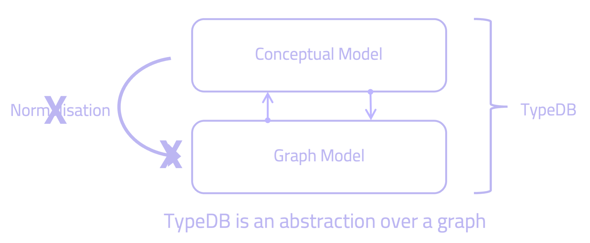

## Comparing TypeDB to Property Graph Databases

Graph databases have matured into mainstream technologies and are becoming increasingly valuable to organisations across any industry. They are more flexible than traditional relational databases as they allow us to leverage the relationships in our data in a way that relational databases cannot do. In a time when organisations are trying to get the most out of their data, this creates opportunities for any organisation. 

However, developing with graph databases leads to plenty of challenges, in particular when it comes to data modelling and maintaining consistency of our data, among others. In what follows, we discuss how TypeDB compares to graph databases, in particular labelled property graphs, and how TypeDB addresses these challenges. While both technologies share some similarities, they are fundamentally different. We'll look at how to read & write data, how to model complex domains and we'll also look at TypeDB's ability to perform automated reasoning.

The main differences between TypeDB and graph databases can be summarised as: 

1. **TypeDB provides a concept-level schema** with a type system that fully implements the Entity-Relationship (ER) model. Instead, graph databases use vertices and edges without integrity constraints imposed in the form of a schema
2. **TypeDB contains a built-in automated reasoner**, graph databases don't provide native reasoning capabilities
3. **TypeDB is an abstraction layer over a graph.** TypeDB leverages a graph database under the hood to create a higher-level abstraction, resulting in both technologies working at different levels of abstraction

There are several different graph technologies available. Some of these are based on RDF and SPARQL, others are imperative, path-based query languages based on Gremlin. Most popular, however, is Cypher, which has grown to become the most adopted graph database query language for property graphs. For this reason, in this comparison we'll just focus on Cypher and labelled property graphs. For a comparison of TypeDB to Semantic Web Technologies, you can read [this](https://docs.vaticle.com/docs/comparisons/semantic-web-and-typedb). 

## The Challenges of Working with a Graph Database

As the name suggests, graph databases are based on graph theory as a mathematical concept to form their data model. They consider connectedness as a first-class citizen, which makes them, compared to relational databases, particularly good at representing connected data. That's because in relational databases, the relations between entities aren't made semantically explicit in the model, whereas graph databases store those connections directly between the elements. 

A graph database consists of the following properties: 

1. The data model contains nodes, relationships, properties and labels
2. Nodes can have properties
3. Nodes can have tags with one or more labels
4. Relationships are directed and connect nodes to create structure in the graph
5. Relationships can have properties

Compared to traditional databases, this data structure is more suitable to work with highly interconnected data due to its flexibility and expressivity. 

However, developing on a graph database requires us to understand many low-level implementation details of graph computing. As a graph database user, we need to overcome plenty of prerequisite challenges and go through a steep learning curve before we can use the technology optimally. This creates a high barrier to entry. The challenges of working with graph databases can be summarised as follows: 

**Modelling Highly Interconnected Data**

Due to the high level of expressivity that graph databases provide, modelling complex domains on a graph is not easy, and is equivalent to modelling knowledge, i.e., ontology engineering.

Specialist graph data engineers are needed to model a graph structure. This approach, however, is not scalable for widespread adoption. Instead, what is needed is a system which allows any engineer to easily model their domain on a graph, without having to be proficient in ontology engineering or be an expert in the underlying graph data structure.

**Maintaining Consistency of Data**

It's essential that the data going into the database complies with the model i.e., schema. Graph databases, like other NoSQL databases, delegate adherence to a schema to the application layer. 

As a result, it's very hard to deliver a system that is generic enough to guarantee consistency of data with regards to the model but maintains the highest level of expressivity possible. 

There is no such thing as data without a schema, at least if you want to derive significant value from it. It's either explicitly defined (like in relational databases), or implicitly at the user level. Given the degree of complexity of highly interconnected data captured by graphs, the lack of consistency becomes a significant hurdle to adopt graph databases.  

**Writing the Graph Queries Itself**

Writing the right graph queries that will interrogate the graph database has its challenges. You need to be explicit in defining the path to traverse between data instances. Given that your data model governs the paths between your data instances, you have to design your queries specific to the way you defined your model. 

What makes this particularly challenging is that you may not have modelled your data in the most generic, consistent and conceptually correct model (e.g., sometimes you defined a relationship as a node, other times as an edge). As a consequence, your queries may not be touching the right data. Each question you want to ask the graph needs a custom graph query, written based on your custom domain model, which may not provide the most optimal path for querying. Therefore, you may for example not be able to abstract the graph query into functions that would take your user's input as an argument, and reuse those functions across multiple use cases. 

Writing graph queries is already a challenging task as you need to understand graph algorithms and data structures. With the additional challenge of not being able to abstract and reuse your graph queries to the point where you can just focus on your problem domain, adopting graph databases becomes very hard. 

To address these challenges, TypeDB abstracts away the low levels of a graph database by implementing a type system. This abstracts away the low-level implementation details of the graph and lets you adopt the technology without a steep learning curve. 

## Modelling and Defining Schema

### Modelling Philosophy of Property Graphs

The graph model consists primarily of nodes and relationships that have names called labels. Relationships are directed and visualised as arrowheads. Both have properties (in the form of key/value pairs) and are called property names. 

As relationships are directed, they always have a start and an end node. To give a label to a relationship, the concept of "verbing" is used. For example, we can say that a man is "married to" a woman, and create the relationship `MARRIED_TO` to represent that marriage. 

However, the graph model doesn't directly map to a conceptual model or ER diagram, as nodes and edges don't always directly map to entities and relationships. Graph databases also offer no native support for concepts such as, for example, ternary relations, n-ary relations or roles. Therefore, to implement a graph model, we must first go through a normalisation process and map our conceptual model (ER diagram) to the graph model. 


*In a graph database we need to map our conceptual model to the graph model.*

### Concept Level Modelling

TypeDB provides a concept-level schema that fully implements the Entity-Relationship (ER) model. TypeDB's schema is a type system that implements the principles of knowledge representation and reasoning. 

Unlike in a graph database, this means that we can map any ER Diagram directly to how we implement it in TypeQL, avoiding the need to go through a normalisation process. In TypeDB, we create a direct mapping of the ER Diagram with entities, relations, attributes and roles to how we implement it later in code. By modelling at the conceptual level using a type system, we avoid the need to go through a normalisation process that would otherwise be required in a graph database. 


*TypeDB's type system is a direct implementation of a conceptual model.*


### Hyper-relational Modelling

A central component of TypeDB's type system is its ability to represent hyper-relations and hyper-entities (in TypeDB, entities, relations and attributes are first class modelling constructs). While in a binary graph a relation or edge is just a *pair* of vertices, a *hyper-relation (*or *hyper-edge)* is a *set* of vertices. 

This enables us to natively model concepts such as n-ary relationships, nested relationships or cardinality-restricted relationships. Using these constructs, we can easily create complex knowledge models that can evolve flexibly. Hyper-entities are defined as entities with multiple instances for one attribute type, which is not possible in a graph database.

TypeDB's hypergraph formalism is based on three premises: 

1. A hypergraph consists of a non-empty set of vertices and a set of hyperedges
2. A hyperedge is a finite set of vertices (distinguishable by specific roles they play in that hyperedge)
3. A hyperedge is also a vertex itself and can be connected by other hyperedges

As property graph databases don't allow relationships to connect more than two nodes, they're unable to represent hyper-relations on their own. However, there are some ways around this by either adding a foreign key to the nodes taking part in that hyper-relation, or representing the hyper-relation as a node (reification). As foreign keys are not very graph-y, reification is often the better approach. 

Nonetheless, reifying the graph should be avoided as it can lead having to refactor our entire graph and breaking the data model. It would also require changes to any queries and application code that could produce or consume such data.

In the image below, we see an example of two *hyper-relations* modelled in TypeDB:

- `marriage`: describing a binary `marriage` relation between *Bob* and *Alice* playing the roles of `husband` and `wife` respectively, and the `marriage` relation playing the role of `certified-marriage` in the `divorce-filing` relation
- `divorce-filing`: describing a ternary `divorce-filing` relation involving three role-players in the roles of `certified-marriage`*,* `petitioner` and `respondent`


In this example, we see that a hyper-relation could be considered to be a collection of a role & role-player pairs of arbitrary cardinality. As hyper-relations cannot be represented natively in binary relations, the above example could be modelled like this in a graph database:


In order to represent these hyper-relations in a property graph model, we need to reify the two hyper-relations (`marriage` and `divorce-filing`) and represent them as nodes. However, as mentioned before, this approach is highly undesirable as we end up modelling four nodes that represent entities and relations. We have now broken the model. That's why modelling natively in hyper-relations offers a more natural and straightforward data representation formalism, enabling modelling at a conceptual level using entity-relationship diagrams.

In a real-life scenario, when the complete conceptual model is not fully foreseen at the outset, the actual modelling outcome may create a lot of unnecessary complexity. Furthermore, modelling hyper-relations natively, as compared to binary directed edges, leads to improvements to query planning and query optimisation, as the data grouped together in the same structure “containers” is also often retrieved in similar groupings by users and applications. And by acknowledging the structure of these in advance of querying, the retrieval process can be more optimally planned and executed.

### N-ary and Ternary Relations

TypeDB's type system allows modelling n-ary and ternary relations. The example below models a ternary relation between a supplier, a buyer, and a part. They can be connected through a single relation we call `supplying`.

First, let's look at how we would model this in a graph database. As we can't natively represent the three entities in one relation, we can either store foreign keys as a property on each node, or, more preferably, create an additional (intermediate) node to support it, similar to how we reified the graph in the example above. 

This is how we would create a `supplying` (intermediary) node that would connect all three other nodes: 


```cypher
(:Company)-[:SUPPLIER]->(:Supplying)
(:Company)-[:BUYER]->(:Supplying)
(:Part)<-[:SUPPLIED]-(:Supplying)
```

In TypeDB, instead of creating an intermediate node, we create one `supplying` relation that relates to the supplier, buyer and the part that's being supplied:


<!-- test-ignore -->
```typeql
$supplier isa company; $part isa part; $buyer isa company; 
(supplier: $supplier, supplied: $part, buyer: $buyer) isa supplying; 
```

The schema in TypeDB would then be as follows (note how the `supplying` relation relates to three roles): 

<!-- test-ignore -->
```typeql
define 
company sub entity, 
plays supplying:supplier, 
plays supplying:buyer; 

part sub entity, 
plays supplying:supplied; 

supplying sub relation, 
relates supplier, 
relates buyer, 
relates supplied;
```

### Nested Relations

In a nested relation, we want a relation to play a role in another relation. For example, we may have modelled a marriage as a relation, and we want to localise this event in London through a `located-in` relation. To do so would require us to connect the `marriage` relation through a relation of type `located` to the entity `London`. 

In a graph database, we cannot create nested relations. Instead, we can model a marriage between two persons with a `MARRIED_TO` relation. However, connecting that edge to a `city` node becomes impossible, as we cannot have a relation connect to another relation. Instead, we end up reifying the model and turning the `MARRIED_TO` edge into a node `marriage`, so we can connect that node to the `city` node through the `LOCATED_IN` edge.


```cypher
(:Person)-[:MARRIED]->(marriage:Marriage)<-[:MARRIED]-(:Person)
(marriage)-[:LOCATED_IN]->(:City {name:"London"})
```

TypeDB's type system natively supports nested relations as modelling constructs. For the model above, we would create a relation `located` that connects the relation `marriage` with the `city` "London". This would look like this:


<!-- test-ignore -->
```typeql
$london isa city, has name "London"; 
$marriage (spouse: $person1, spouse: $person2) isa marriage; 
($marriage, $london) isa located; 
```

The schema for this would look as follows: 

<!-- test-ignore -->
```typeql
define 
city sub entity, 
plays locating:location;

person sub entity, 
plays marriage:spouse; 

marriage sub relation, 
relates spouse, 
plays locating:located; 

locating sub relation, 
relates located, 
relates location;
```

## Reading Data

To fetch data in Cypher, we describe a graph pattern that starts with a bound node which indicates where the traversal should start. We can add filters and use a `WHERE` statement to do pattern matching. In TypeDB, the basic structure to fetch data is a `match get` query, where we specify a pattern of entities, relations, roles and attributes that TypeDB will fetch data against. The `get` keyword indicates which specific variables we want to be returned, similar to the `RETURN` statement in Cypher. 

Let's look at two example queries and how they compare in Cypher and TypeQL. 

### Example Queries

`Who are Susan and Bob's common friends?`

Here, we're querying for all the friends that both Susan and Bob know. In Cypher, we can describe this as follows: 

```cypher
MATCH (bob:Person {name:"Bob"})-[:ISA_FRIEND_OF]->
(susan:Person {name:"Susan"})-[:ISA_FRIEND_OF]->(commonfriend:Person),
(bob)-[:ISA_FRIEND_OF]->(commonfriend)
RETURN commonfriend
```

The pattern describes the path that connects Bob to Susan, through the `KNOWS` relation. We also specify a `KNOWS` relation between Susan and Bob to another person. We then return that common friend.

In TypeDB, the same query looks like this (we could actually optimise this query through TypeDB's automated reasoner by writing a rule and inferring the common friends):

<!-- test-ignore -->
```typeql
match $bob isa person, has name "Bob"; 
$susan isa person, has name "Susan"; $common-friend isa person;
($susan, $common-friend) isa friendship; ($common-friend, $bob) isa friendship;
get $common-friend;
```

In TypeDB, we ask for the relations of type `friendship` between Bob and Susan, Susan and an undefined person, and Bob and an undefined person. Note that the `ISA_FRIEND_OF` relation doesn't directly translate into a `friendship` relation in TypeDB. The former is a directional edge that only represents how one person is a friend of another person, but not the other way around. Conversely, the TypeDB relation `friendship` represents that both persons play the role of `friend`. Let's look at another example:

`Which movies have been released after 2002 in London's Odeon Cinema by Pixar?`

In this query, we look at a more complex pattern. Cypher allows the use of a `WHERE` keyword which providers criteria for filtering pattern matching results. In the example below, we look at movie titles that have been released after 2002 in a specific Odeon Cinema in London by Pixar: 

```cypher
MATCH (cinema:Cinema {name:'Odeon London'}),
 (london:City {name:'London'}),
 (pixar:Studio {name:'Pixar'}),
 (london) <-[:LOCATED_AT]-(cinema) <-[:RELEASED_AT]
  -(movie:Movie) - [:PRODUCED_BY] -> (pixar)
WHERE movie.year > 2002
RETURN movie.title
```

In TypeDB, the same would look like this: 

<!-- test-ignore -->
```typeql
match $cinema isa cinema, has name "Odeon London"; 
$london isa city, has name "London"; 
$studio isa studio, has name "Pixar"; 
$movie isa movie, has title $movie-title; 
($london, $cinema) isa locating; 
($cinema, $movie) isa release; 
($movie, $studio) isa production, has year $year; $year > 2002; 
get $movie-title; 
```

In TypeDB, instead of using `WHERE`, the pattern matching and filtering can be done anywhere in the query. Filtering of specific values can be done by assigning a variable to the value of an attribute. These variables can then be returned to the user by adding them in the `get` clause. In the example above, we ask for the variable `$movie-title`, which is assigned to the values of the `title` attribute, which is owned by the `movie` entity. 

## Automated Reasoning

### Type-based Reasoning

TypeDB's type system allows for type-based reasoning through the modelling of type hierarchies in entities, attributes and relations. A type hierarchy for vehicles in TypeDB could look like this: 

<!-- test-ignore -->
```typeql
define 

vehicle sub entity; 
car sub vehicle; 
sedan sub car; 
coupe sub car
minivan sub car; 
aircraft sub vehicle;
fixed-wing aircraft; 
jet-aircraft sub aircraft; 
truck sub vehicle; 
garbage-truck sub truck; 
heavy-truck sub truck; 
```

Given this model, if we wanted to fetch every single type of vehicle, rather than specifying every single type one by one, we can just query for the parent type, `vehicle`, and TypeDB, through type-based reasoning, will also return the instances of all the subtypes:

<!-- test-ignore -->
```typeql
match $vehicle isa vehicle;
```

Although graph databases don't support type hierarchies and type-based reasoning, there are some ways around it. For example, if we're inserting a minivan, a coupe, a jet aircraft and a garbage truck, we could add their parent types as additional labels to these nodes. In TypeDB, of course, we wouldn't need to specify their parent types as these would be inferred by the type hierarchy. 

<div class="tabs dark">

[tab:Cypher]
<!-- test-ignore -->
```cypher
CREATE (n:vehicle:car:minivan {name:'Maruti Suzuki Ciaz'})
CREATE (n:vehicle:car:coupe {name:'Audi A5'})
CREATE (n:vehicle:aircraft {name:'Concept Airplane'})
CREATE (n:vehicle:aircraft:jet_aircraft {name:'Boeing 747'})
CREATE (n:vehicle:garbage_truck {name:'Siku 1890 Super Bin Lorry'})
```
[tab:end]

[tab:TypeQL]
<!-- test-ignore -->
```typeql
insert 
$suzuki isa minivan, has name "Maruti Suzuki Ciaz";
$audi isa coupe, has name "Audi A5";
$aircraft isa aircraft, has name "Concept Airplane";
$boeing isa jet-aircraft, has name "Boeing 747";
$siku isa garbage-truck, has name "Siku Super Bin";
```
[tab:end]
</div>


If we then wanted to get all the types of vehicles, we can simply write the following in Cypher and TypeQL:

<div class="tabs dark">
[tab:Cypher]

```cypher
MATCH (vehicle:Vehicle) RETURN
```

[tab:end]

[tab:TypeQL]
<!-- test-ignore -->
```typeql
match $vehicle isa vehicle;
```
[tab:end]
</div>

However, this approach in Cypher of using multiple labels becomes problematic as there's no way to validate our data, so the query becomes unsafe as we wouldn't have any guarantee that all `vehicle` sub types had been assigned the correct label. To obtain that certainty, we would need to explicitly state all the labels of the nodes that we want to be returned, making the query much longer and more verbose. In the end, we're forced to decide between a long query with certainty, or a short one without. 

<div class="tabs dark">

[tab:Cypher]
```cypher
MATCH (vehicle:Vehicle) RETURN vehicle UNION 
MATCH (vehicle:Car) RETURN vehicle UNION 
MATCH (vehicle:Sedan) RETURN vehicle UNION 
MATCH (vehicle:Coupe) RETURN vehicle UNION 
MATCH (vehicle:Minivan) RETURN vehicle UNION 
MATCH (vehicle:Aircraft) RETURN vehicle UNION 
MATCH (vehicle:Fixed_wing) RETURN vehicle UNION 
MATCH (vehicle:Jet_aircraft) RETURN vehicle UNION 
MATCH (vehicle:Truck) RETURN vehicle UNION 
MATCH (vehicle:Garbage_truck) RETURN vehicle UNION 
MATCH (vehicle:Heavy_truck) RETURN vehicle
```
[tab:end]

[tab:TypeQL]
<!-- test-ignore -->
```typeql
match $vehicle isa vehicle;
```
[tab:end]
</div>

In addition to entities, TypeDB also allows for type-based reasoning in attributes and relations. For example, we can model an `employment` hierarchy with two sub-types: a `part-time-employment` and a `full-time-employment`. This schema would look as follows:

<!-- test-ignore -->
```typeql
define 
employment sub entity;
part-time-employment sub employment;
full-time-employment sub employment;
```

As relations in a graph database cannot have multiple labels, the same approach of using multiple labels used above for nodes wouldn't work for relations. Instead, for this employment hierarchy example, to retrieve all types of employments, we would need to specify all the labels in the hierarchy. In TypeDB, we would just ask for the parent relation:

<div class="tabs dark">

[tab:Cypher]
```cypher
MATCH 
(organisation)-[employs]->(employees) 
WHERE 
employs:PART_TIME_EMPLOYED 
OR 
employs:FULL_TIME_EMPLOYED
OR 
employs:EMPLOYED
RETURN employees
```
[tab:end]
[tab:TypeQL]

<!-- test-ignore -->
```typeql
match 
(employee: $person) isa employment; 
get $person;
```
[tab:end]
</div>

### Rule-based Reasoning

In TypeDB, we can create rules (learn more [here](https://docs.vaticle.com/docs/schema/rules)) to abstract and modularise our business logic and perform automated reasoning. Property graphs do not support rules. Rules can infer any type of concept, i.e. entities, relations or attributes.

For example, we could create a rule that infers the relation between siblings, if two persons share the same parent. If the inferred relation is called `siblingship`, then the rule would look as follows:

<!-- test-ignore -->
```typeql
rule sibling-if-share-same-parent: 
when {
  (parent: $parent, child: $child1) isa parenthood;
  (parent: $parent, child: $child2) isa parenthood;
} then {
  (sibling: $child1, sibling: $child2) isa siblingship;
};
```

Having defined this rule, TypeDB would infer that the two children are siblings if the conditions in the rule are met by the data previously ingested. To call the inference, we just query for the `siblingship` relation in a `match` query:

<!-- test-ignore -->
```typeql
match (sibling: $sibling) isa siblingship; get $sibling; 
```

To get the same answer in a graph database, we'd have to manually write the query different paths that represent the conditions of the rule (instead of querying directly for the siblingship relation). In this example, that Cypher query could look like this, where, besides querying directly for siblings, we also ask for all persons who share the same parent (which in TypeDB above we modelled as a rule):

```cypher
MATCH 
(sibling1:Person)-[:SIBLING_OF]->(sibling2:Person) 
OR 
(sibling1:Person)<-[:PARENT_OF]-(:person)-[:PARENT_OF]->(sibling3:Person)
RETURN sibling1, sibling2, sibling3
```

A more complex example of automated reasoning is when the inferred concepts depend on multiple rules (chaining rules). In the example below, we want to retrieve all the persons who are cousins of each other, where only `parenthood` relations across three generations have been ingested. With the right rules defined, we would be able to just query for `cousinship` relations like this:

<!-- test-ignore -->
```typeql
match (cousin: $cousin) isa cousinship; 
get $cousin; 
```
The logic underlying the inference of the `cousinship` relation would be as follows: 

- When person A has a parent B
- If that parent B has a parent C
- If that parent C has a child D who is not a sibling to B
- And if that child D has a child E
- Then person A and child E are cousins

As we can't just represent this logic in a rule in a graph database, we need to explicitly write it in the query itself. For this example, this would look like this:

```cypher
MATCH 
(parent:Person)-[PARENT_OF)->(child1:Person)
-[PARENT_OF]->(child4:Person),
(parent)-[PARENT_OF)->(child2:Person)
-[PARENT_OF]->(child3:Person)
RETURN child4, child3
```

To represent this logic in TypeDB, we can create two separate rules. The first rule infers the cousin relation. This rule then depends on the second rule, which infers an uncle or aunt relation. 

In the first rule, we infer the `cousinship` relation. The logic is as follows:

- When child A has a parent B
- And parent B has a sibling C
- If that sibling C has a child D
- Then A and D will be cousins

<!-- test-ignore -->
```typeql
rule an-aunts-child-is-a-cousin: 
when {
    $a isa person;
    $b isa person;
    $c isa person;
    $1 (parent: $a, child: $b) isa parenthood;
    $2 (uncle-aunt: $a, nephew-niece: $c) isa uncle-auntship;
} then {
    (cousin: $b, cousin: $c) isa cousinship;
};
```
One of the conditions of this rule is the `uncle-auntship` relation, which would be an inferred relation and depend on our second rule, which is based on the following logic:

- When parent A has a child B
- If that parent A has a sibling C
- Then B and C will be in a `uncle-auntship` relation

<!-- test-ignore -->
```typeql
rule uncle-aunt-between-child-and-parent-sibling: 
when {
    $a isa person; 
    $b isa person;
    $c isa person;
    $1 (parent: $b, child: $a) isa parenthood;
    $2 (sibling: $b, sibling: $c) isa siblingship;
} then {
    (nephew-niece: $a, uncle-aunt: $c) isa uncle-auntship;
};
```

TypeDB rules can also be used to store more complex business logic. For example, let's say we want to query for all schedules that overlap in a logistics network. In Neo4j we can write this query: 

```cypher
MATCH 
(sched1: Schedule), (sched2: Schedule) 
WHERE 
sched1.end > sched2.start 
sched1.end <= sched2.end
RETURN
```

Rather than representing the logic that determines if schedules overlap in a query, with TypeDB we can represent this in a rule. That way, we can just query directly for all schedules that participate in an `overlaps` relation to get all overlapping schedules:

<!-- test-ignore -->
```typeql
match $schedule isa schedule; ($schedule) isa overlaps; get $schedule; 
```

The rule that infers the `overlaps` relation looks like this: 

<!-- test-ignore -->
```typeql
rule overlapping-schedules: 
when {
  $schedule1 isa schedule, has end $1End; 
  $schedule2 isa schedule, has start $2Start, has end $2End; 
  $1End > $2Start; 
  $1End <= $2End; 
} then {
  ($schedule1, $schedule2) isa overlaps; 
); 
```

Rules in TypeDB work particularly well when we need to infer connections between otherwise unconnected data. For example, let's say we want to find all the diseases to which a particular person has a risk factor to. In the next example, we want to infer those answers by using the following logic:

- If someone consumes more than 10 units of alcohol per week, then they risk having Diabetes Type II and Hypoglycemia
- If someone's parent has been diagnosed with Diabetes II and/or Arthritis, then they risk having those diseases too
- If someone consumes more than 12 cigarettes per week, then they risk having multiple sclerosis, lung cancer, high blood pressure, multiple sclerosis, chronic obstructive pulmonary disease and/or heart disease, high cholesterol

So, for example, if John Doe matches these conditions, we want to be returned a list of diseases to which he's at risk of, like this:

```
Diabetes Type II
Hypoglycemia
Arthritis
High Blood Pressure
Multiple Sclerosis
Chronic Obstructive Pulmonary Heart Disease
```

To do this query in Cypher, we need to represent all the logic that determines someone's risk factors in the query itself:

<!-- test-ignore -->
```Cypher
MATCH (person:Person {name: "John2"})
OPTIONAL MATCH (person)-[consumes:CONSUMES]->(s:substance)
OPTIONAL MATCH (disease:Disease)<-[:HAS_DIAGNOSIS]-(:Person)<-[:IS_CHILD]-(person)

WITH COLLECT({units_per_week:consumes.units_per_week, name:s.name}) AS substance_consumptions,  COLLECT(disease) as  p_diseases

CREATE (td:TempDisease{diseases: []})
WITH substance_consumptions, td, p_diseases

FOREACH( sc in substance_consumptions | 
  FOREACH( _ in case when sc.units_per_week > 10 and sc.name='Alcohol' then [1] else [] end | 
    SET td.diseases=td.diseases + "Diabetes Type II" )
  FOREACH( _ in case when sc.units_per_week > 10 and sc.name='Alcohol' then [1] else [] end | 
    SET td.diseases=td.diseases + "Hypoglycemia" )
  FOREACH( _ in case when sc.units_per_week > 12 and sc.name='Cigarettes' then [1] else [] end | 
    SET td.diseases=td.diseases + "Lung Cancer" )
  FOREACH( _ in case when sc.units_per_week > 12 and sc.name='Cigarettes' then [1] else [] end | 
    SET td.diseases=td.diseases + "High Cholesterol" )
  FOREACH( _ in case when sc.units_per_week > 12 and sc.name='Cigarettes' then [1] else [] end | 
    SET td.diseases=td.diseases + "High Blood Pressure" )
  FOREACH( _ in case when sc.units_per_week > 12 and sc.name='Cigarettes' then [1] else [] end | 
    SET td.diseases=td.diseases + "Multiple Sclerosis" )
  FOREACH( _ in case when sc.units_per_week > 12 and sc.name='Cigarettes' then [1] else [] end | 
    SET td.diseases=td.diseases + "Chronic Obstructive Pulmonary Disease" )
  FOREACH( _ in case when sc.units_per_week > 12 and sc.name='Cigarettes' then [1] else [] end | 
    SET td.diseases=td.diseases + "Heart Disease" )
)

FOREACH( disease IN p_diseases |
  FOREACH( _ in case when disease.name="Arthritis" then [1] else [] end | 
    SET td.diseases=td.diseases + "Arthritis" )
  FOREACH( _ in case when disease.name="Diabetes Type II" then [1] else [] end | 
    SET td.diseases=td.diseases + "Diabetes Type II" )
)

WITH td, td.diseases as diseases

DELETE td

WITH diseases

UNWIND diseases AS disease
RETURN collect(DISTINCT(disease)) as diseases
```

In TypeDB, instead, we just write one query that fetches the `risk-factor` relation for John Doe:

<!-- test-ignore -->
```typeql
match $john isa person, has name "John Doe"; $disease isa disease; 
($john, $disease) isa risk-factor; get $disease;
```

The `risk-factor` relation is an inferred relation that contains the logic necessary to retrieve which diseases someone is at risk of. This logic is represented into four separate rules in order to modularise our logic. Finally, in order to represent each individual risk factor, the `risk-factor` relation is sub-typed into three separate relations: `alcohol-risk-factor`, `hereditary-risk-factor` and `smoking-risk-factor`. The four rules are shown below:

<!-- test-ignore -->
```typeql
rule alcohol-risk-diseases:
when {
    $person isa person;
    $c(consumer: $person, consumed-substance: $substance) isa consumption, has units-per-week $units;
    $units >= 10;
    $substance isa substance, has name "Alcohol";
    $disease isa disease, has name "Diabetes Type II";
    $disease2 isa disease, has name "Hypoglycemia";
} then {
    (person-at-risk: $person, risked-disease: $disease, risked-disease: $disease2) isa alcohol-risk-factor;
};

rule hereditary-risk-of-diabetes:
when {
    $person isa person;
    $parent isa person;
    (parent: $parent, child: $person) isa parentship;
    (patient: $parent, diagnosed-disease: $disease) isa diagnosis;
    $disease isa disease, has name "Diabetes Type II";
} then {
    (person-at-risk: $person, risked-disease: $disease) isa hereditary-risk-factor;
};

rule hereditary-risk-of-arthritis:
when {
    $person isa person;
    $parent isa person;
    (parent: $parent, child: $person) isa parentship;
    (patient: $parent, diagnosed-disease: $disease) isa diagnosis;
    $disease isa disease, has name "Arthritis";
} then {
    (person-at-risk: $person, risked-disease: $disease) isa hereditary-risk-factor;
};

rule smoking-risk-diseases:
when {
    $person isa person;
    (consumer: $person, consumed-substance: $substance) isa consumption, has units-per-week $units;
    $units >= 12;
    $substance isa substance, has name "Cigarettes";
    $disease isa disease, has name "Multiple Sclerosis";
    $disease2 isa disease, has name "Lung Cancer";
    $disease3 isa disease, has name "High Blood Pressure";
    $disease4 isa disease, has name "Multiple Sclerosis";
    $disease5 isa disease, has name "Chronic Obstructive Pulmonary Disease";
    $disease6 isa disease, has name "Heart Disease";
} then {
    (person-at-risk: $person, risked-disease: $disease, risked-disease: $disease2, risked-disease: $disease3, 
    risked-disease: $disease4, risked-disease: $disease5, risked-disease: $disease6) isa smoking-risk-factor;
};
```

## Conclusions

In conclusion, we've see how:

1. **TypeDB's type system provides a concept-level schema** that fully implements the Entity-Relationship (ER) model, while graph databases use vertices and edges without integrity constraints imposed in the form of a schema
2. **TypeDB contains a built-in automated reasoner**, graph databases don't provide native reasoning capabilities
3. **TypeDB is an abstraction layer over a graph database.** TypeDB leverages a graph database under the hood to create a higher-level abstraction, resulting in both technologies working at different levels of abstraction

In sum, TypeDB provides one language that gives us a concept-level model, a type system, a query language, a reasoning engine and schema verification. The result is a higher level language that abstracts away the low level complexities inherent in a graph database. 

This comparison has aimed to provide high level similarities and differences between both technologies, but, of course, there is more to TypeDB and graph databases than what we’ve tried to show here.
